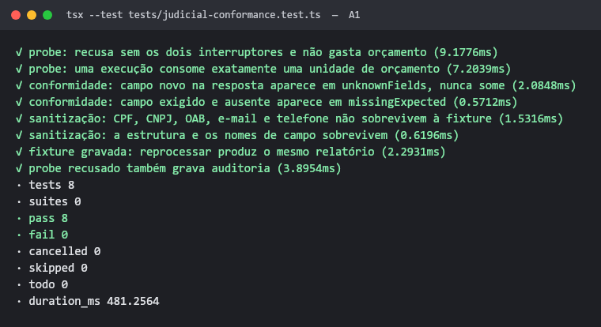
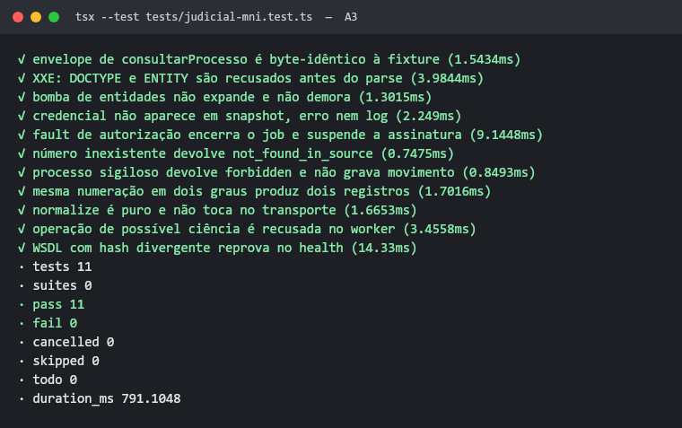
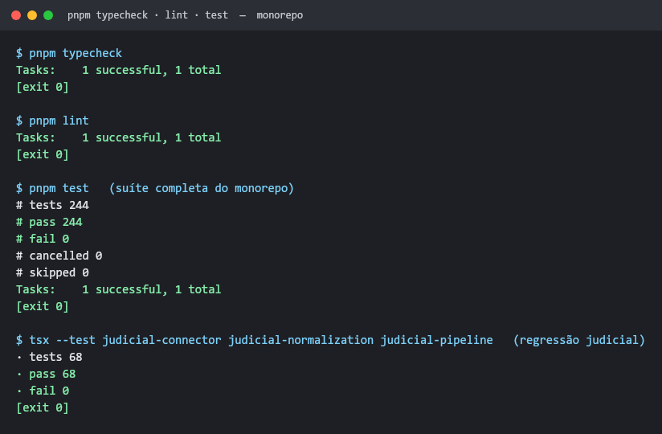
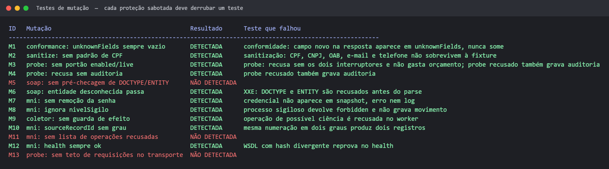
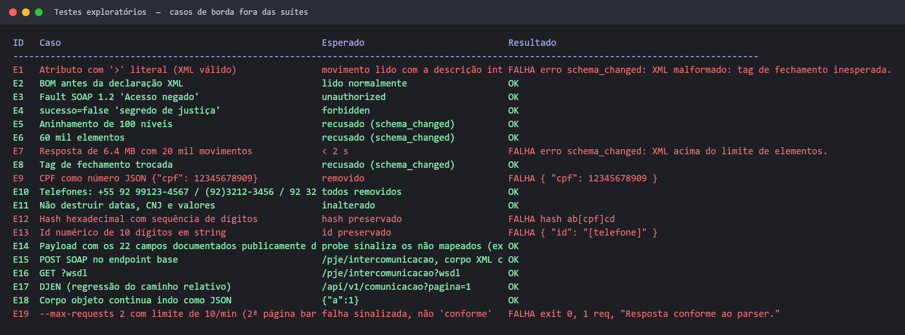
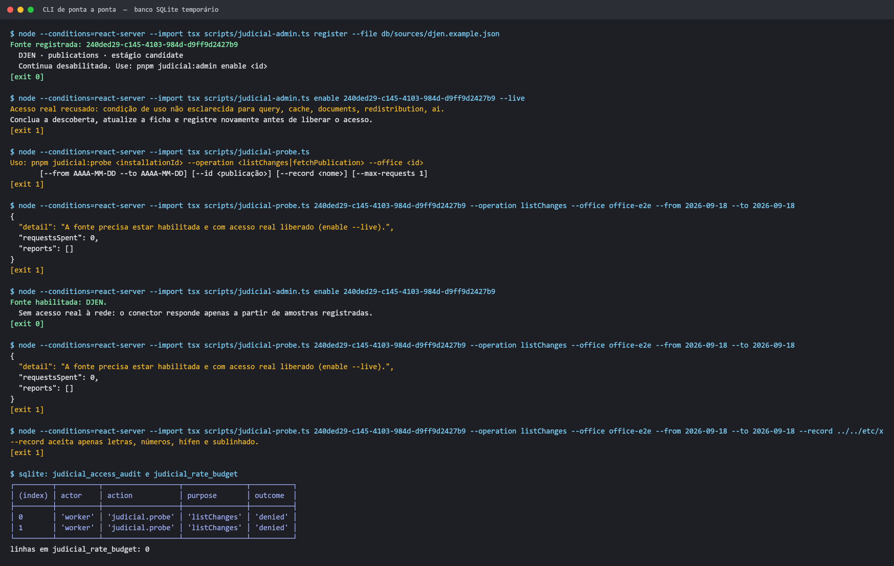
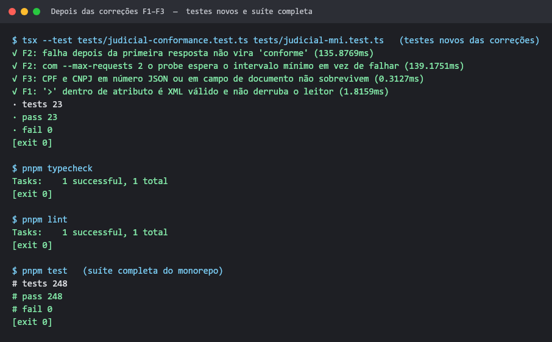
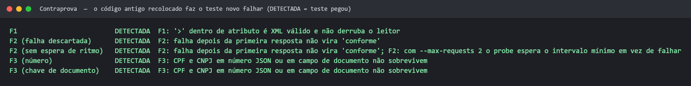
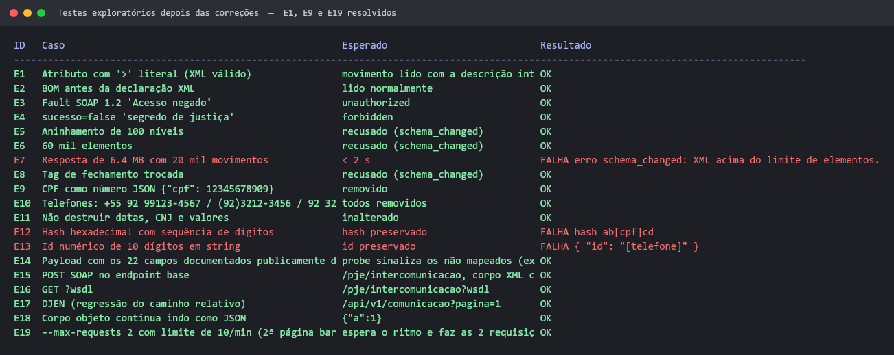

# Relatório de testes: A1 (arnês de conformidade) e A3 (conector MNI/SOAP)

Data: 22/09/2026. Escopo: as mudanças da Onda 1 descritas em
[plano-conectores-tribunais.md](plano-conectores-tribunais.md), itens A1 e A3. Nenhum teste
contatou tribunal: a Onda 0 (habilitação) não foi concluída, e o próprio código recusa acesso real
sem ela.

## Resultado em uma linha

**Tudo o que foi especificado funciona e está coberto por teste. Os testes adicionais acharam 6
defeitos fora das suítes (3 de severidade alta), registrados em
[fix/falhas-testes-A1-A3.md](fix/falhas-testes-A1-A3.md). Os 3 de severidade alta (F1–F3) já foram
corrigidos e verificados; veja a [seção 5](#5-correções-f1f3).**

| Camada | O que verifica | Resultado |
| --- | --- | --- |
| 1. Suítes automatizadas | Aceites de A1 e A3, regressão judicial, monorepo inteiro | 244/244, typecheck e lint limpos |
| 2. Testes de mutação | Se cada proteção tem um teste que falha quando ela some | 10 de 13 detectadas |
| 3. Testes exploratórios | Casos de borda que as suítes não cobrem | 13 de 19 ok, 6 falhas |
| 4. CLI de ponta a ponta | `judicial:admin` e `judicial:probe` contra um banco real | Todos os portões se comportaram como esperado |

## 1. Suítes automatizadas

### A1 — conformidade, sanitização e probe

Os 8 testes nomeados no plano passam.



### A3 — conector MNI/SOAP

Os 11 testes nomeados no plano passam, incluindo XXE, bomba de entidades (recusada em ~1 ms),
remoção da senha e recusa das operações de possível ciência no worker.



### Monorepo e regressão judicial

`pnpm typecheck`, `pnpm lint` e `pnpm test` com código de saída 0. A suíte completa tem 244 testes.
A regressão das suítes judiciais que já existiam (conector, normalização e pipeline, 68 testes)
continua verde depois das mudanças no coletor, no transporte e em `parseSourceDate`.



## 2. Testes de mutação

O plano diz que "um teste que não falha se o código for removido também não conta". Para cada
proteção, um script removeu o trecho, rodou a suíte correspondente e restaurou o arquivo. Uma mutação
**detectada** significa que algum teste falhou, que é o resultado desejado.



Das 13 proteções sabotadas, 10 derrubaram um teste. As três restantes (M5, M11 e M13) **continuam
protegidas no código**: cada uma tem uma segunda camada que também barra o caso, e é por isso que o
teste não percebe a remoção da primeira. Falta um teste que isole cada camada; detalhes no item F6 do
[arquivo de falhas](fix/falhas-testes-A1-A3.md#f6--três-proteções-sem-teste-que-as-isole).

## 3. Testes exploratórios

Casos escolhidos para quebrar o código: XML válido mas incomum, volume, formatos de PII fora dos
exemplos e a interação do probe com o limite de ritmo. Para verificar o transporte sem rede, o
`https.request` foi substituído dentro do processo, registrando o caminho e o corpo que seriam
enviados.



**O que passou:** BOM, Fault SOAP 1.2, sigilo informado em texto, limites de profundidade e de
elementos, tags trocadas, cinco formatos de telefone, preservação de datas/CNJ/valores, e as
mudanças do transporte: o endpoint SOAP sem barra final, `?wsdl`, o caminho do DJEN inalterado e o
corpo JSON inalterado.

**O que falhou:**

| Caso | Defeito | Registro |
| --- | --- | --- |
| E1 | `>` dentro de atributo derruba o leitor XML | [F1](fix/falhas-testes-A1-A3.md#f1--atributo-xml-com--quebra-o-leitor) |
| E19 | Probe relata "conforme" quando a 2ª requisição falhou | [F2](fix/falhas-testes-A1-A3.md#f2--probe-relata-conforme-quando-uma-requisição-falhou) |
| E9 | CPF em número JSON não é sanitizado | [F3](fix/falhas-testes-A1-A3.md#f3--cpf-em-campo-numérico-sobrevive-à-sanitização) |
| E7 | Processo com mais de ~16,6 mil movimentos é barrado e vai para quarentena | [F4](fix/falhas-testes-A1-A3.md#f4--teto-de-elementos-barra-processos-grandes-e-os-põe-em-quarentena) |
| E12, E13 | Hash e ids numéricos adulterados na fixture | [F5](fix/falhas-testes-A1-A3.md#f5--sanitização-adultera-hashes-e-identificadores) |

O E7 não é um problema de desempenho: 16 mil movimentos (4,4 MB) são lidos em 116 ms. O problema é
o teto de elementos, que fica abaixo do limite de bytes do transporte.

**Informativo, não é defeito (E14):** um payload com os 22 nomes de campo que a documentação pública
do DJEN lista faz o arnês apontar 12 campos não mapeados (`nomeOrgao`, `destinatarios`,
`destinatarioadvogados`, `link`, `meio` e outros). É o comportamento esperado: o primeiro probe real
vai sair com código 2 até alguém revisar esses campos e colocá-los na lista de lidos ou de
ignorados. Isso faz parte do A2. A lista de nomes vem da documentação e não foi confirmada em
produção.

## 4. CLI de ponta a ponta

Roteiro executado contra um SQLite temporário (`DATABASE_PATH` apontando para o scratchpad; o banco
de desenvolvimento `.data/k5.sqlite` não foi tocado). Os passos usaram a ficha de exemplo
`db/sources/djen.example.json`.



| Passo | Resultado |
| --- | --- |
| `register` com a ficha de exemplo | registrada, continua desabilitada |
| `enable --live` | recusado: as cinco permissões estão `nao_esclarecido` |
| `judicial:probe` sem argumentos | mostra o uso, sai com 1 |
| probe com a fonte desabilitada | recusado, 0 requisições |
| `enable` sem `--live`, depois probe | recusado de novo: falta o segundo interruptor |
| `--record ../../etc/x` | recusado antes de qualquer acesso (sem travessia de caminho) |
| Banco depois do roteiro | 2 linhas de auditoria `denied`; 0 linhas de orçamento gasto |

O caminho feliz do probe com resposta real não foi executado, porque isso exige a Onda 0. Ele está
coberto pelas suítes com transporte de fixture.

## 5. Correções F1–F3

Cada correção veio com um teste que reproduz o caso original. A suíte completa passou de 244 para
248 testes, todos verdes, com typecheck e lint limpos.



**Contraprova.** Para garantir que os testes novos não passam por acaso, o código antigo de cada
correção foi recolocado, um de cada vez. Em todos os cinco casos o teste novo falhou (DETECTADA), e
o arquivo foi restaurado em seguida.



Nos testes exploratórios, E1, E9 e E19 passam agora. E7, E12 e E13 continuam falhando: são F4 e F5,
que continuam abertos.



| Defeito | O que mudou |
| --- | --- |
| F1 | O leitor XML acha o fim da tag ignorando `>` entre aspas |
| F2 | O probe sai com 1 quando uma requisição falha depois da primeira resposta, e espera o intervalo de ritmo entre páginas como o coletor |
| F3 | Números JSON passam pelos padrões de PII; campos `cpf`, `cnpj`, `documento` e `numeroDocumento*` são sempre removidos |

## O que não foi testado

- **Contato real com DJEN ou tribunal:** bloqueado por projeto até a habilitação da Onda 0.
- **`pnpm build`:** as mudanças não alteram rotas nem configuração de build.
- **Interface:** A1 e A3 não têm tela; a lista de movimentos entra no A4.

## Como reproduzir

```bash
npx -y pnpm@12.4.2 test
```

```bash
cd apps/web && npx tsx --test --test-reporter=spec tests/judicial-conformance.test.ts tests/judicial-mni.test.ts
```

Os scripts de mutação e exploratório foram rodados fora do repositório e não fazem parte da
entrega. Os casos que valem ficar no código estão indicados como "correção proposta" em cada item
do [arquivo de falhas](fix/falhas-testes-A1-A3.md).
