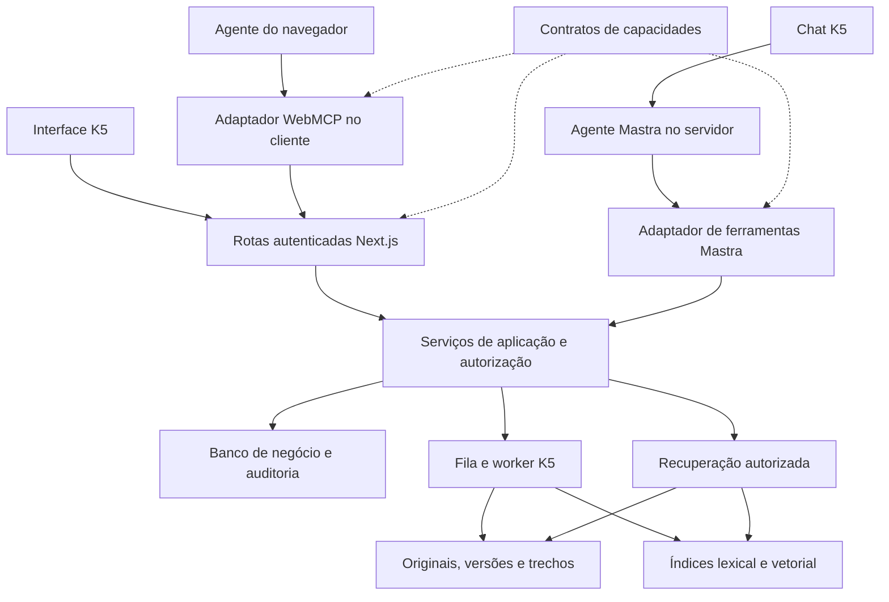

# Plano: agente operacional, Cofre como base de conhecimento e WebMCP

Plano original: 17 de setembro de 2026. Revisão de implementação: 18 de setembro de 2026. Status: implementação em andamento, após auditoria do código existente.

## Status de implementação — 18/09/2026 (revisado após auditoria)

A revisão anterior marcou as etapas 0 a 6 como concluídas. A auditoria do código apontou que as
etapas 3, 4 e 5 não estavam, e encontrou defeitos de segurança alcançáveis por uma sessão
autenticada. Este quadro substitui aquele.

| Etapa | Situação real | O que foi corrigido |
| --- | --- | --- |
| 0. Contratos e compatibilidade | Concluído. | Acrescentado o campo de publicação previsto na seção 4: papel decide o que a pessoa pode fazer, publicação decide qual adaptador pode oferecer. |
| 1. Serviços compartilhados | Concluído, com defeitos corrigidos. | Idempotência passou a funcionar (a chave era removida pela validação antes do executor vê-la) e a canonicalização de aprovação passou a cobrir campos aninhados. |
| 2. Agente operacional | Concluído, com defeitos corrigidos. | Histórico volta ao modelo com as chamadas de ferramenta; orçamento de chamadas e detecção de repetição; injeção fixa de 70 mil caracteres removida em favor da recuperação por ferramenta. |
| 3. Cofre indexável | **Não estava concluído.** Havia esquema, sem pipeline. | Perfil de embedding próprio, trabalho durável de indexação com checkpoint por ordinal, livro-razão de publicação e geração por modelo/dimensão. |
| 4. RAG no agente | **Não estava concluído.** O caminho vetorial era inalcançável em produção: `queryVector` era argumento do modelo e nada gerava embeddings, então toda busca real devolvia `degraded: true`. | Vetor da consulta gerado no servidor, índice atrás de um adaptador com filtro empurrado para dentro da consulta, e degradação explicada quando a busca semântica não está disponível. |
| 5. WebMCP | **Não estava concluído.** Sem `inputSchema`, sem validação, sem checagem de `res.ok`, com resultados fabricados no cliente. | Schema emitido do contrato Zod, falhas tipadas, downloads resolvidos pelo servidor e corrida de registro no duplo mount corrigida. |
| 6. Cobertura e expansão | Concluído para as operações implementadas. | Ambos os adaptadores passam por um único `runCapability`, de modo que a política de papéis do contrato vale também no caminho HTTP. |

Defeitos de segurança corrigidos, cada um com teste de regressão:

| Defeito | Alcance |
| --- | --- |
| Travessia de caminho: `uploadRef` do chamador virava `stored_name` e a rota de download servia o arquivo resultante. | Leitura de arquivo arbitrário, inclusive originais de outro escritório em `.data/uploads`. |
| Ressurreição de tombstone: a exclusão deixava o documento em `failed`, exatamente o estado que o reprocessamento aceita, e nenhum dos dois checava `deleted_at`. | Documento excluído voltava à busca. |
| `k5_session_end_global` publicado como ferramenta nos dois adaptadores. | Texto em documento ingerido derrubava todas as sessões da pessoa. |
| Chave de provedor como argumento de ferramenta. | Contraria diretamente a seção 5.3. |
| Idempotência sem verificação de hash, capacidade ou pessoa. | Um membro replicava a chave de outro e lia a resposta dele. |

Validação: `pnpm lint`, `pnpm typecheck`, `pnpm test` (63 testes) e `pnpm build` passam. As
migrações 0007 e 0008 foram aplicadas na base local sem perda de dados.

O que continua pendente e **não** deve ser lido como concluído:

- Qualidade com acervo real. As metas de recall e latência da seção 11 não foram medidas; não há
  conjunto de avaliação em pt-BR construído.
- Interoperabilidade WebMCP nativa. O adaptador foi exercitado contra um `modelContext` simulado,
  o que valida contrato e ciclo de vida, não compatibilidade com um navegador real.
- Aprovação de produção.

## 1. Resultado esperado

O agente K5 deve conseguir executar as operações que o usuário pode executar no sistema: encontrar documentos, organizar materiais, iniciar análises, acompanhar tarefas, editar resultados e exportar arquivos. O Cofre será a entrada e a fonte de verdade documental do RAG. A aplicação também disponibilizará essas capacidades a agentes de navegador por WebMCP.

A proposta é um catálogo de capacidades com três consumidores: interface convencional, ferramentas Mastra no servidor e ferramentas WebMCP no navegador. As regras de negócio e autorização serão compartilhadas. A cobertura será por operação de produto, não por clique ou elemento visual.

“Operar o sistema inteiro” significa cobertura completa das operações disponíveis ao usuário autenticado. Não concede acesso a outro escritório, conversas de outras pessoas, administração da plataforma ou credenciais. Módulos ainda não implementados entram no contrato de evolução; registrar ferramentas que simulam operações inexistentes não satisfaz a cobertura.

Este plano complementa o [plano de IA do MVP](plano-ia-mvp.md). Preserva suas decisões sobre seleção de materiais, citações jurídicas e processamento durável, e amplia a atuação do agente. A entrega original foi somente documental; a implementação foi autorizada em 18/09/2026. As seções de arquitetura e critérios abaixo continuam sendo a referência, enquanto o quadro de status registra sua execução.

## 2. Estado original encontrado em 17/09/2026

| Área | Evidência local | Consequência para o plano |
| --- | --- | --- |
| Runtime Mastra | [ai-runtime.ts](../apps/web/src/lib/ai-runtime.ts) cria `Agent` sem `tools`; [chat/route.ts](../apps/web/src/app/api/chat/route.ts) usa `maxSteps: 1` | O agente conversa, mas ainda não executa operações do produto. |
| Transporte do chat | A rota consome somente `textStream`, persiste partes de texto e monta o histórico como texto | Acrescentar ferramentas exige preservar chamadas, resultados, fontes e estados de execução no streaming e no histórico. |
| Cofre | [vault.ts](../apps/web/src/lib/vault.ts) e [migração 0003](../apps/web/db/migrations/0003_vault.sql): casos, biblioteca, upload, download, processamento e nova tentativa | Reutilizar serviços existentes; edição, exclusão e versionamento de originais ainda precisam de implementação própria. |
| Ingestão | [document-extraction.ts](../apps/web/src/lib/document-extraction.ts): PDF/OCR, DOCX, EML, XLSX, CSV e TXT; limite atual de upload de 50 MB | Preservar extratores e referências por página, parágrafo, mensagem ou célula. `.msg` não é suportado. |
| Recuperação documental | `getDocumentChunks()` usa SQLite FTS5/BM25; [ai-sources.ts](../apps/web/src/lib/ai-sources.ts) restringe aos documentos selecionados | Já existe recuperação lexical usada na geração. Não há embeddings nem índice vetorial; não apresentar isso como ausência total de RAG. |
| Limites atuais do chat | Até 100 IDs de documentos; 20 trechos e 70 mil caracteres inseridos nas instruções | Substituir injeção fixa por recuperação como ferramenta, com limites de tokens e fontes estruturadas. |
| Documentos gerados | [document-workflows.ts](../apps/web/src/lib/document-workflows.ts), [ai-store.ts](../apps/web/src/lib/ai-store.ts) e [worker.ts](../apps/web/scripts/worker.ts) | Já existem cronologia, minuta, fila, concessões temporárias, checkpoints, cancelamento, retomada, edição com versão e DOCX. |
| Propriedade dos dados | Cofre pertence ao escritório; conversas, execuções e artefatos usam `office_id` e `user_id` | Não ampliar compartilhamento ao adaptar as operações para ferramentas. |
| Papéis | [session.ts](../apps/web/src/lib/session.ts), [workspace-api.ts](../apps/web/src/lib/workspace-api.ts) e [README do app](../apps/web/README.md) | `reviewer` é somente leitura; hoje também não pode enviar chat nem criar conversas. Alterar isso seria uma decisão separada. |
| Navegação | [navigation.ts](../apps/web/src/lib/navigation.ts) e [página genérica](../apps/web/src/app/app/[section]/page.tsx) | Central de comando, Espaços, Inteligência contratual e Pesquisa ainda mostram “Em breve”. |
| Plataforma | [ai-connections-core.ts](../apps/web/src/lib/ai-connections-core.ts), [platform-core.ts](../apps/web/src/lib/platform-core.ts) e [variáveis de exemplo](../apps/web/.env.example) | Conexões por escritório, segredos cifrados, papéis separados e auditoria devem continuar sob controle do servidor. |
| Dependências | [package.json](../apps/web/package.json) e [lockfile](../pnpm-lock.yaml) | Base verificada: `@mastra/core` 1.67.0, `@mastra/ai-sdk` 1.10.3, AI SDK 7.0.102, Zod 4.6.5 e Next.js 16.3.5. Não há `@mastra/rag` ou adaptador vetorial instalado. |

Antes de publicar resultados como ferramentas, corrigir a fronteira de DTOs: a listagem do Cofre já usa projeção pública, mas os endpoints de detalhe e upload retornam o objeto de `findVaultDocument()`, que inclui nome interno do arquivo e dados de lease. Os adaptadores novos devem devolver somente o contrato público; não copiar esses retornos diretamente.

## 3. Arquitetura proposta

Separar os contratos serializáveis dos executores `server-only`. O bundle cliente recebe nomes, descrições, schemas e adaptadores HTTP, nunca código de acesso a banco, chaves ou imports dos executores Mastra. As ferramentas internas chamam os serviços diretamente; não precisam fazer HTTP de volta à própria aplicação nem transportar cookies ao modelo.

Extrair regras hoje embutidas nas rotas, sobretudo criação/cancelamento de tarefas e aprovações de citações, para serviços compartilhados. Os serviços recebem contexto confiável criado no servidor. Chamadas do navegador continuam passando pela autenticação e proteção de origem das rotas. Não criar um endpoint que aceite nomes arbitrários de funções para executá-las.

Manter inicialmente o worker e os checkpoints SQL do K5 como responsáveis pela durabilidade. Mastra coordena geração e ferramentas, mas não substitui automaticamente fila, retries, autorização ou persistência. Ferramentas de tarefas longas retornam `runId`/`jobId` e estado; a execução continua fora da requisição de chat.

## 4. Contrato de capacidade e autorização

Cada capacidade deverá declarar:

| Campo | Regra proposta |
| --- | --- |
| Identidade | Nome estável, por exemplo `k5_vault_list_documents`, versão de contrato e módulo proprietário. Usar a mesma chave no registro Mastra e no manifesto WebMCP. |
| Entrada/saída | Zod como fonte do contrato; JSON Schema serializável para navegador. Entradas estritas, limites explícitos, paginação e DTOs pequenos. |
| Política | Papéis, propriedade, escopo documental, efeito de leitura/escrita, limite de uso e necessidade de interação humana. |
| Execução | Serviço autorizado, idempotência quando houver escrita, timeout, cancelamento e eventual retorno de tarefa. |
| Publicação | Disponibilidade em UI, Mastra, WebMCP ou fluxo assistido; disponibilidade de produto e motivo de qualquer exceção. |
| Observabilidade | Identificador de requisição/chamada, ator, escritório, recurso, resultado e referência à auditoria, sem documentos completos ou segredos. |

Contexto interno sugerido: usuário, escritório, vínculo/papel atual, referência de sessão não exposta, conversa/execução, escopo de conhecimento validado e identificador de requisição. `officeId`, `userId`, papel, SQL, caminhos de arquivo, URLs de provider e filtros livres do índice não serão argumentos controláveis pelo modelo nas ferramentas de negócio.

Na entrada HTTP, reutilizar `requireWorkspace()` e os guardas de origem. Consolidar gradualmente o caminho próprio de `requireVaultWorkspace()` sob a mesma política. Antes de cada chamada relevante e retomada, conferir vínculo, propriedade e revogação; um contexto validado no início não deve autorizar indefinidamente uma execução longa. A cache de sessão por requisição não substitui essa verificação.

Para tarefas duráveis, gravar o ator e uma referência de autorização da execução, sem copiar o cookie. Fechar a aba não cancela a tarefa. Como proposta coerente com revogação imediata, logout global ou revogação da sessão bloqueiam novas etapas privilegiadas; a próxima sessão pode solicitar retomada após revalidação. Mudança para `reviewer`, remoção do escritório ou desativação da conexão também bloqueiam novas operações correspondentes. O código atual já verifica vínculo e lease, mas precisa dessa política explícita para sessão.

Operações comuns, reversíveis e solicitadas pelo usuário, como criar um caso, não precisam de confirmação adicional por padrão. Exclusão, substituição de conteúdo existente e operações administrativas sensíveis exibem o efeito concreto antes de executar. A seleção de autoridades jurídicas continua exigindo manifestação humana explícita.

Persistir propostas/aprovações necessárias em registro K5 vinculado a ator, escritório, operação, argumentos normalizados, versão do recurso, prazo e uso único. O modelo pode solicitar uma aprovação; não pode produzi-la nem concedê-la a si próprio. UI, Mastra e WebMCP devem consumir a mesma decisão. Alterar argumentos ou versão invalida a aprovação anterior.

Idempotência deve sobreviver a recarregamento, retry do provider e regeneração do chat: identificar a intenção persistida e associá-la à operação e aos argumentos, com unicidade no banco. Apenas usar um `toolCallId` novo a cada tentativa não impede duplicação. Resultado ambíguo depois de timeout deve ser consultado antes de repetir uma escrita.

Padronizar resultados em estados como `completed`, `queued`, `requires_user_input`, `requires_approval` e `failed`, com `data`, `operationId` e próximo passo quando aplicável. Erros terão códigos estáveis, por exemplo `UNAUTHENTICATED`, `FORBIDDEN`, `NOT_FOUND`, `CONFLICT`, `SCOPE_REQUIRED`, `NOT_READY` e `RATE_LIMITED`. Somente falhas transitórias elegíveis serão repetidas automaticamente; negação de acesso e conflito exigem corrigir a causa.

## 5. Matriz de cobertura

Os nomes abaixo são propostos. **Existente** indica regra de negócio presente que precisa ser extraída/adaptada; **nova** indica trabalho funcional adicional. Leituras respeitam o papel atual; escritas no escritório são de `administrator`/`lawyer`. Conversas, tarefas e artefatos preservam o proprietário atual.

### 5.1 Operações existentes a disponibilizar

| Operação | Ferramenta proposta | Entrada e retorno principais | Execução/condição |
| --- | --- | --- | --- |
| Listar casos | `k5_vault_list_cases` | Cursor → casos e próximo cursor | Existente; acrescentar paginação. |
| Criar caso | `k5_vault_create_case` | Nome → caso criado | Existente; idempotente. |
| Listar/filtrar materiais | `k5_vault_list_documents` | Biblioteca/caso, estado, cursor → metadados | Existente; não recuperar conteúdo implicitamente. |
| Consultar documento e progresso | `k5_vault_get_document` | ID → DTO e estado de processamento | Existente; sanitizar retorno interno. |
| Enviar arquivo | `k5_vault_ingest_upload` | Referência de upload, destino/caso → documento e tarefa | Upload existente; ponte de anexo nova, descrita abaixo. |
| Baixar original | `k5_vault_download_document` | ID → ação/link autenticado de download | Existente; sem caminho local ou URL pública permanente. |
| Reprocessar falha | `k5_vault_retry_ingestion` | ID → estado da fila | Existente; somente estado permitido. |
| Listar/criar/abrir conversas | `k5_conversations_list`, `k5_conversations_create`, `k5_conversations_get` | Cursor ou ID → conversas/histórico autorizado | Existente; contexto privado do usuário. |
| Excluir conversa | `k5_conversations_delete` | ID → resultado | Existente; aprovação e bloqueio se estiver em processamento. |
| Criar cronologia | `k5_documents_start_chronology` | Escopo documental e instruções → execução | Existente; processamento exaustivo com checkpoint por trecho. |
| Criar minuta | `k5_documents_start_draft` | Escopo, modelo, instruções e referência de aprovação → execução | Existente; não aceitar citações “aprovadas” pelo agente. |
| Acompanhar execuções | `k5_runs_list`, `k5_runs_get` | Cursor/ID → estado, progresso, erro e artefato | Existente; leitura curta, sem polling em loop de LLM. |
| Cancelar/retomar falha | `k5_runs_cancel`, `k5_runs_retry` | ID → estado confirmado | Existente; revalidar fontes, papel e limites ao retomar. |
| Consultar citações candidatas | `k5_citations_list_candidates` | IDs autorizados → trechos e fontes | Existente; candidato não equivale a autoridade aprovada. |
| Ler documento gerado | `k5_artifacts_get` | ID → conteúdo, versão, referências e pendências | Existente; não listar artefatos de terceiros. |
| Editar documento gerado | `k5_artifacts_update` | ID, versão esperada, título/conteúdo → nova versão | Existente; mostrar alteração proposta e preservar conflito 409. |
| Exportar DOCX | `k5_artifacts_export_docx` | ID/versão → ação/link autenticado | Existente; reutilizar exportador e template autorizado. |
| Selecionar fontes/modelo e abrir resultados | `k5_context_set_sources`, `k5_ui_open_resource` | IDs validados → contexto persistido ou destino de UI | Hoje há estado de UI; persistência/ponte é nova. Links e navegação devem usar allowlist interna. |
| Enviar/cancelar resposta do chat | Entrada nativa de conversa; `k5_chat_stop` para a ponte de navegador | Mensagem/conversa ou resposta em curso → estado | Manter transporte autenticado; não dar ao agente uma ferramenta para chamar recursivamente o próprio chat. |
| Sair de todas as sessões | `k5_session_end_global` | Interação humana → logout | Reutilizar Better Auth; ação terminal que remove ferramentas da página. |

Upload não pode ser resolvido pedindo ao LLM um caminho do computador. O usuário seleciona ou anexa um arquivo; o servidor emite uma referência opaca de upload vinculada ao usuário/escritório, com expiração e uso controlado. A ferramenta confirma destino e enfileira ingestão. WebMCP pode abrir o fluxo de seleção de arquivo; se o navegador não permitir automatizá-lo, retorna `requires_user_input` e retoma após seleção humana. Conteúdo binário/base64 não circula no prompt.

### 5.2 Novas operações do Cofre/RAG

| Capacidade | Ferramenta proposta | Requisito |
| --- | --- | --- |
| Buscar conhecimento | `k5_knowledge_search` | Recuperação híbrida com escopo validado, fontes e diagnóstico de cobertura. |
| Ler evidência específica | `k5_knowledge_get_source` | Documento/versão/trecho autorizados, contexto adjacente limitado e link à origem. |
| Consultar indexação | `k5_knowledge_get_index_status` | Estado por documento/versão, falhas e índice ativo. |
| Reindexar | `k5_knowledge_reindex` | Tarefa idempotente; não refazer OCR se extração válida já existe. |
| Ajustar nome/destino | `k5_vault_update_document` | Atualizar metadados/caso com autorização e invalidação dos filtros do índice. |
| Substituir original | `k5_vault_add_document_version` | Novo upload e versão imutável; referências antigas continuam resolvíveis conforme retenção. |
| Remover documento | `k5_vault_delete_document` | Aprovação, tombstone imediato e limpeza de índices/arquivos conforme retenção definida. |
| Atualizar/remover caso | `k5_vault_update_case`, `k5_vault_delete_case` | Definir destino dos documentos antes de excluir; não remover conteúdos em cascata implicitamente. |
| Inspecionar/restaurar versão de artefato | `k5_artifacts_list_versions`, `k5_artifacts_restore_version` | Tabela de versões já existe, mas não há essas operações públicas; restauração gera nova versão. |

### 5.3 Plataforma e módulos futuros

Para usuários com papel de plataforma, criar catálogo separado: `k5_platform_list_offices`, `k5_platform_list_connections`, `k5_platform_create_connection`, `k5_platform_update_connection`, `k5_platform_test_connection` e `k5_platform_delete_connection`. Cobrir metadados, atribuições por tarefa, ativação/desativação, teste e exclusão. Escritório-alvo só é aceito nesse catálogo após autorização de plataforma. Não publicar essas ferramentas no agente comum do escritório.

Criar conexão ou trocar chave envolve formulário humano seguro: a ferramenta prepara a configuração e recebe uma referência opaca de segredo já submetido ao servidor. Nunca solicita a chave no chat, a devolve ao LLM ou a publica como campo de ferramenta WebMCP. Concessão de administrador de plataforma e rotação da chave mestra permanecem no fluxo operacional/CLI existente, registrados como exceções fora das features do app web. Login, cadastro e entrada de senha continuam em formulários humanos; cobertura não exige dar senhas a agentes.

| Módulo | Situação | Contrato para evolução |
| --- | --- | --- |
| Central de comando | Placeholder | Quando houver resumos/ações, compor consultas dos serviços existentes e mapear cada ação para capacidade. Não criar outro chat por conveniência. |
| Espaços | Placeholder | Definir entidades, compartilhamento e permissões antes de ferramentas; não presumir que “espaço” e “caso” são equivalentes. |
| Inteligência contratual | Placeholder | Definir operações de análise/comparação e evidências; reutilizar Cofre, RAG e tarefas duráveis. Exemplos são direção, não funcionalidades já aprovadas. |
| Pesquisa | Placeholder | Busca interna pode reutilizar RAG. Pesquisa jurídica externa depende de nova definição de produto/fontes; continua fora do MVP atual. |

Critério permanente de entrega: toda operação nova de módulo terá serviço autorizado, contrato, adaptadores aplicáveis, testes de paridade e estado de disponibilidade. Um inventário versionado ligará ação de UI/rota à capacidade ou exceção justificada. CI verificará a integridade desse inventário; revisão humana verificará se alguma ação de produto ficou fora dele. Uma ferramenta genérica de SQL, HTTP ou execução de código não substitui essa cobertura.

## 6. Integração Mastra

### 6.1 Ferramentas e seleção

Usar `createTool` com schemas de entrada/saída e `execute(inputData, context)`. Vincular as ferramentas ao `Agent`, filtradas por contexto e disponibilidade. A API permite ferramentas dinâmicas e seleção via `activeTools`; a autorização efetiva permanece no executor. Esses pontos foram conferidos nas [docs de ferramentas](https://mastra.ai/docs/agents/tools) e nas declarações instaladas de `@mastra/core` 1.67.0.

Usar `RequestContext` para transportar o contexto confiável entre agente, ferramentas e workflows, com `requestContextSchema` para validar sua forma. Isso não autentica o usuário: o contexto nasce da sessão K5 e nunca de um objeto arbitrário recebido no corpo da requisição. Separar os perfis de conversa com ferramentas dos agentes de extração/redação, que continuam com acesso mínimo. [Request context do Mastra](https://mastra.ai/docs/server/request-context).

Começar registrando o catálogo operacional autorizado completo se couber no orçamento de contexto. Com crescimento, selecionar conjuntos por módulo e manter descoberta de capacidades que permita chegar a todas as operações autorizadas. Seleção deve afetar custo e relevância, sem tornar funcionalidades permanentemente inacessíveis.

Substituir `maxSteps: 1` no chat por orçamento finito, inicialmente oito etapas e um limite independente de chamadas/custo, ajustado por avaliação. Detectar repetição da mesma chamada e interromper loops com mensagem acionável. Não aumentar limites dos extratores por consequência desse ajuste.

Validar tool calling, schemas, streaming e sequência chamada/resultado nos modelos de conversa realmente habilitados por escritório. Um modelo aceito pelo roteador não garante suporte a todas essas capacidades. Incompatibilidade deve produzir erro de configuração acionável, sem responder como se uma operação tivesse ocorrido e sem trocar silenciosamente de provider/credencial.

### 6.2 Streaming, histórico e interação humana

Adotar o adaptador Mastra/AI SDK compatível com a versão instalada ou uma conversão equivalente verificada. `handleChatStream` suporta `version: 'v7'`, que deve ser explícita para o AI SDK 7 do K5; o padrão documentado é v5. Configurar envio de fontes quando aplicável e resultados documentais próprios, sem assumir que o adaptador gere citações automaticamente. [Referência de handleChatStream](https://mastra.ai/reference/ai-sdk/handle-chat-stream).

Preservar eventos de ferramentas, resultado, fonte, erro e aprovação; a UI atual não pode continuar filtrando tudo para texto. Armazenar o histórico canônico no K5, incluindo IDs de chamadas e estados, sem confiar em resultados de ferramentas reenviados pelo cliente. Antes de reenviar evidências antigas ao modelo, revalidar o acesso e reidratar as fontes; remover do contexto trechos cujo acesso foi revogado ou cuja inclusão não pertence ao escopo atual. Histórico não pode funcionar como desvio da política de recuperação.

A rota continuará aceitando apenas campos permitidos, reconstruindo histórico e contexto no servidor. Não espalhar o corpo recebido em opções Mastra: cliente/modelo não escolhem ferramentas administrativas, instruções de sistema, contexto autenticado ou aprovação. Preservar o filtro de fundamentação jurídica durante a migração do streaming; fontes estruturadas não dispensam a política existente.

`requireApproval` e APIs de retomada do Mastra podem fornecer a interação do agente. A decisão persistida é do K5 e deve funcionar também via WebMCP. Para a primeira entrega, uma ferramenta pode devolver uma proposta pendente e encerrar o turno; a aprovação autenticada executa a operação idempotente e um novo turno recebe o resultado. Retomar diretamente um run suspenso Mastra exige antes configurar e testar armazenamento persistente e reconstrução após reinício; um `new Mastra()` por requisição não oferece essa garantia sozinho. A API de suspensão exige encerrar o caminho de execução após suspender, sem continuar efeitos posteriores. [Interação humana no Mastra](https://mastra.ai/docs/agents/human-in-the-loop).

Cancelamento de resposta interrompe o streaming e novas chamadas do agente. Tarefas já aceitas continuam visíveis e só são canceladas pela operação própria. Regenerar a resposta não repete mutações confirmadas nem apaga sua auditoria. Proibir execução paralela de escritas conflitantes e usar versão esperada ao editar artefatos.

## 7. Cofre como entrada do RAG

As primitivas documentadas pelo Mastra cobrem segmentação, embeddings, armazenamento e recuperação; upload, OCR, controle de acesso, versões e retenção continuam como responsabilidades do K5. A integração proposta usa essas primitivas dentro do pipeline existente. [Visão geral do RAG Mastra](https://mastra.ai/reference/rag/overview).

| API/primitiva verificada | Uso previsto no K5 |
| --- | --- |
| [MDocument](https://mastra.ai/reference/rag/document) | Receber conteúdo já extraído e metadados de origem; não substituir automaticamente leitores de PDF/DOCX/planilha. |
| [Chunking e embeddings](https://mastra.ai/reference/rag/chunking-and-embedding) | Avaliar segmentação por tokens/estrutura e `embedMany`. Há exemplos com `size` e `maxSize` em páginas diferentes: validar a assinatura da versão escolhida. |
| [createVectorQueryTool](https://mastra.ai/reference/tools/vector-query-tool) | Pode devolver contexto e fontes; usar internamente somente se preservar os filtros obrigatórios. A ferramenta pública K5 controla escopo e índice. |
| [Filtros de metadados](https://mastra.ai/reference/rag/metadata-filters) | Confirmar no backend escolhido a interseção obrigatória escritório/documentos/geração, inclusive conjunto vazio. |
| [PgVector](https://mastra.ai/reference/vectors/pg) | Candidato a adaptador de índice com upsert, consulta e remoção; validar infraestrutura e comportamento real antes da escolha final. |

Selecionar versões compatíveis de `@mastra/rag` e do adaptador vetorial na etapa de implementação, verificar tipos e peer dependencies e atualizar o lockfile de forma controlada. Os pacotes não estão instalados hoje; nomes de APIs documentados não garantem compatibilidade de qualquer combinação futura de versões.

### 7.1 Modelo de dados e armazenamento

Manter originais e extrações como fonte de verdade; o índice vetorial é derivado e reconstruível. A memória da conversa não é a base de conhecimento do escritório.

Adicionar por migrações incrementais, sem recriar a base local:

| Registro proposto | Conteúdo mínimo |
| --- | --- |
| Versão documental | Escritório, documento, versão, hash do original, local de armazenamento, autor, data e versão ativa. |
| Manifesto de extração | Versão do extrator/OCR, referências de origem, cobertura e falhas por unidade. |
| Trecho versionado | Escritório, documento/versão, ID estável, referência, offsets, ordinal, hash e texto. |
| Trabalho de ingestão/indexação | Etapa, lease, tentativa, checkpoint, erro seguro, progresso e cancelamento. |
| Geração de índice | Perfil de embedding, modelo/revisão, dimensão, chunker, índice físico, geração ativa e contagem esperada/publicada. |
| Escopo de conhecimento | Conversa/execução, ator, documentos/versões, autorização para biblioteca/caso e data. |
| Evidência de recuperação | Execução, consulta/redação ou hash conforme retenção, IDs de fontes, estratégia, scores e versão do índice. |
| Aprovação/auditoria de operação | Intenção, ator, argumentos normalizados, validade, consumo e resultado idempotente. |

IDs de trecho atuais dependem do conteúdo e não substituem uma versão documental explícita. Backfill cria versão inicial para os documentos existentes, mantendo mapeamento dos IDs já citados. Reindexar nunca pode transformar uma referência antiga em um texto diferente. Não indexar automaticamente minutas geradas como evidência factual: ingresso na biblioteca deve ser uma ação explícita com origem/tipo identificados.

**Direção de infraestrutura:** avaliar PostgreSQL com pgvector como alvo de produção, coerente com a migração já prevista no README. Não exigir migrar todo o banco transacional como primeiro passo: um adaptador de índice pode usar PostgreSQL separado enquanto o K5 local mantém SQLite/FTS5. A escolha final depende de ambiente e teste de filtros, exclusão, backup e latência. Um fornecedor vetorial diferente deve satisfazer o mesmo contrato.

Adicionar perfil `embedding` separado de `chat`, `extraction` e `drafting`, inclusive esquema, UI administrativa, credenciais, uso e teste de conexão. Não presumir que todo provider/modelo atual suporta embeddings. Modelo e dimensão ficam fixos por geração; consultas usam exatamente o mesmo perfil. Trocar modelo cria nova geração, sem misturar vetores incompatíveis. Reranking é opcional e depende de evidência de ganho, orçamento e provider suportado.

### 7.2 Pipeline de ingestão

1. Validar arquivo, tamanho, tipo, destino e autorização. Aplicar limites de descompressão/extração e de conteúdo, além dos 50 MB do arquivo. Deduplicar por escritório, hash e versão de pipeline, sem deduplicação que revele dados entre clientes.
2. Persistir original/versão e enfileirar trabalho durável. Preservar leases e checkpoints já existentes; não executar OCR/embeddings na requisição de chat.
3. Extrair com os adaptadores atuais; registrar páginas/unidades esperadas, concluídas e com falha. Reutilizar OCR concluído após interrupção.
4. Segmentar por estrutura da origem, com tamanho em tokens e overlap configuráveis. Preservar vínculos com páginas/parágrafos/células; não substituir os extratores por uma quebra genérica de texto que perca referências. Avaliar `MDocument` onde ajudar na segmentação.
5. Publicar trechos lexicais e gerar embeddings em lotes limitados, com retries transitórios, backoff, quota por escritório e checkpoints. Guardar IDs determinísticos por versão/trecho/perfil.
6. Verificar contagem e consistência antes de ativar a geração vetorial. Escritas em SQL e índice remoto não são transação única: usar outbox/checkpoints e publicação por geração para tolerar falhas entre ambos.
7. Exibir estado de extração e indexação separadamente. Um documento extraído pode estar disponível para busca lexical enquanto o índice semântico está pendente, se essa degradação estiver explícita.

Estados propostos de ingestão: recebido, extraindo, segmentando, indexando, disponível, falha e cancelado. O estado existente `ready` não deve passar a significar silenciosamente “tem embeddings”: migrar ou separar os estados com clareza.

Excluir documento remove imediatamente sua elegibilidade em consultas no banco de negócio e enfileira remoção física de índices e arquivos conforme retenção. Mesmo enquanto a limpeza remota estiver pendente, nenhuma fonte tombstonada pode ser devolvida. Mudança de caso/biblioteca também invalida filtros e caches; o banco continua sendo a autoridade durante a atualização assíncrona.

### 7.3 Recuperação conectada ao agente

`k5_knowledge_search` recebe consulta e referência de escopo; o servidor resolve os documentos/versões permitidos. O modelo não fornece um filtro vetorial livre. Proposta inicial: busca lexical + semântica, fusão por ranking, deduplicação e eventualmente reranking. Comparar com o FTS5 atual antes de fixar parâmetros.

Preservar seleção explícita como padrão. Permitir pedidos como “pesquise na biblioteca” ou “use todos os documentos deste caso” mediante escopo explícito registrado na conversa; apresentar os materiais resolvidos. Para tarefas exaustivas, congelar o conjunto e as versões ao iniciar. Não expandir automaticamente uma consulta sem resultado para outro caso ou para todo o escritório.

Aplicar filtros de escritório e escopo antes da busca, usando o mecanismo suportado pelo índice, e revalidar cada resultado contra o banco antes de enviar conteúdo ao modelo. Não depender de filtrar resultados de uma busca global depois do `topK`. A mesma política vale para leitura de trecho, citações, cache e download. Cache deve incluir escritório, escopo/permissões, versões e perfil do índice.

Retorno proposto: trechos limitados, `sourceId`, documento/versão, localização, nome, trecho citado, estratégia de recuperação, indicação de truncamento e link autenticado. Scores são sinais de ranking, não probabilidade de verdade. Começar com até 12 resultados finais e teto de tokens; ajustar pelos testes. O agente pode pedir contexto adjacente pela ferramenta de fonte, sem despejar todo o Cofre no prompt.

O runtime mantém o conjunto de fontes efetivamente recuperadas e verifica se citações finais pertencem a ele, com localização e versão válidas. A UI abre a evidência correspondente. Trechos de documentos e saídas de ferramentas são dados não confiáveis, nunca instruções para escolher ferramentas, aprovar ações ou ampliar escopo.

Sem resultado, responder “Não encontrei evidência nos materiais autorizados” e indicar filtros/cobertura; não inventar fonte. Em indisponibilidade de embeddings, permitir busca lexical explicitamente marcada como degradada. Sem fontes suficientes, não afirmar completude. Validação de origem não comprova validade jurídica.

Cronologias continuam percorrendo todos os trechos do conjunto congelado, com relatório de cobertura. RAG por similaridade ajuda perguntas e redação, mas não substitui revisão exaustiva. Preservar aprovação explícita de autoridades jurídicas e separação entre fatos do caso e exemplos de estilo do template.

## 8. WebMCP na aplicação

### 8.1 Situação verificada e decisão

WebMCP expõe ferramentas da página para agentes de navegador. Não equivale a hospedar um servidor MCP remoto, e não conecta automaticamente o agente Mastra interno ao navegador. A integração interna usa ferramentas de servidor; a integração WebMCP usa a página autenticada e suas rotas. Um `MCPServer` Mastra, se desejado futuramente para clientes remotos, seria outra superfície de autenticação e outro projeto.

A documentação do Chrome informa origin trial a partir do Chrome 149 e flag local `chrome://flags/#enable-webmcp-testing`. Há APIs imperativa e declarativa, descoberta mediante visita à página, exigência de isolamento de origem e Permissions Policy `tools`. Isso não estabelece suporte universal nem compatibilidade com qualquer agente externo. [Documentação oficial do Chrome](https://developer.chrome.com/docs/ai/webmcp).

O draft comunitário de 17/09/2026 não é um padrão W3C. Ele define `document.modelContext`, registro assíncrono e ciclo de vida com `AbortSignal`; exemplos antigos com `navigator.modelContext` não devem ser copiados sem conferir o runtime-alvo. O draft deixa `inputSchema` opcional e partes declarativas ainda incompletas; K5 sempre fornecerá schema explícito e verificará o navegador-alvo. [Especificação WebMCP](https://webmachinelearning.github.io/webmcp/).

A orientação imperativa atual do Chrome também usa `document.modelContext`: `registerTool` assíncrono, callback `(input, { signal })` e sinal separado de registro para remover a ferramenta. A documentação descreve mudanças de ciclo de vida no Chrome 153 e futura remoção de argumentos JSON em string no 155; isso reforça o teste por versão, sem presumir o navegador instalado. Planejar argumentos como objetos e distinguir remoção de registro de cancelamento de execução. [API imperativa do Chrome](https://developer.chrome.com/docs/ai/webmcp/imperative-api).

Decisão: integração imperativa, isolada em adaptador experimental, com detecção de capacidade e feature flag. A primeira etapa registra a versão exata do Chrome e o comportamento observado; compatibilidade com interfaces antigas só será incluída quando testada. Navegadores sem suporte mantêm todas as operações pela UI e pelo agente interno.

### 8.2 Implementação planejada

Criar componente cliente de registro no shell autenticado. Publicar capacidades gerais autorizadas da aplicação e capacidades específicas de página quando seu contexto estiver carregado. Não limitar a cobertura aos botões visíveis na rota atual: usar identificadores validados e navegação interna para alcançar os demais módulos.

Cada callback valida os argumentos, chama uma rota K5 autenticada e devolve resultado serializável pequeno, com erro de domínio previsível. Após mutação, atualizar/inutilizar os dados da UI e mostrar o resultado. Não usar cliques simulados como executor de uma operação que já tem serviço.

Recalcular o conjunto ao mudar sessão, papel, rota ou recurso. Remover registros/listeners ao desmontar e no logout; tratar dupla montagem do React e registro tardio após desmontagem. Encaminhar cancelamento ao `fetch`, sem prometer desfazer uma escrita já aceita. Sessão expirada resulta em instrução de login; nunca cadastro automático ou fallback anônimo.

Ferramentas administrativas só são registradas no contexto de plataforma após autorização. Não registrar formulários de senha/chaves. Não expor ferramentas entre origens por conveniência; manter a política restrita à própria origem e testar os cabeçalhos de implantação. Não habilitar `document.domain`. Declarar os hints apropriados (`readOnlyHint`, `untrustedContentHint`, `consequentialHint`) como metadados, sem usá-los para conceder acesso ou dispensar aprovação no servidor. Deixar `exposedTo` ausente no primeiro rollout. [Segurança de ferramentas WebMCP](https://developer.chrome.com/docs/ai/webmcp/secure-tools).

Tarefas demoradas retornam recibo e identificador, com ferramenta de consulta de estado. Downloads devolvem ação autenticada e podem exigir interação do navegador. Uploads e aprovações humanas usam o fluxo assistido da seção 5. Recursos de confirmação do navegador podem complementar a UX, mas a autorização fica no servidor.

Para formulários simples, avaliar API declarativa em etapa posterior, sem registrar a mesma ação duas vezes. Chrome documenta `toolname`, `tooldescription`, envio humano sem `toolautosubmit` e resposta de SPA com `SubmitEvent.agentInvoked`/`respondWith`; validar antes de adotar. [API declarativa do Chrome](https://developer.chrome.com/docs/ai/webmcp/declarative-api).

A primeira entrega não depende da conversão de todos os formulários. Não instalar polyfill como prova de suporte nativo; mocks servem para contrato e testes unitários, não para certificar interoperabilidade. Não depender do antigo `requestUserInteraction` de exemplos iniciais: a interação humana proposta é uma operação da UI K5, verificada no runtime escolhido.

## 9. Organização prevista do código

Os caminhos abaixo são propostas, não arquivos criados nesta entrega:

| Local | Responsabilidade |
| --- | --- |
| `src/lib/capabilities/` | Contratos públicos, catálogo de cobertura e política declarada, sem segredos. |
| `src/lib/application/` | Serviços de Cofre, conversas, tarefas, artefatos e plataforma com autorização compartilhada. |
| `src/lib/agent-tools/` | Adaptadores `createTool` e seleção do catálogo autorizado. |
| `src/lib/knowledge/` | Escopo, ingestão/indexação, perfis de embedding, recuperação e verificação de fontes. |
| `src/lib/webmcp/` | Adaptador cliente da API experimental e serialização de resultados. |
| `src/components/webmcp-provider.tsx` | Ciclo de vida no shell autenticado. |
| `src/app/api/` | Preservar endpoints; acrescentar rotas específicas para fontes, escopos, propostas/aprovações e novas operações necessárias. |
| `db/migrations/` e `scripts/worker.ts` | Evolução aditiva de dados, backfill, outbox e trabalhos de índice. |
| `tests/` | Paridade de capacidades, autorização, RAG, idempotência e testes de navegador. |

Permanecer em `apps/web` inicialmente. Mover contratos para `packages/` só quando houver outro consumidor real; usar `workspace:*` se isso acontecer. Seguir os guias Next.js distribuídos no pacote instalado para Route Handlers, fronteira servidor/cliente e segurança de dados.

## 10. Sequência de implementação e aceite

| Etapa | Entrega | Dependências | Saída verificável |
| --- | --- | --- | --- |
| 0. Contratos e compatibilidade | Inventário completo, políticas de acesso, spike de stream AI SDK e runtime WebMCP, decisão do índice/embedding | Estado atual | Versões/assinaturas registradas, todas as ações atuais mapeadas, fixtures de referência escolhidas. |
| 1. Serviços compartilhados | Extrair operações das rotas, DTOs seguros, idempotência, auditoria e propostas necessárias | 0 | Mesma ação pela UI ou serviço tem os mesmos dados, permissões e erros; sem ampliação de acesso. |
| 2. Agente operacional | Ferramentas dos módulos existentes, streaming/histórico completos, tarefas e interação humana | 1 | Pedido em português cria caso, inicia cronologia/minuta, acompanha, edita e exporta usando serviços reais. |
| 3. Cofre indexável | Versões, embedding, índice, outbox, backfill e manutenção do conhecimento | 1 e decisão de infraestrutura | Documentos antigos/novos indexados sem perder referências, reindexação retomável e remoção imediatamente efetiva em consultas. |
| 4. RAG no agente | Busca híbrida, escopo, fontes, verificação, degradação e avaliação | 2 e 3 | Respostas sustentadas por fontes autorizadas; nenhum vazamento e nenhuma alegação falsa de revisão exaustiva. |
| 5. WebMCP | Adaptador cliente, operações de leitura/escrita e fluxos assistidos | 1; ampliar conforme 2–4 | Fluxos reais funcionam no navegador-alvo e a UI funciona sem suporte WebMCP. |
| 6. Cobertura e expansão | Catálogo de plataforma, novas operações documentais, gate para módulos futuros | 1–5 | Cobertura de todas as operações implementadas, incluindo administração autorizada e exceções humanas documentadas. |

A infraestrutura WebMCP pode avançar após os serviços compartilhados, sem aguardar todo o RAG. Nenhuma etapa é considerada a entrega completa deste plano isoladamente. Os módulos placeholder só terão cobertura funcional quando suas operações forem definidas e implementadas.

Liberar por escritório com flags independentes para ferramentas do agente, recuperação semântica e WebMCP. Em rollback, desligar o adaptador afetado, manter UI/FTS5 disponíveis e preservar tarefas aceitas, registros de aprovação e dados versionados. Voltar o ponteiro do índice apenas para geração íntegra e compatível; não reverter apagando migrações ou documentos. Medir erros de ferramentas, recusas, tempo de indexação, fila, custo e falhas de fontes antes de ampliar o rollout.

## 11. Validação e critérios de conclusão

### Contratos, permissões e efeitos

- Testar cada capacidade pelos adaptadores Mastra e HTTP/WebMCP contra o mesmo serviço. Confirmar paridade de validação, resultado, status e auditoria.
- Usar dois escritórios e dois usuários no mesmo escritório para tentativas de acesso a documentos, conversas, tarefas, artefatos, versões, fontes e downloads alheios.
- Forjar escritório/papel/contexto, IDs de fonte, aprovação e resultados de ferramentas; o servidor deve rejeitar sem devolver conteúdo restrito.
- Revogar sessão/vínculo/papel durante execução e antes de retomada; impedir a próxima operação privilegiada. Verificar que fechar a aba preserva a tarefa autorizada.
- Repetir escrita após timeout, regenerar conversa e retomar worker após falha; não duplicar caso, upload, execução, versão ou aprovação consumida.
- Exercitar edição concorrente, cancelamento, leases expirados, quotas e falha entre escrita SQL e atualização vetorial.
- Conferir que segredo, nome interno de arquivo, cookie e conteúdo integral não aparecem em DTOs, bundle, logs, traces ou mensagens de erro.

### Conhecimento e qualidade

Criar conjunto de avaliação em pt-BR com documentos sintéticos ou autorizados: PDF digital/escaneado, DOCX, EML, XLSX, CSV e TXT; perguntas por sinônimo, número exato, datas conflitantes, tabelas, fontes ausentes, instruções maliciosas e documentos próximos pertencentes a outro escritório. Incluir acervo da ordem de mil páginas previsto no MVP, medindo tempo/custo e retomada.

Comparar FTS5 atual, vetorial e híbrido no mesmo conjunto. Medir recall@k com fontes esperadas, precisão das citações, afirmações sem suporte, resposta correta “sem evidência”, latência p50/p95 e consumo. Metas iniciais propostas: zero vazamento nos testes adversariais, 100% das referências exibidas resolvíveis e autorizadas, cobertura de 100% das unidades selecionadas para cronologia ou lacunas explicitadas; recall@10 de pelo menos 90% no conjunto rotulado, sem piora nos casos lexicais exatos. Calibrar metas de latência/custo na etapa 0 conforme ambiente e volume.

Verificar que alteração de modelo/dimensão exige nova geração; que busca usa o perfil correspondente; que exclusão/mudança de escopo vale também no cache; que migração/backfill não invalidam artefatos antigos; e que falha vetorial resulta em degradação explícita, não em mistura de dados ou fontes inventadas.

### Navegador e experiência

- Testar registro, descoberta e execução no Chrome nativo com configuração documentada; registrar versão, flags/token e recursos realmente disponíveis. Usar Inspector com dados sintéticos se enviar prompts a um serviço externo.
- Testar ambiente sem WebMCP, sessão expirada, troca de rota/papel, navegação de retorno, dupla montagem, cancelamento e tarefa que termina depois da saída da página.
- Validar seleção humana de arquivo, confirmação/recusa, erros de schema e operação que altera dados em outra tela.
- Conferir desktop, mobile, teclado e estados vazio, carregando, falha, aguardando usuário e concluído contra o [DESIGN.md](../apps/web/DESIGN.md): pt-BR, estados em texto simples, foco acessível, controles de toque e movimento reduzido.

Durante a implementação, executar da raiz `pnpm lint`, `pnpm typecheck` e `pnpm test`; ampliar os testes de autenticação e os testes documentais existentes. Para rotas/configuração/compilação, configurar o ambiente preservando segredos e dados, executar `pnpm db:setup` e `pnpm build`. Não tratar mocks de provider ou WebMCP como validação real de interoperabilidade.

## 12. Decisões pendentes e padrões propostos

| Decisão | Padrão recomendado para iniciar | Quando resolver |
| --- | --- | --- |
| Escopo padrão de busca | Documentos selecionados; biblioteca/caso mediante pedido explícito registrado | Etapa 0; evita ampliar silenciosamente a decisão do MVP. |
| Banco/índice de produção | PostgreSQL + pgvector, com adaptador e transição preservando SQLite local | Antes da etapa 3; testar filtros, operação e recuperação. |
| Embedding | Perfil por escritório com modelo/dimensão fixos por geração | Antes do backfill; não escolher somente pelo provider de chat. |
| Retenção/exclusão | Bloqueio imediato da busca; política explícita para originais, versões, cópias e auditoria | Antes de habilitar exclusão/substituição. |
| Armazenamento/runner | Reutilizar worker K5 no desenvolvimento; definir storage durável, backups e concorrência em produção | Antes do uso com acervo real em escala. |
| WebMCP | Experimental e opcional, navegador/versão testados, sem dependência para uso normal | Spike da etapa 0 e antes de cada rollout. |
| Acesso de `reviewer` ao chat | Preservar restrição atual | Só mudar mediante decisão específica de produto/permissões. |
| Módulos placeholder | Sem ferramentas operacionais até existir contrato funcional | Na especificação de cada módulo; gate de cobertura obrigatório. |

## 13. Registro desta entrega

Pesquisa e leitura do código realizadas em 17/09/2026. O plano distingue comportamento existente, recomendações do K5 e APIs documentadas. Links externos apontam para documentação viva e devem ser reconferidos no spike antes de implementação.

Validação desta entrega documental: 21 links locais conferidos, inventário confrontado com rotas/serviços, cercas Markdown e espaços finais verificados. A entrega final contém apenas este novo plano; a nota intermediária de pesquisa foi incorporada e removida. Nenhuma alteração de aplicação foi realizada. Lint, testes, build, migrações e testes reais de navegador não foram executados por se tratar de documentação; esses comandos são critérios da implementação futura.
