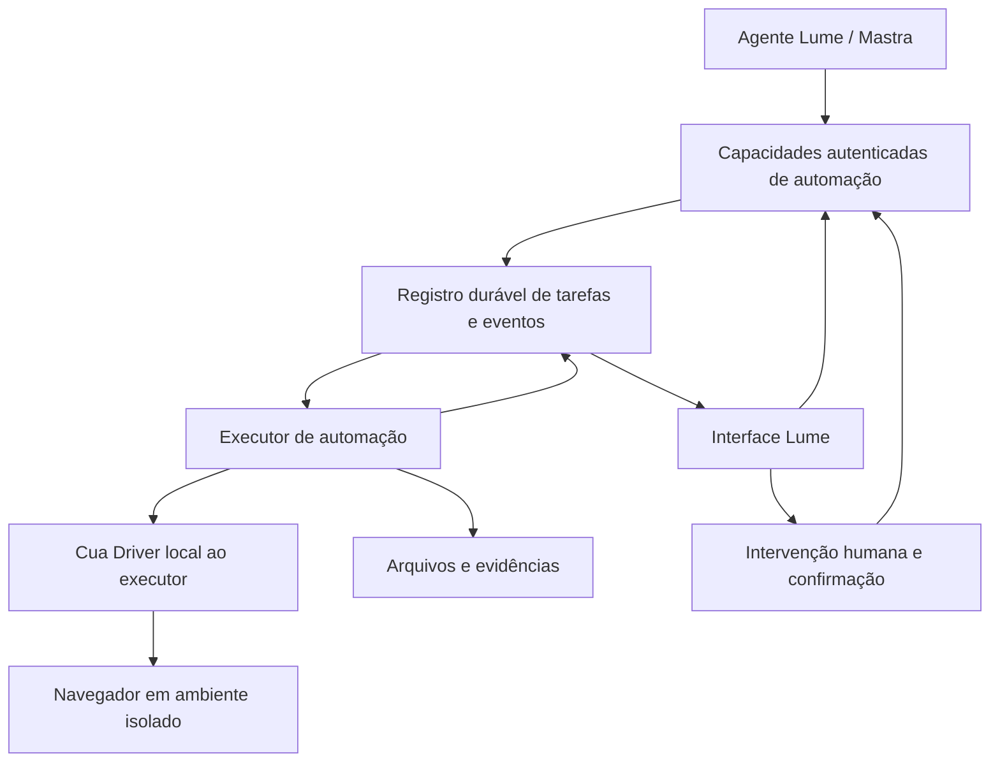

# Automação de navegador para o Lume — proposta inicial

Data: 22/09/2026. Status: em discussão; não autoriza implementação ou provisionamento.

Objetivo: oferecer ao agente Lume uma capacidade de operar sites por meio do Cua Driver,
com execução acompanhável, isolamento e resultados verificáveis.

Decisões confirmadas pelo usuário em 22/09/2026: navegador na nuvem, dedicado por sessão;
primeiro fluxo em `https://www.jusbrasil.com.br/jurisprudencia/`, pesquisar pelo campo,
obter um documento de inteiro teor e disponibilizá-lo ao Lume. R2 foi sugerido como
armazenamento; recomenda-se usar a integração existente com o Cofre. O usuário confirmou
início sem login e seleção automática dos resultados por relevância pelo Lume, com
possível apoio do Jev. Integração de conta Jusbrasil fica fora do primeiro escopo.

## 1. O que existe e o que precisaremos construir

O Cua Driver fornece controle de aplicações e navegadores. O SDK TypeScript atual
carrega um runtime nativo no processo; o executável oferece MCP por stdio. Ele não
resolve sozinho o produto de automação remota com escritórios, filas, credenciais e
acompanhamento. Fontes: [README oficial](https://github.com/trycua/cua/blob/main/libs/cua-driver/README.md)
e [pesquisa técnica](pesquisa-cua-driver.md), com revisão e limitações verificadas.

No K5, o encaixe já existe:

| Base existente | Uso proposto |
| --- | --- |
| [Catálogo de capacidades](../apps/web/src/lib/capabilities/contracts.ts) e [executor único](../apps/web/src/lib/agent-tools/index.ts) | Publicar ferramentas de automação com autorização e DTOs explícitos. |
| [Contexto autenticado](../apps/web/src/lib/application/context.ts) | Derivar escritório, usuário e papel no servidor; revalidar a autorização durante a execução. |
| [Tarefas de documentos](../apps/web/src/lib/application/runs-service.ts) | Reaproveitar o padrão de trabalho durável; criar domínio próprio para automações. |
| [Aprovações](../apps/web/src/lib/application/approvals-service.ts) | Reaproveitar o padrão de confirmação vinculada aos argumentos, ampliando-o para a ação e o estado observados no site. |
| [Armazenamento](../apps/web/src/lib/storage/index.ts) | Guardar arquivos e evidências com acesso autorizado; ingestão explícita dos resultados no Cofre. |

O [chat atual](../apps/web/src/app/api/chat/route.ts) limita cada resposta a 8 passos,
16 chamadas e 180 segundos. Uma tarefa de navegador deve sobreviver à desconexão do
chat. A tabela `ai_run` e seu worker são especializados em cronologia/minuta: não
basta acrescentar uma ferramenta que execute cliques dentro da requisição HTTP.

## 2. Duas decisões independentes

**Onde executar:**

| Opção | Consequência |
| --- | --- |
| Nuvem — escolhida | Lume provisiona e encerra o navegador, dedicado por sessão; login e perfis remotos precisam de fluxo próprio. |
| Computador do usuário | Um aplicativo auxiliar precisa ser instalado e pareado. Pode atender fluxos dependentes de sessões ou recursos locais; depende de a máquina estar disponível. |
| Híbrido | Mesmo contrato de tarefa com dois executores. Adiar a segunda implementação até existir um caso que a exija. |

**Quem decide os próximos cliques:**

| Opção | Consequência |
| --- | --- |
| Lume chama primitivas de navegador | Serviço controla sessões e executa ações; o loop do Lume precisa tornar-se durável e lidar com observações de browser. |
| Lume delega um objetivo a um executor especializado | Executor mantém seu próprio loop de observação/ação/verificação. Chat recebe progresso e resultado. Recomendação provisória para tarefas demoradas. |

Delegação não exige usar `cua-agent`. Podemos manter Mastra e o roteamento de modelos
do Lume, usando somente Cua Driver para atuar. O modelo executor precisa de configuração
explícita por escritório e, se usar screenshots, suporte a imagens; não presumir que
qualquer modelo selecionado no chat serve para esse papel. Orçamentos e uso devem incluir
esse segundo loop.

## 3. Topologia proposta para execução na nuvem

A aplicação web conserva autorização, propriedade das tarefas e integração com o Cofre.
O serviço de automação gerencia execução, ambiente do navegador e seu ciclo de vida.
Seu processo nativo roda separado do Worker web descrito em [ambientes](ambientes.md).
A hospedagem concreta permanece em aberto.

Proposta de organização: contratos compartilhados em `packages/browser-contracts`,
executor em `apps/browser-service` e integração de negócio em
`apps/web/src/lib/application/browser-service.ts`. São caminhos propostos, ainda inexistentes.
Contratos não devem importar dependências nativas para o bundle web.

Usar o SDK TypeScript dentro do executor é a primeira opção a experimentar. MCP stdio
local é outra integração possível, se trouxer melhor compatibilidade no protótipo.
O acesso remoto deve passar por uma interface autenticada nossa; não publicar sockets,
CDP ou interfaces internas do Driver na internet. O HTTP do Driver documentado na
pesquisa é um transporte local com limitações próprias, não um MCP remoto pronto
para atender o Lume.

## 4. Contrato que o Lume consome

Começar com três capacidades públicas:

- `k5_browser_start_task`: objetivo, endereço inicial, referências autorizadas de arquivos
  e perfil, quando houver. Retorna imediatamente uma tarefa identificada.
- `k5_browser_get_task`: estado, progresso, impedimento atual e resultado com referências
  às evidências e arquivos disponíveis.
- `k5_browser_cancel_task`: pede interrupção, reconhecida pelo executor, seguida de limpeza.

O servidor define o contexto de autorização, os destinos permitidos e os limites de
tempo, ações, custo e arquivos. O modelo não escolhe `officeId`, credenciais, tokens de
acesso remoto ou permissões. Retomar após login/aprovação é uma operação humana autenticada;
a ferramenta de consulta não permite ao agente aprovar a própria ação.

Exemplo de objetivo a validar com o usuário: consultar um registro em um portal,
baixar um documento e devolvê-lo ao Lume com URL de origem, instante da consulta e arquivo.
O serviço separa encontrar o arquivo, concluir seu download e confirmar sua ingestão no Cofre.

## 5. Execução, sessões e efeitos externos

- **Tarefa, sessão de browser e perfil são conceitos diferentes.** Tarefa é a intenção e
  seu histórico; sessão é um ambiente vivo; perfil contém estado de login que pode ser
  reutilizado sob autorização. Isolamento por escritório e usuário, com uma única execução
  controlando cada sessão/perfil por vez. Um perfil compartilhado pelo escritório exige
  decisão de produto própria.
- **Estado durável:** `queued`, `running`, `waiting_for_user`, `succeeded`, `failed`,
  `cancelled`, `expired` e `needs_review` para resultado externo incerto. Salvar eventos
  ordenados, concessão temporária ao executor, evidências e motivo de espera. Retomar
  a partir do estado atual observado, não repetir cegamente o histórico de cliques.
- **Recuperação:** chave de idempotência evita duplicar a solicitação; concessão e número
  de geração impedem dois executores ativos na mesma sessão. O gateway de ações precisa
  recusar um executor cuja concessão expirou. Persistência não garante execução única no
  site: após timeout em uma submissão, verificar recibo/estado antes de permitir nova tentativa.
- **Autorização:** sessão e vínculo revogados impedem ações seguintes. Para o MVP, fechar
  a aba de chat não cancela a tarefa; logout global suspende novas ações até reautenticação.
  Verificar autorização antes dos passos e propagar revogação ao executor. Uma ação já
  enviada ao site não pode ser desfeita por revogar uma sessão no Lume.
- **Ação com efeito externo:** definir por fluxo quais efeitos estão autorizados e quais
  exigem confirmação. A aprovação deve identificar destino, conta, conteúdo e ação;
  mudanças relevantes invalidam a confirmação. Permitir cliques arbitrários não cria um
  modo de leitura garantido. O primeiro fluxo deve ter ações e destinos delimitados.
- **Intervenção humana:** login, MFA, CAPTCHA ou certificado podem exigir pausa e controle
  humano. Nunca executar humano e agente ao mesmo tempo na sessão; reobservar ao devolver
  o controle. A experiência de visualização/controle remoto precisa de protótipo próprio.
- **Isolamento:** restringir rede e destinos no ambiente de execução, incluindo redireções,
  subrecursos e endereços internos. Manifests do Driver são uma camada complementar.
  Dados de páginas são conteúdo não confiável, não instruções que ampliam permissões.
  O modo `bounded` com restrição de origens exige ferramentas tipadas de navegador:
  não admite combinar essa restrição com ferramentas genéricas de desktop capazes de
  contorná-la. Não presumir fallback visual irrestrito no mesmo modo; validar cada
  recurso necessário contra o manifesto e a versão selecionados.
- **Dados:** segredos e perfis cifrados, sem credenciais em prompts ou logs; referências
  temporárias e autorizadas para arquivos. Retenção de screenshots e gravações deve ser
  explícita. Downloads precisam de limites e validação antes de entrar no Cofre.

Uma fila apoiada no banco pode bastar para o protótipo. Eventos consultados por polling
podem iniciar a integração; streaming de progresso e vídeo são necessidades distintas.
Escolher broker, pool de máquinas e protocolo de visualização depois de validar o fluxo.

## 6. Sequência de validação proposta

1. Validar o fluxo escolhido no Jusbrasil, incluindo os requisitos de login e o acesso ao inteiro teor.
2. Fixar versão/commit do Driver e provar abrir, observar, preencher, navegar, baixar
   e verificar o resultado no ambiente escolhido. Recursos lidos em `main` podem não
   existir na release escolhida. Para nuvem, testar Linux com navegador com janela e
   display virtual: há referências oficiais a Xvfb, mas nossa imagem, isolamento e fluxo
   de arquivos ainda precisam de validação. Não presumir equivalência ao Chromium headless.
3. Medir passos, duração, uso de modelo e falhas do fluxo; testar pausa/retomada e uma
   reinicialização. Esta prova decide se Driver e ambiente atendem ao caso real.
4. Criar tarefas duráveis, isolamento de sessões, limites e consulta/cancelamento.
5. Publicar capacidades no Lume e entregar resultado com evidências e ingestão no Cofre.
6. Ampliar para perfis persistentes, intervenção remota e efeitos externos conforme o
   primeiro caso os exija, antes de habilitá-los a usuários.

Critérios mínimos antes de liberar: dois escritórios não acessam a sessão/arquivo um do
outro; interrupção não repete submissão; revogação impede novos passos; expiração e
cancelamento liberam recursos; sucesso exige evidência do resultado esperado.

## 7. Primeiro fluxo: Jusbrasil → inteiro teor → Cofre → Lume

### Evidência disponível e o que ainda precisa de prova

A [página pública](https://www.jusbrasil.com.br/jurisprudencia/) expõe campo de pesquisa
e filtros por tribunal. A [orientação oficial de busca](https://suporte.jusbrasil.com.br/hc/pt-br/articles/360041544752-Como-fazer-busca-de-Jurisprud%C3%AAncia-no-Jusbrasil)
descreve pesquisar, abrir uma decisão e acessar inteiro teor quando disponível.
Isso não comprova download de arquivo em toda decisão, nem os direitos da conta que
será conectada. Não foi feita pesquisa interativa ou download nesta etapa.

O [suporte sobre downloads](https://suporte.jusbrasil.com.br/hc/pt-br/articles/360061523572-N%C3%A3o-consigo-fazer-download-ou-c%C3%B3pia-de-conte%C3%BAdos-de-pesquisa-jur%C3%ADdica-O-que-fazer)
informa possíveis restrições diante de excesso de solicitações, indícios de uso
automatizado ou compartilhamento. Tratar bloqueio, limite, login, assinatura e CAPTCHA
como motivos explícitos de espera/indisponibilidade; sem repetição agressiva ou tentativa
de contorno. A prova deve usar a forma de acesso disponível à conta escolhida.
Este escopo é jurisprudência; não inferir requisitos de certificado a partir do fluxo
distinto de acesso a autos processuais.

### Sequência de produto proposta

1. Lume prepara consulta, filtros opcionais, quantidade máxima e destino no Cofre.
   O servidor valida permissões, orçamento e referências de caso/perfil.
2. Serviço aloca um ambiente isolado com navegador dedicado à sessão. Reutilização
   de login fica fora deste MVP: usar perfil anônimo efêmero, sem importar cookies pessoais.
3. Executor abre a página de jurisprudência, observa o campo, pesquisa e captura os
   candidatos com identificadores próprios e URLs observadas.
4. Lume seleciona por relevância, com apoio opcional do Jev conforme a seção 8. O primeiro
   protótipo deve importar somente um documento para provar o percurso completo.
5. Executor abre o resultado escolhido, encontra o inteiro teor e usa a ação de download
   disponível. Confere conclusão e bytes; página de login ou erro salva com extensão PDF
   não conta como documento. Se houver apenas texto na página, registrar que o arquivo
   não foi obtido; exportar uma captura/PDF gerado seria uma capacidade diferente e
   precisaria de identificação explícita, sem apresentá-la como original do tribunal.
6. Executor envia o arquivo para uma entrada autenticada de ingestão vinculada à tarefa.
   O servidor verifica a autorização, tamanho, tipo real, hash e identidade do artefato.
   Segredos gerais de R2 não precisam estar no ambiente que navega sites externos.
7. Backend registra o original no armazenamento R2 e o documento no Cofre. Adaptar/reusar
   [createUploadRef](../apps/web/src/lib/application/uploads-service.ts) e
   [ingestUpload](../apps/web/src/lib/application/vault-service.ts), preservando o vínculo
   com escritório/usuário, versão, limpeza de arquivos órfãos e limite atual de 50 MB.
   A checagem atual por extensão não basta para validar um download externo: a nova entrada
   precisa conferir o conteúdo. O registro de proveniência também será novo.
8. Worker existente executa extração/OCR e cria trechos com referências. Depois de
   extraído, o conteúdo pode ser consultado lexicalmente; indexação semântica acontece
   separadamente e seu estado deve permanecer visível.
9. Lume recebe `documentId` e consulta `k5_knowledge_search`/`k5_knowledge_get_source`,
   usando escopo explícito dos documentos importados para esta pesquisa. Guardar vínculo
   com a conversa/tarefa; importar não deve substituir os anexos já selecionados.

O executor de navegador pode liberar o ambiente depois que a transferência do arquivo
for confirmada. A ingestão continua no worker de documentos. Não repetir o download
porque OCR ou embeddings falharam; retomar a etapa correspondente sobre o original salvo.

### Resultado e rastreabilidade

Separar as etapas `pesquisando`, `selecionando`, `baixando`, `armazenando` e `processando`.
Informar separadamente: arquivo salvo, texto disponível e índice semântico disponível.
Um registro de R2 sozinho não satisfaz “Lume passa a ter acesso ao documento”.

Proveniência proposta por arquivo: tarefa, consulta e filtros, URL canônica do resultado,
origem do arquivo quando identificável (sem tokens de URLs temporárias), instante de
coleta, SHA-256 e metadados observados de tribunal, processo e decisão. Campos ausentes
ficam desconhecidos; não são completados por inferência. Identificar reprodução fornecida
pelo Jusbrasil e original do tribunal quando houver evidência dessa distinção.

Chave idempotente de importação por tarefa/artefato evita documentos duplicados após
reconexão. Hash auxilia conferência e deduplicação dentro do escopo autorizado, sem
revelar documentos de outro escritório. Uma seleção com vários resultados permite
conclusões parciais por documento, mantendo o motivo dos itens não obtidos.

Importação torna o material consultável. Não altera as regras existentes de aprovação
de citações para minutas nem declara que uma decisão é adequada ao caso só por ter sido baixada.

## 8. Seleção pelo Lume com apoio do Jev

Decisões do usuário: acesso sem login e seleção automática pelo Lume. O uso do Jev é
uma opção aceita para o desenho, ainda sem ativação ou chamada de modelo nesta etapa.

### Responsabilidades

- Lume transforma o pedido em consulta, contexto relevante e filtros explícitos, e
  interpreta os documentos ao final. Não enviar todo o histórico ou arquivos do caso
  a um site de busca; usar somente termos necessários ao pedido.
- Executor observa o Jusbrasil via Cua Driver e cria candidatos com IDs estáveis próprios,
  URL, título, ementa/trecho disponível e metadados observados. Dados do site são evidências,
  não instruções para ferramentas. Identificadores de elemento do Driver não são IDs de candidato.
- Jev fornece julgamentos tipados sobre relevância. Não opera o navegador nem escreve
  justificativas; o código ordena os candidatos e aplica limites. Lume pode explicar a
  seleção com base nos trechos observados, sem atribuir ao Jev uma justificativa inexistente.

A documentação atual recomenda perguntas comparáveis por candidato para reordenação.
O [cookbook de reranking](https://docs.typesafe.ai/cookbooks/rerank_typesafe.md) demonstra
recuperação seguida de julgamento; para o grau de utilidade neste fluxo, a proposta é
usar [Score](https://docs.typesafe.ai/primitives/score.md) com níveis descritos, em vez
de interpretar relevância como probabilidade de uma decisão jurídica estar correta.
As páginas foram consultadas em 22/09/2026; não foram executadas avaliações pagas.

### Seleção em duas etapas

1. Capturar uma lista limitada de resultados e aplicar filtros exatos quando os campos
   estiverem disponíveis. Campos desconhecidos não podem ser tratados como filtros satisfeitos.
2. Avaliar a utilidade da ementa/trecho para a pergunta: sem relação; mesmo tema sem
   responder à questão; contribuição parcial; contribuição diretamente útil. Uma decisão
   contrária à tese também pode ser altamente relevante. Contexto ausente/truncado é
   insuficiência de evidência, não prova de irrelevância.
3. Ordenar os candidatos, eliminar duplicatas comprovadas e tentar os downloads públicos
   mais promissores dentro do orçamento. A disponibilidade é observada separadamente:
   `unknown`, `public_download`, `login_required`, `subscription_required`, `blocked`
   ou `no_file`. Não usar a pontuação do Jev para inferir acesso.
4. Extrair o inteiro teor obtido e reavaliar a utilidade com evidência mais completa.
   Documentos longos exigem recuperação de trechos representativos, com cobertura
   explicitada; não afirmar leitura integral se o modelo recebeu somente parte.
5. Devolver documentos e referências efetivamente obtidos, além de candidatos relevantes
   indisponíveis. Não preencher uma quantidade mínima com material irrelevante nem
   transformar ementa ou captura em suposto inteiro teor.

Proposta inicial de limites, a ajustar após o protótipo: até 10 candidatos observados,
até 3 inteiros teores importados e orçamento explícito de navegação, tempo e tentativas.
O protótipo técnico continua limitado a um arquivo. Nenhum limiar numérico de relevância
ou confiança está calibrado; validar seleção e abstenção em consultas representativas
em pt-BR antes de automatizar cortes. Score e confiança não atestam validade jurídica.

### Integração com o K5

Já existem [cliente e controles TypeSafe](../apps/web/src/lib/typesafe/client.ts),
[reranking do Cofre](../apps/web/src/lib/typesafe/rerank.ts) e
[configuração por escritório](typesafe-implementacao.md). Reutilizar credenciais cifradas,
orçamento, registro de uso e tratamento de indisponibilidade. O ranking de resultados
externos precisa de perguntas versionadas próprias e configuração independente, proposta
como finalidade `browser_research` com modos `off`, `shadow` e `enabled`.
Essa finalidade ainda não existe no código; não reutilizar silenciosamente o controle `rag`
ou o timeout de dois segundos da busca interna.

Sem Jev configurado, em modo `off`, ou em caso de falha, o Lume mantém a seleção sobre
os candidatos observados dentro dos mesmos limites. Em `shadow`, medir o Jev preservando
a seleção do Lume; esse modo também envia dados ao provedor e consome tokens. Registrar
o método aplicado e não misturar rankings parciais de lotes que falharam.

Para validar o ganho, comparar seleção do Lume e seleção auxiliada pelo Jev nas mesmas
consultas/candidatos, com avaliação humana separada: relevância dos selecionados,
documentos úteis perdidos, custos, duração e proporção de downloads públicos concluídos.
O resultado de testes anteriores de RAG não comprova qualidade no Jusbrasil.

No MVP anônimo, login/assinatura indisponibiliza aquele candidato; bloqueio da sessão
interrompe as tentativas. Se nenhum inteiro teor público for obtido, informar esse
resultado com os candidatos encontrados. Acesso autenticado ou busca em outra fonte
será uma expansão explícita do fluxo.

## 9. Próximas decisões de arquitetura

Mantém-se a recomendação de um executor durável para o objetivo de pesquisa. Falta
escolher hospedagem e modelo executor, validar Driver/Jusbrasil no ambiente exato e
medir os limites propostos. Perfil persistente, conta Jusbrasil e seleção manual de
candidatos não fazem parte do MVP definido pelo usuário.

Nenhum código, infraestrutura ou dependência foi alterado nesta etapa. Próximo passo:
delimitar o protótipo Jusbrasil anônimo com seleção automática e integração ao Cofre.
