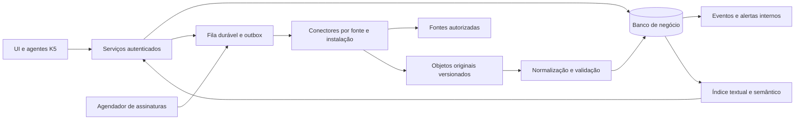

# Plano de implementação da infraestrutura de dados judiciais do K5

Data: 18/09/2026. Status: proposta executável. Esta entrega autoriza o planejamento, não contrata fornecedores, solicita credenciais, contata tribunais ou inicia coleta de processos.

Atualização de 19/09/2026: a fundação (F1), a parte do DJEN que não depende de acesso externo e as duas telas da seção 9 foram implementadas. Nenhum conector foi homologado e nenhum tribunal foi contatado; o acesso real à rede permanece desligado por padrão. O que existe no código, o que continua fechado e a verificação executada estão em [nota de implementação](infra-judicial-implementacao.md).

Documentos complementares: [pesquisa das fontes e caminhos de acesso](fontes-infra-judicial.md), [registro nacional de investigação](registro-cobertura-judicial.md), [análise inicial do DataJud](pesquisa-datajud.md), [plano documental do MVP](plano-ia-mvp.md) e [serviços, ferramentas e RAG](plano-agente-ferramentas-rag-webmcp.md).

## 1. Objetivo e decisões de partida

Construir uma infraestrutura própria que consulte fontes autorizadas, acompanhe processos vinculados ao escritório, preserve as evidências recebidas e disponibilize informações verificáveis ao Cofre, à Central de comando e aos agentes. A pesquisa de jurisprudência entra como uma trilha separada, porque publicação, movimento e decisão não são fontes equivalentes.

Decisões propostas:

- Iniciar com DJEN e um tribunal prioritário, expandindo depois para outro tribunal de sistema diferente. O universo nacional entra no inventário desde o início, sem promessa de cobertura já existente.
- Priorizar APIs documentadas, dados abertos e integrações oficiais. Implementar coleta de páginas somente quando as condições de acesso da fonte estiverem esclarecidas e não houver uma interface adequada.
- Coletar primeiro processos explicitamente vinculados e publicações pertinentes. Não começar com uma cópia de todos os processos brasileiros nem com descoberta indiscriminada por CPF/CNPJ.
- Não depender do DataJud para lançar: manter o conector desabilitado para uso comercial até esclarecer a permissão aplicável. A disponibilidade pública de uma interface não estabelece licença de reutilização comercial.
- Não executar peticionamento, ciência processual nem cálculo automático de prazo no primeiro produto. Cada operação que possa produzir efeito externo exige avaliação própria, inclusive chamadas HTTP de leitura.
- Preferir fontes e permissões comprovadas a conexões não documentadas. Sem acesso a um tribunal, registrar a lacuna e continuar as entregas independentes.

A prioridade confirmada pelo usuário é **cível estadual + STJ/STF**. A ordem proposta é DJEN, STJ e um tribunal estadual para processos. TJAM é candidato técnico ao primeiro spike porque publica contratos de consulta; TJDFT é candidato para jurisprudência regional. A escolha comercial do tribunal processual deve considerar onde atuam os primeiros escritórios, sem presumir demanda por TJAM nem disponibilidade equivalente no TJSP. STF entra desde a descoberta, com entrega de jurisprudência textual condicionada à fonte adequada; bases estatísticas não cumprem esse objetivo sozinhas.

## 2. Base real do repositório

Leitura do código em 18/09/2026, incluindo alterações locais em andamento. Existência de código não equivale a validação operacional.

| Base observada | Reutilização e trabalho necessário |
| --- | --- |
| [Casos e documentos do Cofre](../apps/web/db/migrations/0003_vault.sql) | Acrescentar vínculos com processos; um caso pode conter vários processos. Não usar o nome do caso como identificador processual. |
| [Sessão](../apps/web/src/lib/session.ts) e [contexto de aplicação](../apps/web/src/lib/application/context.ts) | Derivar escritório e papel da sessão e revalidar o acesso nas operações interativas. |
| [Catálogo de capacidades](../apps/web/src/lib/capabilities/contracts.ts) e [ferramentas](../apps/web/src/lib/agent-tools/index.ts) | Adicionar contratos judiciais que reutilizem os mesmos serviços da UI. Não dar ao modelo uma ferramenta HTTP arbitrária. |
| [Worker](../apps/web/scripts/worker.ts) | Já processa documentos, índices e tarefas. Usar o padrão de trabalho durável, com filas separadas para coleta e OCR. |
| [Armazenamento](../apps/web/src/lib/storage/index.ts) | Há adaptadores local e R2 no código em andamento. Preservar a interface; não afirmar que o bucket de produção já existe. |
| [Banco de negócio](../apps/web/src/lib/database.ts) | Continua SQLite síncrono. A presença de `pg` e de um adaptador vetorial não significa que o banco da aplicação foi migrado. |
| [Indexação](../apps/web/src/lib/knowledge/indexing.ts) e [índice vetorial](../apps/web/src/lib/knowledge/vector-index.ts) | Reutilizar versionamento, geração de índices e remoção. Validar as implementações em andamento antes de depender delas. |
| [Workflows documentais](../apps/web/src/lib/document-workflows.ts) e [política de IA](../apps/web/src/lib/ai-policy.ts) | Hoje exigem fontes documentais selecionadas. Generalizar os tipos de evidência e a seleção antes de aceitar dados externos. |

Não modificar arquivos de outras tarefas durante este planejamento. Durante a implementação, reconciliar a numeração de migrações com o estado atual, sem reservar agora um número que possa colidir com trabalho paralelo.

## 3. Fontes, utilidade e limitações

Os endereços e evidências específicas ficam no [catálogo de fontes](fontes-infra-judicial.md). As linhas abaixo definem a estratégia do K5, não garantias de acesso.

| Fonte | Dados úteis | Utilidade no K5 | Conexão a investigar | Limite essencial |
| --- | --- | --- | --- | --- |
| DJEN | Publicações, texto da comunicação e referências/certidões quando disponíveis | Caixa de publicações, vínculo por número CNJ, evidência de publicação | OpenAPI, consulta pública, cadernos e paginação | Não é o conjunto completo de movimentos ou autos. Validar cobertura por tribunal e período. |
| Diários próprios dos tribunais | Acervo de publicações, inclusive períodos anteriores à adesão ao DJEN | Histórico e preenchimento de lacunas documentadas | API, cadernos PDF/HTML e arquivo oficial | Não presumir que o diário antigo continua sendo a fonte corrente. |
| MNI | Capa, movimentos, documentos e comunicações conforme operações habilitadas | Atualização de processos e importação de autos autorizados | WSDL, versão, endpoint por instalação, homologação e credencial | O padrão não concede acesso; nem toda operação é neutra quanto a efeitos jurídicos. |
| PJe | Dados da instalação e interfaces disponibilizadas pelo tribunal | Conector reutilizável com configuração por instalação | MNI e APIs documentadas pelo operador | Não confundir serviços internos publicados na documentação com API pública para terceiros. |
| eproc | Eventos e documentos conforme autorização | Acompanhamento e obtenção de documentos | Canal oficial do tribunal e especificação de integração | Não presumir API nacional única ou credencial reutilizável entre tribunais. |
| e-SAJ e Projudi | Consultas e integrações disponíveis em cada instalação | Cobertura onde não houver outra fonte suficiente | TI do tribunal, webservices e consulta pública permitida | Sistemas e legados podem coexistir; o adaptador depende da instalação. |
| STJ, dados abertos | Conjuntos publicados de jurisprudência e outros temas | Pesquisa, decisões citáveis e atualização de acervo | CKAN, metadados e arquivos de cada recurso | A API do catálogo não implica consulta transacional de todo processo ou inteiro teor em todo conjunto. |
| STF e repositórios jurisprudenciais de outros tribunais | Decisões, ementas, precedentes e temas conforme conjunto | Pesquisa de autoridades e contexto jurídico | Dados abertos, APIs documentadas e downloads oficiais | Ementa não substitui inteiro teor; verificar alcance, atualização e licença por recurso. |
| TPU/SGT | Classes, assuntos e movimentos padronizados | Filtros e normalização sem perder o código original | Consulta, exportações e serviço oficialmente documentado | Não adivinhar equivalências entre descrições locais e códigos nacionais. |
| DataJud, opcional | Metadados e movimentos públicos conforme contrato vigente | Enriquecimento e comparação de cobertura | Aliases por tribunal e API pública | Restrição comercial e defasagem precisam ser tratadas; não é dependência do MVP. |
| Domicílio Judicial Eletrônico, etapa separada | Comunicações do destinatário habilitado | Caixa corporativa, se houver demanda e autorização | API da organização destinatária e gestão de credenciais | Acesso ao conteúdo pode produzir ciência; não conectar ao coletor genérico. |
| Upload do advogado | Peças, decisões e exportações de origem conhecida | Continuidade do trabalho quando uma fonte não está disponível | Fluxo existente do Cofre | Não declarar atualização automática nem cobertura externa a partir de upload manual. |

O [CNJ documenta MNI](https://www.cnj.jus.br/modelo-nacional-de-interoperabilidade/) e operações SOAP para integração. O [STJ declara acesso automatizado via CKAN](https://dadosabertos.web.stj.jus.br/). As condições de uso e autenticação devem ser verificadas separadamente da existência técnica da interface.

### 3.1 Alvos concretos da primeira investigação

| Alvo | Ponto de entrada confirmado em documentação | Primeiro incremento | O que ainda validar |
| --- | --- | --- | --- |
| DJEN | OpenAPI e ambientes indicados no catálogo de fontes | Coletar publicações de processos selecionados | Produção, limites, cobertura e condições de reutilização |
| TJAM SAJ | WSDL `https://consultasaj.tjam.jus.br/mniws/servico-intercomunicacao-2.2.2/intercomunicacao?wsdl` | Consulta de processo público conhecido | Operações reais, disponibilidade, quotas, movimentos e documentos |
| TJAM Projudi | WSDL `https://projudi.tjam.jus.br/projudi/webservices/consultaProcessualWebService?wsdl` | Segundo adaptador/instalação, mesma amostra de aceite | Contrato específico; não presumir compatibilidade com SAJ |
| STJ | CKAN `package_show`, conjuntos de espelhos e íntegras identificados no catálogo | Pesquisa com metadados e links de evidência; importação amostral de inteiro teor | Relação entre recursos, licença/atribuição de cada conjunto, formatos e atualização |
| TJDFT | `POST https://jurisdf.tjdft.jus.br/api/v1/pesquisa`, manual oficial | Pesquisa regional paginada | Termos, limites e alcance do conteúdo retornado |
| STF | Corte Aberta e portais oficiais de jurisprudência | Inventário de bases e spike de aquisição de decisões | Fonte textual citável e condições; XLSX/CSV estatístico não substitui decisão |
| TPU | WSDL `https://www.cnj.jus.br/sgt/sgt_ws.php?wsdl` | Classes, movimentos e assuntos para filtros | Disponibilidade, vigência e estratégia de atualização |

A página oficial do TJAM declara consulta sem autenticação/habilitação; isso não elimina a validação de operação e reutilização. Na pesquisa, somente chamadas de metadados CKAN do STJ foram observadas com sucesso; os serviços processuais acima não foram homologados. Detalhes e links documentais estão no [catálogo](fontes-infra-judicial.md).

A [Portaria CNJ 374/2026](https://atos.cnj.jus.br/atos/detalhar/6972) atualiza as regras do DataJud, incluindo previsão de polos de pessoas jurídicas e remessa diária com período de transição. O contrato real da API precisa ser confrontado com essa norma. A restrição comercial permanece; não extrapolar os novos campos para disponibilidade atual, pesquisa por qualquer pessoa ou garantia de atualização diária.

## 4. Processo de descoberta para cada fonte individual

### 4.1 Unidade de cobertura

Cadastrar por `órgão + instalação + grau + sistema + finalidade + intervalo temporal`. Exemplo conceitual: um TJ pode ter e-SAJ legado, eproc atual, turmas recursais e diários históricos distintos. Uma linha por sigla de tribunal não basta. MNI é um protocolo; DJEN é uma fonte de publicações; nenhum deles substitui esse inventário.

O [registro nacional](registro-cobertura-judicial.md) contém a lista inicial por tribunal. Cada linha deve ser desdobrada em instalações antes da implementação. Tribunais superiores, justiça eleitoral e militar também estão no inventário, mesmo que entrem em ondas posteriores.

### 4.2 Roteiro obrigatório de investigação

1. **Definir a necessidade.** Registrar processos, períodos, graus e dados desejados pelo escritório: capa, movimentos, publicações, decisões ou autos. Separar consulta de um processo conhecido de descoberta por pessoa/OAB.
2. **Encontrar a origem oficial.** Partir do diretório do CNJ e do portal do próprio órgão. Pesquisar no domínio oficial: `API`, `webservice`, `MNI`, `WSDL`, `integração`, `dados abertos`, `consulta processual`, `jurisprudência` e `diário`. Guardar URLs, data e responsável pela investigação.
3. **Mapear instalações.** Identificar sistemas atuais e legados, primeiro/segundo grau, turmas, seções judiciárias, datas de migração e cobertura histórica. Não inferir sistema pelo nome do tribunal ou pelo padrão da URL.
4. **Localizar contrato técnico.** Obter OpenAPI, WSDL/XSD, manual ou especificação de exportação. Registrar versão, endpoint de homologação/produção, métodos, filtros, paginação, campos, anexos e efeitos de cada operação. Endpoint observado no navegador fica como não documentado até esclarecimento.
5. **Determinar acesso.** Público, chave pública, conta institucional, credencial de destinatário ou atuação autorizada de advogado. Confirmar elegibilidade do K5, representação do escritório, expiração, rotação e limites. Nunca reutilizar credenciais pessoais entre clientes.
6. **Determinar uso permitido.** Registrar condições para armazenamento, reprodução, uso comercial, envio a modelos de IA, redistribuição, retenção e exclusão. Se o documento não responder, abrir uma pergunta concreta ao canal oficial; silêncio não é autorização. Não enviar documentos de clientes no contato inicial.
7. **Contatar quando necessário.** Preparar solicitação à TI/integrações; ouvidoria/SIC para localizar a documentação quando não houver canal técnico. O envio externo será uma ação específica autorizada pelo usuário, não parte automática deste plano.
8. **Fazer spike limitado.** Com acesso permitido, consultar amostras autorizadas em homologação e depois produção, sem coleta em massa. Testar um registro conhecido, um ausente, paginação, indisponibilidade, restrição e documento corrigido. Não acessar o teor de comunicações com possível ciência durante descoberta genérica.
9. **Medir cobertura.** Comparar com o portal oficial e materiais autorizados do escritório. Registrar denominador da amostra, campos ausentes, defasagem observada, documentos inacessíveis e instâncias não cobertas. Um HTTP 200 não é aceite.
10. **Registrar decisão.** Marcar como candidato, documentação localizada, acesso pendente, spike aprovado, piloto, produção, degradado ou suspenso. Cada avanço exige evidência; não usar “sem API” quando apenas não foi encontrada documentação.
11. **Manter o contrato.** Versionar a especificação e fixtures sanitizadas, acompanhar avisos oficiais e executar canários permitidos. Reabrir a investigação se mudar sistema, autenticação, formato, termos ou comportamento.

### 4.3 Ficha de fonte

Cada instalação terá uma ficha versionada com: ID; órgão/grau/sistema/período; finalidade; portal e canal oficial; proprietário técnico K5; documentação e data de revisão; ambientes e hosts autorizados; versão do contrato; operações e efeitos; autenticação/escopo; condição de uso e evidência; campos; identificadores; cursores; limite publicado e orçamento interno; atualização observada; tamanho máximo de resposta; anexos; retenção; fixtures; monitoramento; custo; dependências e critérios de suspensão.

Para cada permissão usar `permitido`, `restrito`, `proibido` ou `não esclarecido`, separadamente para consulta, cache, documentos, redistribuição e IA. Não reduzir todas as permissões a um booleano.

Modelo de solicitação a preparar, sem envio nesta entrega:

> Desenvolvemos o K5, software comercial para escritórios de advocacia. Precisamos consultar [dados] de [instalação/grau], para processos vinculados por clientes autorizados, com volume inicial estimado de [volume]. Existe API, MNI ou exportação oficial? Solicitamos documentação, procedimento de habilitação, ambiente de homologação, limites, cobertura e condições para armazenar os dados e utilizá-los em análises por IA. Alguma consulta ou acesso a documentos produz ciência ou outro efeito processual? Há condições específicas para fornecedores de software que operam em nome do escritório?

### 4.4 Receitas por tipo de origem

| Receita | Investigação e primeiro experimento | Evidência exigida para concluir |
| --- | --- | --- |
| R1 — DJEN | Ler OpenAPI; confirmar servidor de produção e operações públicas; descobrir tribunais/filtros; consultar janela curta e percorrer todas as páginas; confrontar com caderno oficial | Campos e datas entendidos, paginação completa, limite conhecido, duplicação/correção testadas, cobertura temporal registrada |
| R2 — MNI/PJe | Localizar WSDL e versão da instalação; listar operações; solicitar elegibilidade e homologação; mapear autenticação e efeito; implementar uma consulta de processo conhecido | Credencial autorizada, contrato por instalação, resultados comparados ao portal e nenhuma operação de ciência misturada à leitura |
| R3 — eproc/e-SAJ/Projudi | Identificar instalação; procurar integração oficial e solicitar documentação; se indisponível, avaliar consulta pública e sua permissão de automação | Interface concreta e condições registradas; disponibilidade de uma tela não encerra a análise |
| R4 — dados abertos/jurisprudência | Descobrir catálogo e recursos; verificar licença, formato e cadência; baixar amostra, manifesto/checksum e metadados; testar atualização de um recurso | Recurso identificável, vínculo entre ementa e inteiro teor quando existir, atualização incremental ou estratégia de substituição documentada |
| R5 — diário histórico | Identificar datas de transição para DJEN e arquivo oficial; enumerar edições, suplementos, republicações e erratas; extrair amostra com referência de página | Período e cobertura por edição, texto conferido, republicação não confundida com duplicata |
| R6 — TPU | Identificar distribuição oficial e versão; importar códigos/hierarquia/vigência; preservar códigos desconhecidos | Mapeamento auditável e atualização que não altera silenciosamente eventos históricos |
| R7 — DataJud | Confirmar permissão aplicável; estudar glossary e regras atuais; consultar número conhecido por alias, aceitando vários registros | Permissão resolvida e amostra validada; distinguir metadados recebidos do modelo usado pelos tribunais para envio |
| R8 — Domicílio | Confirmar titular/representação, credencial vigente e contrato de operações; classificar listagem versus teor/ciência; testar só em ambiente e conta autorizados | Efeitos esclarecidos e fluxo humano aprovado antes de qualquer acesso que possa aperfeiçoar comunicação |

## 5. Arquitetura proposta

### 5.1 Implantação

Piloto local: Next.js e worker Node existentes, SQLite, armazenamento local e conectores com fixtures. Piloto externo de baixo volume: uma instância de escrita bem definida e armazenamento durável, com limites explícitos; não escalar SQLite com várias réplicas independentes.

Produção: PostgreSQL para negócio, jobs e outbox; armazenamento de objetos compatível com a interface existente; processos separados para web, coleta, parsing/OCR e indexação. A migração do banco inteiro do K5 é uma entrega explícita, com adaptação das queries síncronas e FTS5, Better Auth, transações e testes de isolamento. Não trocar somente a URL do banco nem considerar o índice vetorial como migração concluída. Não introduzir Redis/Kafka no primeiro incremento: medir antes de adicionar outra infraestrutura.

Usar o backend de objetos já escolhido pelo projeto, após verificar sua configuração e limites. A seleção de nuvem e região continua pendente; não há provisionamento ou compra nesta entrega. Antes da implantação, ler os guias locais do Next.js e as instruções do provedor escolhido.

### 5.2 Contrato dos conectores

Interface conceitual, a detalhar em TypeScript/Zod durante a implementação:

- `describeCapabilities`: tipos de dados, filtros, autenticação e efeitos suportados por instalação.
- `lookupCase`: consulta por identidade exata; retorna zero, um ou vários registros, nunca escolhe silenciosamente o primeiro.
- `listChanges`: consulta incremental por janela/cursor quando suportada.
- `fetchPublication` e `fetchDocument`: operações distintas e condicionadas a permissão e ausência de efeito não aprovado.
- `health`: verifica disponibilidade com chamada permitida e barata; não usa documentos privados para canário.
- `normalize`: transforma payload já recebido, sem rede e com versão explícita do parser.

Saída comum: registros limitados, cursor opaco, cobertura/truncamento, fonte, instante da consulta, referências aos originais e erros estruturados. Erros mínimos: `unauthorized`, `forbidden`, `rate_limited`, `source_unavailable`, `schema_changed`, `not_found_in_source`, `partial`, `unsupported` e `human_action_required`.

Não repassar URL arbitrária, filtros livres ou credenciais do modelo ao conector. Aceitar IDs internos e filtros tipados; o servidor resolve a instalação e o escopo autorizado. Não oferecer operações que o conector não suporta.

## 6. Modelo de dados e proveniência

Todas as tabelas de negócio e seus índices de autorização carregam `office_id`. Catálogos globais, se existirem, conterão apenas configuração pública de fontes e vocabulários; acesso a evidências continuará mediado pelo escritório. No MVP, manter também snapshots e caches de coleta isolados por escritório. Uma futura base pública compartilhada exige projeto específico de permissões, direitos e retenção.

| Entidade proposta | Conteúdo e identidade |
| --- | --- |
| `judicial_source_installation` | Configuração administrativa da fonte, versão, capacidades, condições e cobertura; sem segredo |
| `judicial_connection` | Escritório, instalação, referência cifrada de credencial, titular, escopos, validade e estado |
| `judicial_case_link` | Caso do Cofre, número CNJ normalizado ou identidade alternativa, instalação, grau e confirmação do usuário |
| `judicial_source_record` | Identidade do registro externo: instalação + ID da fonte; várias identidades podem apontar para o mesmo processo |
| `judicial_snapshot` | Resposta original, hash, versão, momento de coleta, parser, visibilidade e condições de uso |
| `judicial_movement` | Código/texto original, código TPU quando comprovado, data do evento e referências ao snapshot |
| `judicial_publication` | Identidade da publicação, edição/página ou hash oficial, disponibilização, publicação e versões/erratas |
| `judicial_document` | Documento externo, tipo, metadados, hash, armazenamento e vínculo opcional com versão do Cofre |
| `judicial_subscription` | Alvo autorizado, filtros, periodicidade, orçamento e responsável pela assinatura |
| `judicial_sync_job` | Lease, cursor, tentativas, checkpoint, estado, erros e autorização de execução |
| `judicial_alert` e outbox | Evento observado, destinatário autorizado e recibo de entrega idempotente |
| `judicial_access_audit` | Quem consultou/importou/selecionou evidência, finalidade e IDs; sem conteúdo sensível ou segredo nos logs |

Guardar separadamente: data do fato/movimento, disponibilização, publicação, atualização declarada pela origem, consulta K5 e ingestão K5. Manter fuso/precisão original; não inventar hora para datas sem horário.

Validar dígitos e formato CNJ, mas preservar números legados e identidades nativas. O número CNJ não deve ser a única chave de uma instância processual. Separar relações de recurso, incidente, origem e migração de sistemas; vincular automaticamente apenas quando houver identificador confiável, caso contrário solicitar revisão.

Deduplicar por identidade da fonte e versão. Quando não houver ID, usar impressão determinística de campos estáveis documentados, registrando a estratégia e possíveis colisões. Um código de movimento e sua data isoladamente não identificam um evento. Entre fontes, registrar possível equivalência sem apagar evidências divergentes. Republicação e retificação criam relações entre versões; não sobrescrever silenciosamente o passado.

## 7. Coleta, atualização e recuperação de falhas

1. Uma operação autenticada cria vínculo ou assinatura. Persistir configuração e job na mesma transação, com idempotência.
2. O agendador considera assinaturas ativas, prioridade e orçamento global da fonte, além de orçamento por escritório/credencial. Não multiplicar um limite global pelo número de workers.
3. O worker adquire lease e revalida assinatura, conexão e permissões. Para trabalho recorrente, usar autorização durável da assinatura e vínculo vigente do responsável; não manter sessão de usuário artificialmente ativa. Revogação de conexão ou vínculo suspende novas coletas. Operações interativas continuam dependentes da sessão válida.
4. Executar requisição com timeout, teto de bytes, concorrência e limite de páginas. Persistir original antes da publicação do resultado normalizado. Coordenar objeto e SQL por estado intermediário/outbox; limpar objetos órfãos com rotina auditável.
5. Normalizar com parser determinístico. Falha de schema envia o material para quarentena e não publica uma lista vazia como sucesso.
6. Confirmar checkpoint somente após persistência íntegra. Usar sobreposição temporal e deduplicação para dados atrasados. Quando a fonte não oferecer ordenação estável, documentar a limitação e fazer reconciliação por janelas; não prometer snapshot consistente inexistente.
7. Gerar mudanças e alertas por transação/outbox. Repetir jobs é permitido; duplicar efeitos visíveis não é. Novos achados históricos no backfill não devem virar tempestade de “novidades de hoje”.
8. Publicar evidências elegíveis para busca; só enviar à IA quando selecionadas e permitidas. OCR ou embedding com falha não apaga o original.

Política inicial proposta: no máximo cinco tentativas transitórias com recuo exponencial e jitter; obedecer `Retry-After`. Autenticação falha exige intervenção/renovação, não tentativas contínuas. Bloqueio ou desafio de acesso suspende o conector; não usar rotação de IP, contas ou resolução de CAPTCHA para contornar limites.

Não existe frequência universal: começar pela cadência da fonte e ajustar à necessidade do escritório. Para o piloto, avaliar DJEN em janelas de 1–6 horas, movimentos a cada 6–24 horas e acervos abertos por publicação de novo recurso. São hipóteses de capacidade, não SLAs prometidos. Manual “Atualizar” reutiliza cache/job pendente e respeita o mesmo orçamento.

Backfill separado da fila de atualização, com janela inicial configurável, progresso e cancelamento. Começar com 30 dias de publicações, se disponíveis, e ampliar somente após medir custo. Para cada varredura guardar janela solicitada, páginas percorridas, registros aceitos/rejeitados e watermark. Uma lacuna de coleta permanece visível até reconciliação.

## 8. Segurança, acesso e operações com efeito

Reutilizar o modelo de sessão, papéis e cifragem do K5; acrescentar credenciais judiciais como domínio separado de conexões de IA. Segredos e certificados nunca aparecem em ferramentas, prompts, WebMCP ou respostas de leitura. Usar formulário seguro, referência temporária e armazenamento cifrado; definir rotação, expiração e revogação. Preferir credenciais institucionais/delegadas quando a fonte oferecer; não pressupor que senha individual do advogado autoriza operação por terceiros.

Tratar URLs recebidas de fontes e anexos como não confiáveis: hosts aprovados, validação de redirects/DNS, bloqueio de rede interna, limites de download e MIME. Sanitizar HTML; verificar malware, arquivos compactados e PDFs antes de extração; executar parsers em processos com recursos limitados. XML/SOAP deve desabilitar entidades externas. Conteúdo coletado não concede instruções ao agente.

Não reutilizar cache de documento autenticado entre escritórios. Retirar imediatamente da busca o material cuja permissão foi revogada ou cujo sigilo mudou; agendar remoção das cópias/índices conforme política aplicável. Snapshots são versionados, mas não ficam imunes a exclusão obrigatória. Registrar tombstone e auditoria mínima quando a retenção do conteúdo não for permitida. Definir política de retenção e tratamento de backups por classe de dado antes do piloto real.

### Domicílio e MNI com comunicações

A [Resolução CNJ 455/2022, texto consolidado](https://atos.cnj.jus.br/atos/detalhar/4509), descreve que o acesso ao conteúdo, inclusive por API, pode aperfeiçoar comunicação processual. Portanto, `GET` não é uma classificação suficiente de segurança.

Classificar cada método como consulta neutra comprovada, acesso com possível ciência, envio/protocolo ou desconhecido. Os três últimos não entram no worker genérico. Domicílio fica fora da primeira entrega; uma etapa própria deverá validar efeitos em homologação, titularidade, auditoria, autorização humana para alvo exato e proteção contra repetição. Se uma chamada retornar timeout depois de possível ciência, reconciliar com a fonte antes de repetir. Nunca prometer que rollback local desfaz ato externo.

## 9. Produto, pesquisa e agentes

### Cofre

Adicionar “Vincular processo”, escolha de fonte/registro, detalhes de cobertura e opção de importar documentos autorizados. Mostrar fonte, data de consulta, atualização declarada e situação da conexão. Exibir “Não encontrado nesta fonte” sem concluir inexistência do processo.

### Central de comando

Caixa de publicações e mudanças observadas, com filtros por caso e fonte. Distinguir novo evento, evento histórico recém-coletado, correção e falha de atualização. O primeiro canal é interno ao K5; e-mail/push externos ficam para etapa de preferência e consentimento própria. Alertas não serão apresentados como substitutos de intimações oficiais.

### Pesquisa

Acervo jurisprudencial separado dos documentos do caso, com tribunal, órgão, data, classe, tipo de documento e proveniência. Busca pode combinar filtros estruturados, texto e semântica. Não selecionar precedentes só por similaridade de embeddings. Se houver somente ementa, explicitar isso; não inventar ratio decidendi, trânsito em julgado ou atualidade jurídica.

### Agentes e cronologias

Criar uma abstração de evidência com tipos `vault_document`, `judicial_movement`, `judicial_publication` e `court_decision`. Cada referência aponta para snapshot/versão e localização estáveis. Preservar compatibilidade com artefatos antigos. Movimento estruturado vira linha de cronologia por transformação determinística; não gastar LLM para redescobrir sua data/código. IA resume e compara com fontes selecionadas, indicando lacunas e divergências.

Ferramentas propostas: consultar cobertura, pesquisar processo conhecido, vincular/desvincular processo, solicitar atualização, acompanhar job, listar movimentos/publicações, abrir evidência e importar documento. Modificação de vínculo, assinatura, importação ou refresh com persistência é escrita auditada. Consulta ao conteúdo com possível efeito jurídico exige classificação adicional e permanece indisponível nesta fase.

Registrar contratos em `capabilities/`, serviços em `application/` e adaptadores em `agent-tools/`; HTTP e WebMCP usam as mesmas regras. `reviewer` mantém consulta aos recursos permitidos e não recebe novas permissões de chat ou escrita por consequência deste plano. Só publicar ferramentas já implementadas.

A pesquisa externa amplia o escopo do MVP e requer atualização explícita de `ai-policy.ts`, seleção de fontes e validação de citações. Uma fonte oficial comprova procedência, não aplicabilidade ou validade atual de uma tese jurídica. Antes de usar autoridades em minutas, preservar a seleção/revisão do advogado.

UI futura segue [DESIGN.md](../apps/web/DESIGN.md): pt-BR, estados em texto simples, tabelas/linhas, teclado, mobile e movimento reduzido. Cobrir sem vínculo, carregando, sem resultado, múltiplos registros, fonte fora do ar, acesso expirado, dados parciais e coleta atrasada.

## 10. Organização proposta do código

| Local, relativo a `apps/web/` | Responsabilidade |
| --- | --- |
| `src/lib/judicial/contracts.ts` | Tipos normalizados, capacidades e erros |
| `src/lib/judicial/connectors/` | Adaptadores DJEN, MNI, catálogos e instalações; sem regras de UI |
| `src/lib/judicial/normalization/` | Identidades, datas, códigos, diffs e proveniência |
| `src/lib/judicial/repositories/` | Persistência e transações; facilitar a migração explícita de banco |
| `src/lib/judicial/jobs/` | Agendamento, leases, limites, checkpoints e reconciliação |
| `src/lib/application/judicial-service.ts` | Autorização e operações de negócio compartilhadas |
| `src/app/api/judicial/` | Rotas autenticadas e DTOs; sem coleta longa dentro da requisição |
| `src/components/judicial/` | Vínculos, fontes e leitura de evidências |
| `scripts/judicial-worker.ts` | Worker de coleta separado em produção, execução única disponível em desenvolvimento |
| `db/migrations/` | Migrações aditivas e índices, numerados conforme estado real do repositório |
| `tests/judicial-*.test.ts` | Contratos, autorização, normalização e recuperação |
| `tests/fixtures/judicial/` | Respostas sintéticas/sanitizadas e versões conhecidas |

Permanecer no app inicialmente; extrair para `packages/` apenas com consumidor real. Não introduzir outro framework de agentes para esta infraestrutura.

## 11. Backlog, dependências e critérios de aceite

Estimativas em semanas de calendário para dois engenheiros experientes, apoio parcial de produto/jurídico e acesso já obtido. São faixas de planejamento, não compromisso. Esperas por habilitação não estão incluídas e podem dominar o prazo.

| Fase | Entregas e tarefas | Dependências | Aceite | Estimativa |
| --- | --- | --- | --- | --- |
| F0 — descoberta | J01 inventário; J02 fichas DJEN/tribunal/acervo; J03 condições de uso; J04 amostra e orçamento | Prioridade provisória e fontes oficiais | Pelo menos uma fonte apta a spike; acesso pendente identificado com responsável e próximo passo | 1–2 semanas |
| F1 — fundação | J05 esquema/proveniência; J06 fila/outbox; J07 registro/capacidades; J08 credenciais e limites | F0 suficiente para contratos | Reprocessar fixtures sem duplicar, retomar lease, testar isolamento entre dois escritórios | 2–3 semanas |
| F2 — DJEN | J09 descoberta/filtros; J10 coleta e backfill; J11 reconciliação/erratas; J12 caixa interna | F1 e condição de uso confirmada | Publicações de amostra confrontadas com fonte, cobertura visível e alertas únicos | 2–3 semanas |
| F3 — processo piloto | J13 conector MNI/oficial do tribunal; J14 vínculo; J15 movimentos; J16 importação autorizada | F1 e acesso ao tribunal | Atualizar processos de amostra sem misturar grau, sistema ou documentos de outro escritório | 3–5 semanas por primeira família |
| F4 — evidência e IA | J17 tipos de fonte; J18 seleção e referências; J19 cronologia mista; J20 avaliação | F2/F3 com dados estáveis | Todas as afirmações avaliadas com referências resolvíveis; metadados não viram teor de decisão | 2–3 semanas |
| F5 — produção | J21 PostgreSQL/portabilidade; J22 deploy e backups; J23 observabilidade; J24 carga e recuperação | Iniciar após F1; concluir antes de ampliar piloto | Restauração ensaiada, filas concorrentes corretas, cobertura e custo medidos | 3–5 semanas |
| F6 — jurisprudência | J25 acervo STJ; J26 descoberta STF; J27 filtros e índice; J28 avaliação de citações | F1 e direitos por conjunto | Decisões/ementas diferenciadas, versão e fonte preservadas, busca avaliada por advogado | 3–5 semanas |
| F7 — expansão | J29 segundo sistema; J30 novas instalações; J31 históricos; J32 revisão de cobertura | Piloto aprovado | Cada instalação passa o mesmo gate; mapa nacional nunca vira booleano genérico | Contínua |
| F8 — Domicílio | J33 efeitos por método; J34 representação; J35 homologação; J36 fluxo humano | Demanda específica, acesso e avaliação dos efeitos | Nenhuma ciência automática incidental, auditoria e reconciliação de resultado incerto | Estimar após descoberta |

Sequência crítica: F0 → F1 → F2/F3 → F4 → piloto; F5 deve terminar antes de produção ampliada. F6 não bloqueia o acompanhamento processual. Planejar aproximadamente 12–20 semanas para piloto endurecido com DJEN e uma família de tribunal, considerando sobreposição possível; recalibrar ao fim de F0/F1. Cobertura nacional não recebe prazo fechado antes de conhecer acessos e instalações. Uma instalação similar pode exigir dias ou semanas; um novo sistema exige novo spike.

Responsabilidades: produto seleciona escritórios/casos e critérios de utilidade; engenharia de integrações responde por fontes e contratos; backend responde por persistência/isolamento; frontend e IA respondem por seleção/evidência; operações responde por continuidade; responsável jurídico/proteção de dados avalia condições e efeitos com a descrição concreta de uso.

Se MNI ficar pendente, entregar DJEN e importação documental; não substituir silenciosamente por scraping. Se nenhuma fonte do piloto tiver uso esclarecido, continuar fundação e testes sintéticos, mantendo o conector real desabilitado.

## 12. Verificação e gate de liberação

| Área | Testes e evidência requerida |
| --- | --- |
| Conector | Contrato/fixtures, ambientes separados, cursor com mesma data, páginas repetidas, dados fora de ordem, resposta vazia, 401/403/429/5xx, timeout e mudança de schema |
| Dados | Número CNJ/legado, vários graus, migração entre sistemas, evento repetido, retificação, fuso e precisão, campo ausente, código TPU desconhecido |
| Autorização | Dois escritórios, papéis, sessão revogada, conexão revogada durante job, link externo forjado, acesso a snapshot/documento de outro cliente |
| Durabilidade | Queda após download/antes do commit, commit sem notificação, lease expirado, reprocessamento, backfill cancelado, objeto órfão e restauração de backup |
| Segurança | SSRF/redirect, XXE, HTML malicioso, arquivo excessivo, segredo em erro/log, conteúdo tentando instruir o agente e mudança de sigilo |
| Produto | Teclado/mobile, fontes parciais, vínculo ambíguo, status atrasado, link de evidência, importação seletiva e desfazer assinatura |
| IA | Separar fato/ementa/decisão/publicação, não inventar prazos, não ampliar escopo, citações somente de fontes selecionadas e versões congeladas |

Amostra proposta por instalação piloto: pelo menos 30 processos autorizados cobrindo classes, graus, ativos/baixados e legados relevantes; dez dias de publicações ou o período disponível; casos sintéticos adicionais para erros raros. Registrar processos sem acesso como limitação de cobertura, não como sucesso omitido do denominador.

Metas iniciais propostas: zero vazamento nos testes adversariais; zero alertas duplicados nos ensaios de retry; 100% das evidências exibidas com origem e versão; 100% dos itens enumerados no recorte de referência recuperados ou explicitamente reportados como lacuna; toda divergência crítica investigada antes de habilitar a instalação. Isso não certifica completude nacional nem garantia futura da origem.

Na implementação, rodar da raiz `pnpm lint`, `pnpm typecheck` e `pnpm test`; `pnpm build` para rotas/configuração/produção, após ambiente e `pnpm db:setup` conforme os READMEs. Testes reais de integração exigem acesso permitido e ficam separados dos testes determinísticos. Não incluir segredos ou respostas pessoais em fixtures versionadas.

## 13. Operação, capacidade e custo

Painel por instalação: última consulta bem-sucedida, watermark, atraso da fila, defasagem observada da fonte, 429/403, schema rejeitado, percentual de falhas, cobertura por operação, documentos importados, custo e versão do conector. Ausência inesperada de dados deve ser detectada, sem equiparar automaticamente “nenhum resultado” a incidente.

SLO interno proposto: publicar item dentro de 15 minutos após sua ingestão íntegra no K5, em 95% dos casos do piloto. Medir separadamente demora para buscar e atraso da própria fonte. RPO inicial proposto de 24 horas e RTO de quatro horas para o piloto; decidir metas definitivas por criticidade antes de vender o serviço. Não apresentar essas metas como disponibilidade do tribunal.

Fórmulas de planejamento:

- Requisições/dia ≈ soma de assinaturas × consultas/dia × páginas/consulta + backfills + anexos + retries; considerar consultas em lote quando a fonte permitir.
- Exemplo hipotético: 1.000 processos × duas consultas/dia = 2.000 consultas antes de páginas e anexos; isso não é benchmark nem autorização de volume.
- Armazenamento ≈ bytes de originais novos + versões + extrações + índices + backups, conforme retenção.
- Custo ≈ banco/worker + armazenamento/egresso + observabilidade + OCR/embeddings + manutenção dos conectores. Incluir horas de manutenção por instalação no custo por processo ativo.

Medir esses componentes durante duas semanas de piloto e definir teto por escritório, fonte e dia. Não gerar embeddings para todo payload bruto; indexar somente conteúdo útil e permitido. LLM não participa da coleta de rotina nem da classificação determinística de campos.

Runbooks obrigatórios: autenticação expirada, alteração de schema, bloqueio da fonte, conteúdo com sigilo/restrição, fila parada, correção de dados e restauração. Cada um identifica responsável, ação de suspensão, evidência a preservar e reconciliação. Rollback desliga fonte/versão e mantém registros; não apaga migrações nem tenta desfazer ato judicial externo.

## 14. Primeiros dez dias de execução

1. Dias 1–2: escolher escritórios e tribunal piloto; abrir fichas do registro; definir utilidade e amostra; conferir termos e documentação vigentes de DJEN e tribunal.
2. Dias 3–4: localizar especificações/credenciais e preparar pedidos de acesso; elaborar contratos, entidades e orçamento; testar somente operações já autorizadas e sem efeito externo.
3. Dias 5–6: produzir fixtures sanitizadas e relatório de cobertura inicial; implementar fila e proveniência usando fixtures; registrar o que ainda depende de terceiros.
4. Dias 7–8: primeiro caminho vertical de publicação até evidência no K5; verificar deduplicação e isolamento; sem depender de IA para normalizar.
5. Dias 9–10: demonstrar resultado com dados permitidos ou explicitamente sintéticos, revisar lacunas, definir cronograma do conector processual e recalibrar F1–F5.

Decisões que continuam abertas: tribunais e volume prioritários; titularidade das conexões; condições de IA/retenção por fonte; provedor/região de infraestrutura; orçamento; necessidade de descoberta por pessoa/OAB e eventual Domicílio. Nenhuma impede terminar o desenho ou executar testes sintéticos; cada uma bloqueia apenas o trabalho dependente.

## 15. Entrega documental e limites da pesquisa

O plano foi confrontado com arquivos reais do K5 e documentação oficial. Especificações e páginas encontradas são pontos de entrada, não evidência de conexão funcional. Alguns portais CNJ retornaram 403 na leitura direta; quando necessário, a pesquisa identifica uso de trechos indexados de fonte oficial. A validação de endpoints de produção, credenciais, cobertura, licenças de cada conjunto e amostras reais faz parte de F0 e dos spikes.

Esta entrega não executa lint, testes ou build de aplicação, pois altera apenas documentação. A verificação documental cobre links locais, consistência do inventário, Markdown e separação entre comportamento existente, fato documentado e proposta.
