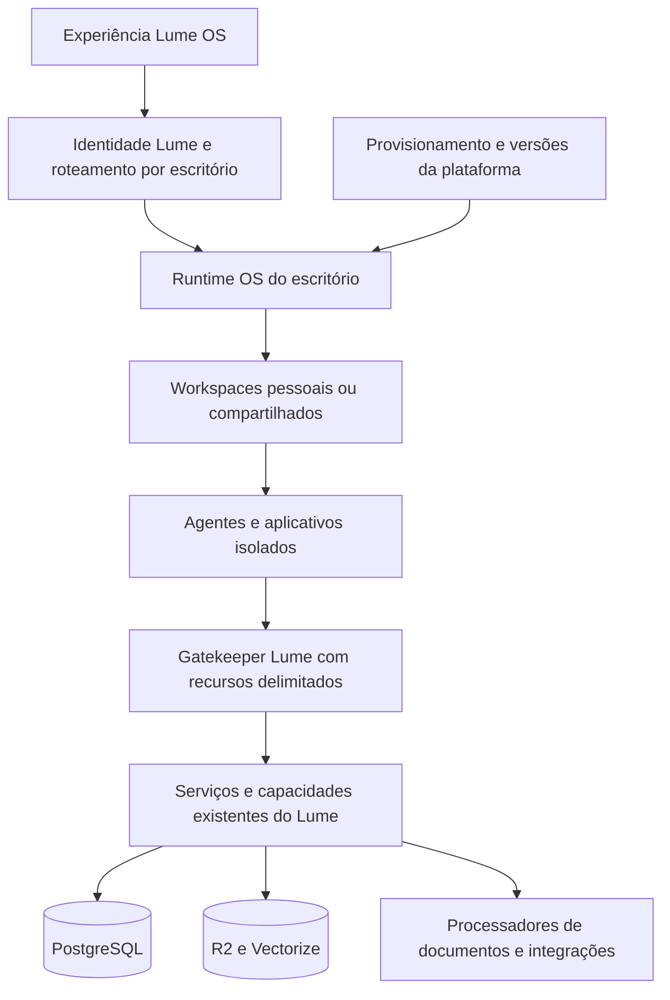

# Lume sobre Cloudflare OS — proposta em discussão

Pesquisa em 24/09/2026. Este documento planeja a mudança; não autoriza nem executa migração.
Base técnica e fontes adicionais: [pesquisa do upstream](pesquisa-cloudflare-os-upstream.md).

## Direção escolhida na conversa

- Adotar a experiência mais ampla do OS e adaptar a UI do Lume ao redor dela.
- Preservar a compatibilidade funcional das funcionalidades existentes.
- Atender inicialmente dezenas de escritórios, com criação automática de ambientes.
- Proposta ainda a confirmar: workspaces pessoais privados e compartilhados por caso/projeto.

A recomendação é construir uma distribuição **Lume OS**: experiência de workspaces,
agentes, recursos e aplicativos do Cloudflare OS, integrada aos serviços jurídicos do Lume.
O núcleo do OS fica fixado por commit; autenticação, integração com o domínio e operação
dos escritórios ficam sob nosso controle. A compatibilidade completa é um critério de
aceite a demonstrar, não uma propriedade obtida apenas ao copiar o repositório.

O upstream se declara **early access**, com uma reescrita v2 ainda em desenvolvimento.
Sua base oferece execução de agentes com Pi, checkpoints, retomada e Code Mode,
além de workspaces em Durable Objects e aplicativos em Dynamic Workers/Facets.
Esses mecanismos justificam a avaliação; não equivalem a uma garantia de maturidade
ou paridade com o Lume. Não é uma simples substituição do Mastra pelo Agents SDK.
Fonte: [README do core](https://github.com/cloudflare/cloudflare-os/blob/bfe217f5e5ef93748a67bc4f44fa56d8add34de6/README.md)
e análise do código na pesquisa vinculada acima.

## O que muda para quem usa

Exemplo proposto: a pessoa abre o workspace de um caso, conecta os documentos autorizados,
pede uma cronologia, acompanha o trabalho mesmo após fechar a aba e encontra o resultado
no editor. Pode criar um painel específico para aquele caso e compartilhá-lo com a equipe
autorizada. O painel consulta os serviços do Lume e respeita suas permissões.

O produto pode oferecer:

| Área | Experiência pretendida |
| --- | --- |
| Início | Workspaces recentes, trabalhos em andamento e ações aguardando decisão |
| Workspace | Conversas, agentes, fontes, arquivos, documentos e aplicativos daquele trabalho |
| Biblioteca do escritório | Instruções, contexto, modelos de trabalho e aplicativos reutilizáveis |
| Cofre, Agenda e Pesquisa | Módulos especializados acessíveis na navegação e como recursos dos agentes |
| Administração | Gestão da plataforma separada da gestão de cada escritório |

Os primeiros aplicativos personalizados podem ser um painel de acompanhamento do caso,
um comparador de documentos e uma visão das atividades da equipe. Começar por leitura
permite provar integração, isolamento e utilidade antes de habilitar escrita por apps gerados.
Cronologias, minutas, DOCX, pesquisa jurídica e OCR continuam usando as implementações
existentes até haver paridade demonstrada no substituto.

## Arquitetura proposta



O diagrama mostra responsabilidades, não uma contagem final de Workers.
Um monorepo pode conter vários aplicativos e vários deployments. Colocar o OS em
`apps/` não exige colocá-lo no mesmo Worker do web atual.

### Escritório, workspace e conversa são conceitos diferentes

- **Escritório:** fronteira de identidade, permissões, dados, configuração e cobrança.
- **Workspace:** espaço de trabalho de uma pessoa, caso ou projeto dentro do escritório.
- **Conversa/agente:** execução e histórico dentro desse espaço, com recursos autorizados.
- **Aplicativo:** código e estado próprios, que acessa dados do Lume por APIs delimitadas.

Não criar um único workspace para todo o escritório. O compartilhamento `build` do OS
inclui histórico e estado do workspace; uma conversa pessoal não deve passar a ser
visível a colegas por ter sido associada ao mesmo caso. Os papéis `build/use` do OS
também não substituem `administrator/lawyer/reviewer` do Lume.
Fonte: [compartilhamento no OS](https://github.com/cloudflare/cloudflare-os/blob/bfe217f5e5ef93748a67bc4f44fa56d8add34de6/docs/sharing.md).

### Topologia: instalação por escritório como primeira hipótese

| Opção | Ganho | Trabalho/custo | Posição inicial |
| --- | --- | --- | --- |
| Instalação OS por escritório, provisionada automaticamente | Mantém a fronteira de organização do upstream; facilita atualizações com poucas alterações no núcleo | Multiplica Workers, classes DO e recursos; exige operação de vários ambientes | Primeira hipótese para validar na escala informada |
| Uma instalação compartilhada com suporte explícito a escritórios | Menos deployments e configuração operacional repetida | Exige modificar diretório, contexto, administração, modelos, compartilhamento, blueprints e todas as entradas do backend | Alternativa se cotas/operação inviabilizarem a primeira |
| Uma instalação compartilhada apenas com IDs de workspace prefixados | Pouco trabalho inicial | Não isola as superfícies globais do OS | Não atende ao requisito |

A decisão fica condicionada à medição de cotas, custo e esforço de atualização.
O [starter](https://github.com/cloudflare/cloudflare-os-starter/blob/3d211477ad009e13a98d863d843e5c12a29ad02b/README.md)
tem seis Workers. Repeti-lo integralmente em 30 escritórios já significaria 180 Workers,
antes de conectores extras e homologação; isso é uma projeção de quantidade, não de custo.
Há limites separados para Workers e classes de Durable Objects; não confundir classes
com instâncias de workspace. Os limites publicados para Workers Paid são 500 Workers
e 500 classes DO por conta, sujeitos a condições/aumento. Precisamos inventariar o uso
atual e projetar 10/30/50 escritórios com os Gatekeepers efetivamente escolhidos.
Fontes: [Workers](https://developers.cloudflare.com/workers/platform/limits/),
[Durable Objects](https://developers.cloudflare.com/durable-objects/platform/limits/).

O conjunto analisado com core no SHA desta pesquisa e Gatekeeper custom do starter tem
5 classes no backend, 4 no Context, 2 no Scheduler e 1 no custom: **12 classes**.
Não é uma contagem universal: o starter fixa outro commit e conectores adicionais alteram o total.

| Escritórios | Workers, assumindo 6 por instalação | Classes DO, assumindo 12 por instalação |
| --- | --- | --- |
| 10 | 60 | 120 |
| 30 | 180 | 360 |
| 50 | 300 | 600 |

A última linha já excede a cota publicada de classes, sem contar homologação ou os
recursos atuais do K5. Antes de consolidar essa opção, dimensionar o pacote mínimo,
verificar aumento de cota e comparar o custo operacional com uma adaptação compartilhada.
Não tratar uma mudança para Workers for Platforms como solução automática: a compatibilidade
de Dynamic Workers, Facets e Gatekeepers nesse destino também precisaria de validação.

Evitar uma versão de código diferente por escritório: o mesmo artefato versionado atende
a todos, com configurações e recursos separados. Atualizar primeiro o ambiente de teste,
depois um escritório piloto e finalmente os demais em lotes. Não compartilhar Context,
diretório ou armazenamento entre instalações sem redesenhar e verificar essa fronteira.

### Provisionamento automático é uma entrega própria

Manter no PostgreSQL um registro do ambiente por escritório, com versão do núcleo,
identidades dos recursos, estado de provisionamento e última verificação. Proposta de estados:
`pending -> provisioning -> verifying -> ready`, com `failed` recuperável e `suspended`.

O cadastro solicita provisionamento idempotente; a plataforma cria recursos, publica a
versão aprovada, configura identidade/modelos/contexto, verifica isolamento e libera acesso.
Uma falha intermediária deve poder continuar sem duplicar recursos. Suspender um escritório
deve bloquear novas execuções e agendamentos; encerramento exige política de retenção/exportação.
Credenciais de provisionamento ficam no serviço operacional, inacessíveis aos agentes.

## Como preservar as funcionalidades do Lume

O ponto de integração existente é `runCapability()` em
[`agent-tools/index.ts`](../apps/web/src/lib/agent-tools/index.ts), utilizado pelos adaptadores
Mastra e HTTP. Já há contratos Zod, verificação de papel e sessão, idempotência e serviços
de aplicação. Vamos separar o executor do adaptador Mastra quando implementarmos a ponte.

Um **Gatekeeper Lume** expõe APIs tipadas para os recursos autorizados do escritório e
chama esse executor. Não entrega acesso SQL, credenciais Google nem um binding de bucket
inteiro a código gerado. Cada leitura registra a observação antes de devolver conteúdo;
quem abrir um workspace derivado também deve poder acessar as fontes observadas.
Registrar fontes para conferir citações e registrar observações de segurança são funções
diferentes; ambas precisam continuar existindo.

| Contrato atual | Estratégia proposta | Critério de paridade |
| --- | --- | --- |
| Better Auth, logout global e papéis | Ponte de identidade; Lume permanece autoridade | Sessão revogada bloqueia próximas leituras/escritas e conexões já abertas |
| Chat e histórico privados por usuário | Novas conversas no OS; migração com mapeamento de IDs e eventos | Textos, operações, erros e decisões preservados; nenhuma conversa exposta a colegas |
| Anexos, fotos, câmera e áudio | Adaptar entradas do OS e reutilizar processamento de mídia do Lume | Mesmos formatos/limites, acesso privado e reabertura de anexos antigos |
| Instruções e conhecimento pessoal/escritório | Contexto OS alimentado por escopos explícitos | Contexto pessoal nunca publicado como contexto coletivo |
| Cofre, busca híbrida e fontes selecionadas | Gatekeeper sobre serviços atuais | Mesmas fontes, referências estáveis e restrições de escopo |
| Clientes, tarefas e agenda | APIs tipadas sobre contratos existentes | Escritas idempotentes, fusos e conflitos preservados |
| Documentos, versões, edição por trechos e DOCX | Editor e serviços atuais integrados à experiência OS | Histórico, conflitos, timbrado, links e exportação preservados |
| Citações e jurisprudência | Preservar pipeline de fontes e revisão | Resultados jurídicos e citações continuam auditáveis na nova UI |
| Aprovações | Integrar painel de ações OS ao registro de decisão Lume | Mesmo conteúdo/versão aprovado, sem execução dupla nem sucesso simulado mostrado como real |
| Google Calendar/Gmail/Drive/Docs | Reutilizar contas, políticas e reconciliação existentes | Não pedir reconexão sem necessidade nem duplicar convites/envios |
| TypeSafe e escolha de modelos | Manter políticas da plataforma; adaptar inferência do OS | Usuário não contorna modelo/budget pelo RPC ou por configurações de app |
| Jobs, notificações e coleta judicial | Manter processadores existentes nesta migração | Filas, cancelamento, tentativas e notificações não regridem |
| WebMCP e APIs existentes | Continuam usando o mesmo executor | Schemas, erros, autorização e comportamento continuam compatíveis |
| PWA, celular e acessibilidade | Incorporar à nova navegação e componentes | Login, upload, editor e aprovações utilizáveis nos tamanhos atuais |

Essa matriz deve ganhar um cenário executável por linha antes da substituição geral.
Uma diferença já verificada: o servidor OS limita anexos de chat a 1 MiB por arquivo;
o composer limita a cinco arquivos e 5 MiB no total, com compressão de imagens. Isso
não preserva os seis anexos por mensagem do Lume nem seus documentos de até 25 MB.
A ponte de mídia é necessária; não reduzir silenciosamente os limites do produto.
Fontes específicas e caminhos estão na pesquisa upstream.
As suítes atuais em `apps/web/tests/` são a base, especialmente `auth`, `capabilities`,
`agent-approvals`, `chat-attachments`, `ai-store`, `artifact-edits`, `citations`,
`agent-instructions`, `agent-knowledge`, Google e Pesquisa.

### Identidade e trabalho em segundo plano

Um login unificado não basta. O OS tem sessões e RPC persistente próprios. A ponte precisa
ligar cada identidade a IDs estáveis do Lume e impedir que o cliente escolha escritório,
papel ou identidade efetiva. Entrada, reconexão, compartilhamento, leitura de histórico,
uso de recursos e retomada após falha precisam respeitar a autorização vigente.

Tarefas interativas continuam subordinadas à sessão atual. Agendamentos autônomos exigem
uma autorização persistente própria, revogável e limitada ao escritório, recursos e ações;
não devemos simplesmente retirar a verificação de sessão para fazê-los funcionar.
É uma decisão de produto se logout cancela só atividade interativa ou também automações
explicitamente autorizadas. Remover o usuário/escritório deve revogar a autoridade correspondente.

### Aprovações e modelos exigem adaptação consciente

O OS pode simular efeitos antes da aprovação. Para as operações do Lume que dependem
de confirmação, preservar estados explícitos de pendência e executar somente a decisão
validada. O contrato upstream oferece `awaitDecision`, que orienta a pausa; essa flag
não é a barreira de segurança. A aplicação da ação continua verificando permissão,
conteúdo, versão e idempotência no servidor.
Fonte: [contrato Gatekeeper](https://github.com/cloudflare/cloudflare-os/blob/bfe217f5e5ef93748a67bc4f44fa56d8add34de6/packages/workshop-shared/src/gatekeeper.ts).

Hoje as conexões e modelos do Lume são administrados globalmente pela plataforma,
conforme [`apps/web/README.md`](../apps/web/README.md#ia-e-documentos). O OS aceita
configurações e contas de modelo por usuário. A migração precisa impor a política Lume
no backend, inclusive para colaboradores, agendamentos e apps; esconder o seletor não basta.
AI Gateway pode ser o transporte e a observabilidade, sem se tornar uma segunda
fonte divergente de configuração. Medir custos por escritório, workspace e execução.

## Organização do código e customização visual

Estrutura ilustrativa, a validar no primeiro ensaio de build:

```text
apps/web/                      # produto e serviços atuais durante a transição
apps/lume-os/                  # distribuição, router, UI OS adaptada e deployment
apps/lume-gatekeeper/          # integração segura com os serviços do Lume
packages/lume-contracts/       # contratos portáveis extraídos quando necessários
vendor/cloudflare-os/          # submódulo/fork fixado em SHA, com histórico upstream
```

Adotar o padrão de composição do starter: configurações e Gatekeepers fora do núcleo.
Uma personalização profunda da UI pode exigir um fork pequeno do frontend e da integração
de identidade; não há evidência de que toda a experiência seja um componente React
importável com um sistema estável de extensões. O frontend do OS usa Vite, TanStack Router
e Cap'n Web, enquanto o Lume usa Next/vinext e AI SDK UIMessage. Adaptar identidade,
navegação, transporte e eventos faz parte do trabalho.

Primeiro integrar os módulos jurídicos existentes por navegação coerente e passagem de
contexto autorizada; depois portar telas selecionadas. Não transformar automaticamente
o Cofre/Agenda em código mutável pelo agente. Aplicativos gerados ampliam a experiência,
mas continuam acessando esses módulos pelas mesmas regras de negócio.

O starter tem Node >=24.19, pnpm 11.17 e TypeScript 7; o K5 fixa pnpm 12.4.2.
O plano de build deve preservar comandos pela raiz e dependências reproduzíveis,
sem copiar cegamente outro lockfile ou sobrescrever o catálogo do monorepo.
Manter versões Cap'n Web compatíveis é especialmente importante para serialização RPC.
Fonte: [workspace do starter](https://github.com/cloudflare/cloudflare-os-starter/blob/3d211477ad009e13a98d863d843e5c12a29ad02b/pnpm-workspace.yaml).

## Ambiente de desenvolvimento e Worker Previews

O preview `refactor` atual valida o HTTP do Lume, com banco/R2/Vectorize separados.
O OS completo precisa de vários Workers, Durable Objects, Dynamic Workers/Facets,
Gatekeepers e recursos adicionais. Não cabe diretamente no perfil HTTP atual.

O upstream já tem uma rotina de previews em múltiplos Workers, mas o commit estudado
usa um build experimental de Wrangler para `previews.services[].preview_id`.
No Wrangler 4.135.0 instalado no K5, esse campo não consta no schema de serviços de preview;
a documentação pública também informa que a ligação alcança o Worker de destino base.

Para o ensaio inicial, usar **um conjunto dedicado de Workers de desenvolvimento**,
com nomes e recursos próprios. Só incorporar previews de toda a instalação após provar
o roteamento de cada binding e a privacidade dos Workers internos. Não apontar o OS de
teste para serviços de produção. O Scheduler do OS usa alarms de Durable Objects;
não confundir esse mecanismo com Cron Triggers ou com a fila documental existente.
Fontes: [script upstream](https://github.com/cloudflare/cloudflare-os/blob/bfe217f5e5ef93748a67bc4f44fa56d8add34de6/scripts/preview/preview.ts),
[isolamento dos previews](https://developers.cloudflare.com/workers/previews/resources/).

## Sequência proposta e critérios de saída

1. **Prova de arquitetura.** Build reproduzível com versão fixada; dois escritórios de
   teste; login Lume; workspace privado; leitura delimitada do Cofre; reconexão e revogação.
   Medir quantidade de recursos, custo por execução e latência. Fechar a topologia.
2. **Operação de escritórios.** Provisionamento idempotente, suspensão, inventário de
   recursos, quotas, versões e atualização em lotes. Repetir criação após falha parcial.
3. **Experiência OS no Lume.** Workspaces, arquivos, conversa, apps, ações e módulos jurídicos
   na mesma navegação. Validar pt-BR, mobile, acessibilidade e sessões sem login duplicado.
4. **Paridade funcional.** Conectar todas as capacidades e mídia; preservar modelos,
   citações, documentos, Google, TypeSafe e WebMCP. Rodar a matriz comparativa de comportamento.
5. **Migração controlada.** Habilitar por escritório. Preservar IDs/deep links e históricos;
   importar conversas privadas idempotentemente ou manter leitura legada com continuidade
   explícita. Não executar as mesmas escritas em dois agentes para comparar resultados.
6. **Valor novo.** Colaboração, blueprints jurídicos, agentes especializados e rotinas
   autônomas. Liberar cada superfície depois de validar autorização e custo.

Critérios que antecedem substituir o agente atual: nenhum vazamento entre dois escritórios
ou entre conversas privadas; revogação em conexão já aberta e após retomada; decisão humana
aplicada uma única vez; mesmo documento/fontes/exportação; custo limitado; retomada sem
repetir e-mails/escritas; aplicativos gerados sem acesso direto aos segredos e bancos.

Rollback de código não reverte dados nem schemas. Manter versionamento de eventos,
exportação do histórico OS e compatibilidade de leitura durante a transição. Definir
como retomar trabalho criado exclusivamente no OS antes de chamar o fallback de completo.

## Decisões ainda abertas

- Confirmar a divisão de workspaces pessoais e compartilhados e quais papéis podem criá-los.
- Confirmar topologia após projeção de recursos para dezenas de escritórios.
- Definir quais ações autônomas podem continuar após logout, com autorização própria.
- Escolher os primeiros dois aplicativos/blueprints jurídicos de maior valor.
- Definir sequência visual: telas atuais integradas primeiro ou portabilidade de algumas já no piloto.

Não estimar a migração inteira antes da prova de identidade, tenancy e paridade. Ela deve
produzir o backlog detalhado, os pontos que exigem fork e uma estimativa baseada no código.

## Referências e estado da investigação

- [Anúncio Cloudflare OS](https://blog.cloudflare.com/cloudflare-os/).
- [Core estudado](https://github.com/cloudflare/cloudflare-os/tree/bfe217f5e5ef93748a67bc4f44fa56d8add34de6).
- [Starter estudado](https://github.com/cloudflare/cloudflare-os-starter/tree/3d211477ad009e13a98d863d843e5c12a29ad02b).
- [Customização do starter](https://github.com/cloudflare/cloudflare-os-starter/blob/3d211477ad009e13a98d863d843e5c12a29ad02b/docs/customization.md).
- [Observação no Gatekeeper de exemplo](https://github.com/cloudflare/cloudflare-os-starter/blob/3d211477ad009e13a98d863d843e5c12a29ad02b/packages/custom-gatekeeper/README.md).

Foram lidos código, documentação e configuração; não foi executado o OS, instalado seu
conjunto de dependências nem publicado ambiente novo. Os clones de pesquisa ficam fora
do monorepo. Esta etapa altera apenas documentação e não modifica o agente atual.
