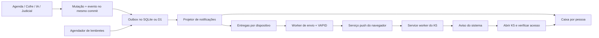

# Plano de notificações do K5

Data: 21/09/2026. Status: proposta de implementação; nenhum código de aplicação ou infraestrutura foi alterado.

Escopo confirmado: push no navegador/PWA e caixa de notificações dentro do K5. E-mail, WhatsApp, aplicativos nativos, campanhas de marketing e cálculo automático de prazos judiciais ficam fora deste trabalho.

## Resultado esperado

Cada pessoa encontra em **Notificações** os acontecimentos relevantes para seu trabalho, com leitura independente dos colegas e acesso ao registro de origem. Quem ativar notificações em um dispositivo também recebe avisos do sistema operacional. A caixa funciona mesmo sem permissão ou suporte a push.

Recomendação: Web Push padrão com VAPID, uma caixa persistida em SQLite/D1 e entrega assíncrona. A caixa é o registro durável; a aceitação de um push pelo provedor não comprova exibição, leitura nem cumprimento de uma obrigação. O sistema não deve apresentar lembretes como garantia de acompanhamento de prazo.

## Base existente e consequências

| Evidência no repositório | Consequência para a implementação |
| --- | --- |
| [Service worker fonte](../apps/web/scripts/service-worker.js) e [PwaProvider](../apps/web/src/components/pwa-provider.tsx) | Acrescentar push ao registro existente de escopo `/`. Não criar outro worker nem editar `public/sw.js`, que é gerado. Preservar atualização voluntária e cache somente de recursos públicos. |
| [Banco assíncrono](../apps/web/src/lib/db/types.ts) e [resolução do backend](../apps/web/src/lib/database.ts) | Mesmas regras de negócio para SQLite local e D1 no Worker. Escritas relacionadas usam `batch()`; não usar transações interativas em D1. |
| [Agenda](../apps/web/src/lib/application/agenda-service.ts) | Há versão otimista, chave de idempotência e `mutation_token`. Eventos devem ser condicionados à mutação realmente aceita. A agenda tem responsável e criador, mas não participantes de reuniões. |
| [Alertas judiciais](../apps/web/db/migrations/0011_judicial.sql) | `judicial_alert.read_at` pertence ao escritório, não à pessoa. Preservar essa semântica existente e criar leitura pessoal separada. |
| [Ingestão judicial](../apps/web/src/lib/judicial/repositories/evidence.ts) | Publicação e alerta são escritos separadamente; o caminho de duplicata faz `continue`. Uma falha entre as escritas pode deixar publicação sem alerta, apesar do comentário de recuperação. Corrigir essa fronteira como parte da integração. |
| [Worker de documentos](../apps/web/scripts/worker.ts), [worker judicial](../apps/web/scripts/judicial-worker.ts), [deploy](deploy-cloudflare.md) | São processos Node. `database.ts` abre SQLite nesses processos; não existe aqui um caminho Node → D1. Não presumir que um processo local consome trabalhos do staging. |
| [Guard de API](../apps/web/src/lib/workspace-api.ts) | `apiWorkspace(request, true)` bloqueia revisores. Preferências, inscrição e leitura pessoais precisam de verificação de origem sem exigir papel de escrita de negócio. |
| [Autenticação](../apps/web/src/lib/auth-core.ts) e [logout global](../apps/web/src/lib/application/ui-service.ts) | Há mais de um caminho de encerramento de sessões. Todos precisam revogar inscrições push. Atualizações automáticas da caixa não podem renovar sessões ociosas. |
| [Navegação](../apps/web/src/lib/navigation.ts) e [design](../apps/web/DESIGN.md) | Texto pt-BR, linhas simples, temas claro/escuro, teclado e toque. Usar navegação compartilhada; manter as quatro abas principais no celular. |

## Eventos e destinatários

Defaults propostos abaixo; são decisões de produto revisáveis, não preferências já confirmadas. Toda resolução de destinatário acontece no servidor, com vínculo atual ao escritório e acesso ao recurso. Nenhum evento é enviado a clientes externos.

| Área / evento | Destinatários iniciais | Caixa / push após adesão |
| --- | --- | --- |
| Agenda: atribuição ou troca de responsável | Novo responsável; antigo responsável recebe aviso de remoção | Ambos; suprimir aviso ao autor da própria alteração |
| Agenda: alteração relevante, conclusão ou cancelamento | Criador e responsável, sem duplicação e excluindo o autor | Ambos; apenas alterações de situação, responsável, data ou horário |
| Agenda: tarefa com vencimento | Responsável; criador quando não houver responsável | Ambos; 09:00 na data civil, no fuso salvo da pessoa |
| Agenda: reunião próxima | Responsável e criador, sem duplicação | Ambos; 30 minutos antes do início |
| Cofre: processamento concluído ou falha definitiva | Pessoa que enviou o documento | Ambos; agrupar lotes. Distinguir extração concluída de disponibilidade no índice de busca |
| Agentes/documentos: cronologia ou minuta concluída/falha | Dono de `ai_run`, mantendo restrição por usuário | Ambos; conclusão abre o artefato, falha abre o contexto da execução |
| Verificação documental: resultado disponível/incompleto | Dono do artefato | Ambos quando o modo mostrar resultados; não expor avaliação em modo shadow nem anunciar aprovação automática |
| Judicial: nova publicação, movimentação ou correção | Seguidores explícitos do caso; padrão inicial para quem habilitou a coleta | Ambos; sem envio automático para todo o escritório |
| Judicial: coleta falhou ou lacuna de cobertura | Responsável pela coleta e administradores do escritório | Ambos; um aviso por incidente, sem repetir cada tentativa |
| Judicial: importação histórica | Seguidores autorizados | Histórico/caixa agrupada, sem push |
| Plataforma e avaliação de respostas | Sem disparos automáticos iniciais | Extensão futura pelo mesmo catálogo; incidentes técnicos ficam na observabilidade |

Adicionar seguidores de caso somente para notificações, separados de `judicial_subscription`, que autoriza coleta. Migrar o responsável atual pela coleta como seguidor inicial de forma idempotente; novos membros não herdam alertas privados antigos. Uma movimentação só emite aviso quando existir produtor real desse evento.

Não emitir push de cada token do chat, porcentagem de processamento, edição de nota, criação de cliente ou retry técnico. Para lotes, consolidar por usuário/categoria/janela de um minuto; o aviso abre a caixa com filtro e os registros individuais continuam disponíveis nela.

## Arquitetura

### Persistência e idempotência

Adicionar a próxima migração disponível em `apps/web/db/migrations/` — hoje a sequência termina em `0016`. Tabelas propostas:

| Tabela | Campos e restrições principais |
| --- | --- |
| `notification_event` | `office_id`, ID, tipo, versão do payload, referência/versão da origem, ator, destinatários pretendidos, dados mínimos, criação, expiração, estado de projeção e lease. Único por `(office_id, dedupe_key)`. |
| `notification_recipient` | Evento, escritório, usuário, `read_at`, `archived_at`, data; único por evento/usuário. Índice para paginação e não lidas por escritório/usuário. |
| `notification_preference` | Escritório/usuário, fuso IANA, silêncio opcional, geração de revogação; categorias e canais em configuração validada e versionada. |
| `push_subscription` | Escritório/usuário, ID opaco do dispositivo, hash único do endpoint, endpoint e chaves cifrados, versão VAPID, geração de autorização, estado, datas de adesão/revogação/última reconciliação. Um endpoint ativo tem um único dono. |
| `notification_delivery` | Destinatário ou grupo, inscrição, estado, tentativas, `next_attempt_at`, expiração, lease/token, código de erro sanitizado, `accepted_at`; unicidade impede dois jobs lógicos para o mesmo destino. |
| `notification_reminder` | Atividade, versão do agendamento, destinatário, regra, fuso, instante UTC, validade e estado; chave única por atividade/agendamento/pessoa/regra. |
| `notification_follow` | Escritório, caso, usuário, início/fim da adesão; chave única de acompanhamento ativo. |

Aplicar FKs e restrições compostas de escritório nas relações, `CHECK` nos estados e índices de trabalhos elegíveis por data. Remoção de usuário/escritório revoga ou elimina dependências. Payloads não guardam cópias de peças, publicações ou prompts.

O produtor prepara statements de evento junto dos statements de negócio. Para Agenda, usar `INSERT ... SELECT` condicionado ao `mutation_token` e à versão aceitos dentro do mesmo `batch`; conflito ou replay não gera evento novo. Para workers, condicionar à posse da lease e à transição terminal realmente persistida. Uma pré-leitura sozinha não garante atomicidade.

Separar a identidade da execução lógica da tentativa técnica: falha terminal e conclusão deduplicam por execução/versão, e uma nova execução explicitamente pedida pode gerar novo evento. Não deduplicar apenas por ID do documento para sempre.

O projetor grava destinatários e intenção de entrega antes de marcar o evento concluído, em batches limitados. Fanout paginado guarda checkpoint; unicidade permite repetir um lote após crash. O público pretendido é capturado no evento ou por corte temporal reproduzível, para uma repetição não incluir pessoas adicionadas depois. Revalidar acesso atual antes de projetar, enviar e abrir.

### Execução por ambiente

**Local/Docker:** novo `scripts/notification-worker.ts`, comando raiz `pnpm notifications:worker` e serviço Docker próprio, compartilhando o SQLite da aplicação. Roda projeção, lembretes e envio em filas independentes, com encerramento gracioso e `--once`. OCR não pode bloquear lembretes.

**Cloudflare:** Worker dedicado com binding para o mesmo D1, Cron Trigger a cada minuto e Cloudflare Queue para distribuir IDs de trabalho ao consumidor. Configuração separada do `vinext/server/fetch-handler`, que hoje atende somente o fluxo web. O Cron agenda lembretes e recupera trabalhos pendentes; a fila acelera e distribui a execução. O banco continua sendo a fonte de verdade.

Não há commit atômico entre D1 e Queue: após commit, publicar uma dica de trabalho; falha nessa publicação é recuperada pelo sweep do banco. A fila pode repetir mensagens; o consumidor reivindica a linha por `UPDATE ... RETURNING` e só conclui com o token da lease. Trabalhos perdidos/expirados na fila reaparecem a partir do banco.

A documentação atual oferece Queues no plano Free, com 10.000 operações/dia e retenção de 24 horas. Não usar a retenção da fila como retenção da notificação. Medir operações, leituras/escritas D1 e CPU antes do rollout; o limite documentado de CPU do Cron Free é 10 ms, portanto o scheduler deve fazer lotes pequenos e encaminhar processamento. Se os testes não couberem no plano, registrar custo e ajustar o plano de hospedagem antes da ativação. Fontes: [Queues](https://developers.cloudflare.com/queues/platform/pricing/) e [limites Workers](https://developers.cloudflare.com/workers/platform/limits/).

Usar um adaptador `PushSender` para isolar transporte. `web-push` é candidato no Node; sua documentação o apresenta como biblioteca Node, não prova compatibilidade em Workers. A primeira etapa deve validar biblioteca e criptografia no runtime real de Workers, com transporte `fetch` e Web Crypto quando necessário, usando implementação mantida do protocolo. Não criar criptografia própria. Fonte: [web-push](https://github.com/web-push-libs/web-push).

**Dependência de staging:** resolver o caminho dos produtores Node para o banco autoritativo antes de anunciar notificações de OCR/IA/coleta no staging. O spike deve escolher e testar um contrato privado de jobs: Worker com binding D1 reivindica e confirma jobs; Node recebe somente o trabalho autorizado e devolve resultado com identidade de serviço e lease. Estado final e evento devem ser gravados juntos em D1. Não sincronizar dois bancos independentes nem abrir uma API genérica de SQL remoto. Essa integração pode ser uma entrega de infraestrutura separada; Agenda e caixa podem entrar antes dela. Estimar essa entrega após examinar os requisitos completos dos workers.

### Entrega e falhas

- Estados de envio: `pending`, `leased`, `accepted`, `retry`, `expired`, `cancelled`, `dead`. `accepted` significa aceitação pelo serviço push.
- Reclamação atômica com prazo, token e recuperação de lease vencida. Limitar concorrência e distribuir por escritório para um lote não bloquear os demais.
- Timeouts, 429 e 5xx: backoff exponencial com jitter, respeitando `Retry-After`, expiração e teto inicial de oito tentativas. 404/410: desativar inscrição e cancelar pendências dela. 400/413: falha permanente de payload; 401/403: investigar configuração/VAPID antes de invalidar dispositivos em massa.
- Para timeout ambíguo, repetir pode duplicar uma exibição. Usar ID/tag estável na notificação, `renotify: false` e deduplicação local limitada a IDs opacos. Não prometer exactly-once entre banco e provedor externo.
- Revalidar preferências, leitura, inscrição, geração de revogação, vínculo e validade imediatamente antes do envio. Uma leitura pode cancelar push ainda pendente; uma requisição já enviada não pode ser retirada com garantia.
- TTL proposto: 24 horas para resultados/alterações; lembrete de reunião expira no início; tarefa expira ao fim do dia local. Reconstruir TTL restante a cada tentativa.
- O sistema push não transporta heartbeats nem sincronização silenciosa. Para push válido recebido, mostrar aviso visível e atualizar abas abertas por `postMessage`; não suprimir sistematicamente o aviso porque uma aba está em primeiro plano.

## API, segurança e ciclo do dispositivo

Rotas propostas sob `/api/notifications`: listagem paginada e contagem; marcar leitura individual/em lote; arquivar; ler/alterar preferências; registrar/listar/revogar inscrições; ler chave pública/configuração; enviar teste apenas ao próprio dispositivo. IDs de usuário/escritório vêm da sessão, nunca do corpo. Não oferecer endpoint genérico de envio para um destinatário arbitrário.

Criar um guard de operações pessoais que reutiliza autenticação e origem confiável, mas permite a revisor alterar seus próprios dados de notificação. Não enfraquecer o guard existente de escrita de negócio. Limitar tamanho de JSON, frequência de inscrições e testes; toda resposta pessoal usa `private, no-store` e fica fora do cache do service worker/CDN.

Endpoints push são destinos de rede fornecidos pelo cliente: exigir HTTPS e hosts de provedores permitidos, validar chaves/formato/tamanho, rejeitar credenciais na URL, hosts internos, IPs literais e redirects. Manter allowlist revisável dos provedores comprovados nos testes. Cifrar endpoint e segredo de inscrição com a infraestrutura de credenciais existente; nunca registrar esses valores, cookies ou payloads nos logs. A chave pública VAPID pode chegar ao navegador; a privada fica somente no ambiente de envio.

Adesão explícita por dispositivo: preparar service worker/configuração antes do clique; chamar a solicitação de permissão diretamente na interação humana; usar `userVisibleOnly: true`; persistir a inscrição autenticada e só então mostrar **Ativadas neste dispositivo**. Se a persistência falhar, mostrar falha recuperável e reconciliar a inscrição existente, sem criar duplicatas.

Reconciliação em login, abertura e retorno ao primeiro plano compara `getSubscription()`, permissão, versão VAPID e estado servidor. `pushsubscriptionchange` é melhoria adicional, não o único mecanismo de recuperação. Uma inscrição revogada pelo K5 exige nova ação de adesão, mesmo quando a permissão do navegador ainda é `granted`.

**Política proposta de sessão:** adesão push é autorização persistente do dispositivo; expiração por inatividade da sessão não impede lembretes genéricos, nem concede acesso à caixa. Logout explícito global revoga todas as inscrições do usuário; remoção do escritório e desativação de conta também impedem entrega. Aplicar nos caminhos de `authClient.signOut()`, `endGlobalSession()` e demais endpoints de revogação aplicáveis, com política central e teste de corrida inscrição/logout. Serializar a geração de revogação com a validação da sessão usada para inscrever, para uma requisição antiga não reativar o dispositivo. Better Auth continua responsável pelas sessões.

Troca de conta no mesmo navegador encerra a associação anterior e exige nova adesão; não transferir silenciosamente um endpoint. Revogação servidor precede limpeza local para que fechar a aba não a interrompa. Fechar notificações já visíveis no dispositivo atual quando possível. Avisos já aceitos pelo provedor podem chegar depois do logout; por isso o payload de lock screen será sempre genérico no primeiro rollout:

> **K5** — Você tem uma atualização no K5.

Payload: versão, ID opaco da notificação/grupo, tag e expiração. Não incluir nomes de clientes, CNJ, títulos de casos/documentos, conteúdo de publicações, nem detalhes de falhas. Clique abre uma rota interna fixa da caixa com ID opaco; o servidor verifica sessão, destinatário e acesso à origem antes de renderizar detalhes ou oferecer navegação. Se precisar entrar novamente, preservar somente retorno interno validado. Outro usuário no mesmo dispositivo não pode resolver o ID.

## Caixa, preferências e lembretes

Adicionar `/app/notifications` com estados de carregamento, vazio, erro e falta de conexão; filtros **Todas** / **Não lidas**, paginação por cursor `(created_at, id)`, leitura individual, **Marcar todas como lidas** até um cursor de corte e arquivamento. Eventos que chegam depois desse corte permanecem não lidos. Leitura é por usuário e sincroniza entre dispositivos; dispensar o aviso do sistema não marca leitura.

Adicionar **Notificações** na sidebar e em **Mais**, com contagem textual acessível; atalho funcional no cabeçalho móvel se necessário, sem nova aba inferior. Usar linhas e controles do sistema visual, sem badges decorativos. Os links abrem atividades/clientes via parâmetros já usados pela Agenda, casos do Cofre e `/app/documents/[id]` para artefatos. Validar destinos de falhas: os caminhos de execução em `openResource()` não têm todos uma página correspondente hoje e precisam de resolução explícita.

Caixa atualiza ao abrir, voltar ao primeiro plano, receber mensagem do service worker e por polling inicial de 60 segundos enquanto visível/online. Coordenar abas e aplicar backoff; botão **Atualizar** continua disponível. Usar consulta de sessão sem refresh para requisições automáticas e preservar validação real no banco. A versão instalada de Better Auth oferece `disableRefresh`; testar que polling não altera expiração nem emite renovação de cookie. Não passar depois por outro helper que faça refresh. WebSocket/SSE não são necessários para o rollout inicial.

Preferências: chave por categoria/canal, ativação por dispositivo, **Enviar teste**, lista de dispositivos/revogação, fuso IANA e horário de silêncio opcional. Caixa ativa por padrão; push exige adesão. Sugestão inicial de silêncio: desligado até a pessoa configurar; quando ligado, adiar push até o fim da janela e descartar se perdeu validade. Não furar silêncio automaticamente por prioridade. Mostrar **Sem suporte**, **Permissão bloqueada**, **Ativar neste dispositivo**, **Ativadas**, **Falha ao ativar** e ajuda de instalação em pt-BR.

No iPhone/iPad, orientar instalação na Tela de Início e adesão a partir do app instalado; o suporte foi introduzido no iOS/iPadOS 16.4 e a permissão exige interação direta. Fazer feature detection, incluindo contexto seguro, service worker, Notifications e PushManager. Fonte: [WebKit](https://webkit.org/blog/13878/web-push-for-web-apps-on-ios-and-ipados/).

Persistir fuso escolhido; oferecer o fuso detectado no navegador como valor inicial, com `America/Sao_Paulo` como fallback explícito. Nunca converter uma data civil de tarefa por `new Date('YYYY-MM-DD')`. Reuniões já são instantes UTC. Calcular lembretes de tarefas com data civil + horário + fuso; guardar instante UTC derivado. Usar Temporal já presente no projeto e política documentada para horários inexistentes/duplicados. Cron executa em UTC ([documentação](https://developers.cloudflare.com/workers/configuration/cron-triggers/)).

Reagendar apenas quando mudarem campos relevantes, destinatário, fuso ou preferência; não em toda edição de nota. Conclusão/cancelamento/remove-responsável invalida jobs antigos. Antes de materializar e enviar, comparar a geração do agendamento com o estado atual. Recuperação após downtime: um único lembrete ainda válido, nunca uma rajada de lembretes vencidos. O remetente precisa repetir essa validação mesmo se o evento já foi projetado.

## Integração e migração judicial

Manter `judicial_alert` como histórico de domínio. A caixa pessoal aponta para esse registro; marcar a notificação como lida não altera o `read_at` compartilhado da caixa judicial, nem o contrário. Não reutilizar `delivered_at` para representar leitura ou entrega a todos os usuários.

Para novos dados, gravar publicação, alerta e evento de forma atômica por item, após resolver referências; onde for impossível, adicionar reconciliação explícita de publicação sem alerta, deduplicada por identidade da publicação. Não confiar no replay atual que pula duplicatas.

No corte de ativação, registrar watermark: histórico anterior fica na caixa judicial existente; nenhuma tempestade de push retroativo. Uma importação opcional de histórico para a caixa pessoal deve ser marcada como histórica, sem push e sem inferir leitura individual a partir de leitura compartilhada. Nunca reescrever a proveniência ou data oficial de publicação.

## Entregas e ordem

| Etapa | Trabalho e arquivos principais | Critério de conclusão |
| --- | --- | --- |
| 0. Spike de infraestrutura | Transporte Web Push no Node/Workers, chave VAPID de teste, D1/Cron/Queue, levantamento dos produtores Node e orçamento de CPU/operações | Push real em Android, desktop e iPhone instalado; caminho de produção e custos registrados; plano específico para conectar produtores ao D1 |
| 1. Núcleo persistente | Migração; `src/lib/notifications/{contracts,events,repository,policy}.ts`; `src/lib/application/notifications-service.ts`; guard pessoal | Evento e mutação atômicos nos dois backends; leitura por usuário; isolamento, conflitos, replay e crash testados |
| 2. Caixa e primeiro produtor | Rotas API, `/app/notifications`, componentes, navegação, integração de `agenda-service.ts` | Alteração de Agenda aparece somente aos destinatários; revisor gerencia seus próprios avisos; atualização não prolonga sessão |
| 3. Push e revogação | `pwa-provider.tsx`, fonte do service worker, inscrições/preferências, `PushSender`, auth/logout, secrets e worker dedicado | Adesão, entrega real, clique seguro, bloqueio, revogação, troca de conta, retries e expiração passam |
| 4. Lembretes | Scheduler, tabela de lembretes, fuso/silêncio, configuração de Cron e worker local/Docker | Funciona com app fechado; reagendamento/cancelamento e recuperação não duplicam nem atrasam avisos vencidos |
| 5. Demais módulos | `vault.ts`, `document-workflows.ts`, `knowledge/indexing.ts`, `typesafe/verification.ts`, repositórios judiciais e seguidores | Eventos terminais corretos, modo shadow preservado, histórico silencioso, falha entre publicação/alerta recuperada; produtores alcançam banco correto |
| 6. Piloto e operação | Métricas, retenção, documentação, flags por escritório, deploy/migrações e runbook | Piloto validado, kill switch testado, nenhuma fuga de dados/renovação de sessão, resultados medidos antes da ampliação |

As etapas são unidades de entrega, não promessa de prazo. A etapa 0 precisa dimensionar principalmente a integração dos workers Node com D1; ela pode exceder o tamanho do próprio canal push. Reutilizar código em `apps/web/src/lib/notifications` com dependências injetadas e entrypoints distintos. Extrair pacote compartilhado apenas quando necessário para os builds.

## Validação e critérios de aceite

- **Banco:** migrations em SQLite e D1/workerd; evento ausente em rollback/conflito; workers concorrentes; crash após commit, antes/depois do enqueue, no meio do fanout e após aceitação pelo provedor; recuperação de leases; índices e paginação sob volume.
- **Autorização:** dois escritórios e dois usuários no mesmo escritório; recurso privado de IA; revisor; origem forjada; tentativa de inscrever/ler/revogar dispositivo alheio; endpoint SSRF; remoção de membro; corrida de logout com envio/inscrição; clique depois de troca de conta.
- **Sessões:** estender `tests/auth.test.ts` com os endpoints reais Better Auth e logout global, provando revogação em todos os caminhos e ausência de renovação por polling. A adesão persistente não permite consultar a caixa sem login válido.
- **Tempo:** datas civis, mudança de fuso, DST, silêncio atravessando meia-noite, edição concorrente, conclusão/cancelamento, indisponibilidade do worker e múltiplos disparos do Cron.
- **Transporte:** adapter falso para 2xx/404/410/429/5xx/timeout/erro VAPID, relógio controlado e TTL. Teste real em staging para criptografia, provedor e compatibilidade Workers; mock não comprova entrega no SO.
- **Navegadores:** Chrome/Edge/Firefox desktop, Safari macOS, Chrome Android e Safari/PWA em iPhone real. App aberto/fechado, sem conexão/reconectado, permissão negada/revogada, push recebido após logout e atualização de SW com formulário não salvo em outra aba.
- **UI:** desktop/celular, teclado, foco, leitor de tela, claro/escuro, movimento reduzido e estados vazio/carregando/erro. Nenhum dado pessoal em Cache Storage. Reexecutar os verificadores PWA existentes.
- **Comandos:** `pnpm lint`, `pnpm typecheck`, `pnpm test`; ambiente preparado e `pnpm db:setup` antes de `pnpm build`; também `pnpm --filter @k5/web build:vinext` e validação do Worker dedicado. Ler os guias Next.js locais pertinentes antes de alterar código.

Metas iniciais, a medir no piloto: p95 de evento persistido até caixa em até 60 segundos e até aceitação push em 120 segundos quando elegível e serviços saudáveis; lembrete processado em até dois minutos do instante previsto. Não incluem o tempo do provedor/SO para exibir. Alertar quando trabalho elegível mais antigo exceder cinco minutos ou aumentar a taxa de falha permanente.

## Operação e rollout

Flags independentes: captura/projeção, UI da caixa, envio push e lembretes; rollout por escritório. Ordem: migrations aditivas → consumidores inicialmente pausados → produtores → caixa → adesão/push em piloto → lembretes → demais módulos. Não pedir permissão antes de haver consumidor operacional. O cadastro pode exigir confirmação de que o SW ativo suporta a versão de push; respeitar **Atualizar agora**, sem forçar reload.

Separar VAPID de desenvolvimento, staging e produção; não gerar par novo a cada deploy. Configuração proposta: chave pública, privada, contato VAPID e ID da chave; privada apenas como secret. Para rotação, manter chave anterior para inscrições existentes e renovar inscrições em uso com a nova. Documentar rotação de emergência, re-adesão e perda de chave. Manter compatibilidade de payload com pelo menos a versão anterior do SW.

Telemetria estruturada: IDs opacos/correlação, contagens por tipo e estado, idade do trabalho, atraso de lembrete, latência, códigos do provedor e inscrições desativadas. Não registrar endpoints nem conteúdo de negócio. Operação deve expor tentativas e reprocessamento restrito a operadores, sempre rechecando validade e autorização; não enviar aviso de falha do próprio canal através desse canal.

Defaults propostos de retenção: caixa por 90 dias; detalhes operacionais por 30 dias; inscrições revogadas removidas em até 30 dias. Retenção da evidência judicial permanece independente. Preservar chaves mínimas de deduplicação por todo o horizonte de replay da origem, mesmo após expirar conteúdo da caixa, e nunca limpar jobs pendentes sem destino terminal. Configurar retenção final antes do piloto conforme necessidades do escritório.

Kill switch desliga envio/agendamento sem apagar caixa nem dados do domínio; ao religar, revalidar validade e evitar replay em massa. Rollback de aplicação preserva migrações aditivas e desabilita novos produtores. Atualizar READMEs, exemplos de ambiente, Docker, documentação de deploy e operação somente junto da implementação correspondente.

## Verificação deste plano

Plano baseado em leitura do código, instruções do projeto, guia PWA do Next.js instalado e fontes oficiais citadas. A infraestrutura remota, entrega real e compatibilidade de biblioteca em Workers ainda não foram testadas. Este trabalho é apenas documental; testes da aplicação e provisionamento não fazem parte desta alteração.
