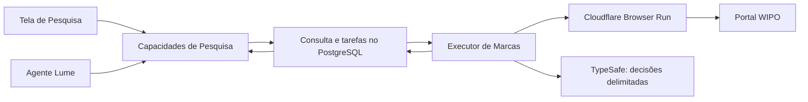

# Plano: Pesquisa por modalidades e Marcas Registradas

Data: 30/09/2026. Este documento preserva o planejamento. A primeira implementação e suas escolhas finais estão em [Pesquisa de marcas](implementacao-pesquisa-marcas.md). A prova com o adaptador real em Browser Run remoto passou para nome, imagem, filtros, paginação e detalhes.

Escopo atual: a interface oferece apenas Marcas e Jurisprudência. A modalidade Web prevista abaixo foi removida; `web_search` continua disponível ao agente.

## 1. Decisões confirmadas

- Refatorar Pesquisa para oferecer modalidades com fontes e comportamento próprios.
- Entregar primeiro **Marcas Registradas**, consultando o Global Brand Database da WIPO por automação com Cloudflare Browser Run.
- Aceitar **nome da marca e imagem/logotipo** na primeira versão.
- Usar **Brasil por padrão**, com outros países disponíveis.
- Exibir **todos os status por padrão**, com filtro disponível para restringir a situação.
- Entregar resultados à tela de Pesquisa e ao agente Lume, sempre com fonte.
- Disponibilizar uma página interna de detalhes para cada resultado.
- Preservar a pesquisa atual na web e de jurisprudência como outras modalidades.
- Reservar Cloudflare AI Search para outra modalidade, ainda sem escopo definido. A [pesquisa do produto](pesquisa-cloudflare-ai-search.md) documenta suas APIs e limitações.

As escolhas abaixo são propostas de implementação, não decisões adicionais atribuídas ao usuário.

## 2. Experiência proposta

Manter a seção Pesquisa na navegação existente. Dentro dela, oferecer **Marcas Registradas**, **Web** e **Jurisprudência**. Os modos Instantânea, Rápida, Automática e Profunda continuam pertencendo à busca Web. Não criar uma opção vazia para a futura modalidade de AI Search.

Em Marcas Registradas, duas entradas: **Nome** e **Logotipo**. Nome recebe texto; Logotipo recebe arquivo com prévia e opção de substituir/remover. Isso atende às duas formas de pesquisa sem prometer combinação simultânea de nome e imagem antes de verificar o fluxo da WIPO.

Mostrar país selecionado, situação e classe Nice junto da consulta. Titular e número de pedido/registro podem ficar nos filtros adicionais. A estratégia de correspondência deve ser explícita: nome exato, aproximado ou fonético, conforme as opções efetivamente suportadas pelo portal; para imagem, a primeira versão usa comparação conceitual. Forma, cor e composição ficam para uma entrega posterior. Não apresentar um percentual inventado de semelhança. [Guia da WIPO](https://www.wipo.int/documents/d/global-brand-database/docs-en-user-guide.pdf?download=true)

Recomendações de padrão ainda discutíveis:

- Buscar nomes semelhantes, com opção de correspondência exata.
- Entregar a primeira página e permitir carregar mais. Meta inicial de apresentação: 30 resultados por página; a paginação real do provedor será traduzida pelo adaptador.

O histórico permite filtrar por modalidade e reabrir a consulta com seus critérios e resultados. Consultas antigas continuam acessíveis pelos links existentes. Pesquisa por nome e por imagem mostram claramente qual critério foi usado.

O progresso informa ações compreensíveis, como “Consultando a WIPO”, “Resultados encontrados” e “Carregando detalhes”. Resultados já obtidos permanecem disponíveis se outra etapa falhar. Uma fonte indisponível não aparece como “nenhum resultado”.

A UI segue [DESIGN.md](../apps/web/DESIGN.md): pt-BR, grade e tipografia existentes, componentes compartilhados, acesso por teclado e comportamento móvel. Lista e detalhes precisam de estados de carregamento, vazio, erro, consulta parcial e ausência de imagem.

## 3. O significado de Brasil

País do titular, escritório de propriedade intelectual e país designado são filtros diferentes na WIPO. Filtrar somente o endereço do titular não representa proteção no Brasil. [Guia da WIPO](https://www.wipo.int/documents/d/global-brand-database/docs-en-user-guide.pdf?download=true)

**Proposta:** Brasil significa registros/pedidos do INPI e registros internacionais que designem o Brasil, conforme a cobertura disponível na WIPO. O adaptador deve validar se consegue expressar essa união em uma consulta. Se precisar de duas, conservar o escopo e o total de cada uma, mesclar por identificador da fonte e deixar a cobertura explícita. Uma marca nacional e um registro internacional distinto não são duplicatas só por terem o mesmo nome.

Outros países seguem a mesma definição de território consultado. A lista deve refletir a cobertura da fonte. Restringir o conjunto a marcas, sem misturar automaticamente outros tipos de registros disponíveis no Global Brand Database.

Na prova técnica, comparar o filtro aplicado no portal com o critério recebido pelo app. Não aceitar como sucesso uma consulta que ignorou país, situação ou classe.

## 4. Resultados, detalhes e fontes

Cada resultado guarda identificador nativo, posição na consulta, nome, representação da marca quando disponível, titular, escritório/território, situação, classes, números, URL da WIPO e horário de coleta. Campos ausentes continuam ausentes.

A página de detalhes acrescenta, quando publicados, tipo da marca, dados do titular e representante, produtos/serviços, classes Nice/Viena, datas de pedido, registro, publicação e encerramento, situação oficial e link para o escritório de origem. Os rótulos e valores originais ficam preservados junto das normalizações usadas pela UI.

Separar três conceitos: situação da marca, disponibilidade dos detalhes e estado da execução. “Rejected”, por exemplo, não é falha da pesquisa. A data de coleta também não é a data de atualização do registro.

Proposta de rota: `/app/research/trademarks/[resultId]`, com identificador interno autorizado. A página abre imediatamente com os dados da lista e busca os detalhes faltantes em segundo plano. O agente pode solicitar os mesmos detalhes pela capacidade correspondente. A disponibilidade de detalhes para todos os resultados não exige abrir todas as páginas antes de mostrar a lista.

Manter sempre duas referências quando a fonte as fornecer:

1. **WIPO Global Brand Database:** página específica do registro.
2. **Escritório de origem:** link observado no registro, como o INPI.

O exemplo indicado foi conferido ao vivo: [LUME, BR500000905046595](https://branddb.wipo.int/en/advancedsearch/brand/BR500000905046595). A página informa situação geral “Ended” e status oficial “Rejected”. O link publicado para o escritório de origem é o [registro no INPI](https://busca.inpi.gov.br/pePI/servlet/MarcasServletController?Action=detail&CodPedido=905046595). Esse exemplo deve validar que o sistema não transforma todo achado em registro ativo.

As referências enviadas ao Lume incluem o identificador interno, identificador nativo, URLs e versão/horário do conteúdo consultado. O agente distingue texto da fonte de sua interpretação e indica resultados parciais. Não inferir disponibilidade de uma marca pela ausência de correspondências. A WIPO registra limitações de cobertura e atualização. [FAQ oficial](https://www.wipo.int/en/web/global-brand-database/faqs_branddb)

## 5. Uma execução compartilhada entre tela e agente

Uma consulta possui modalidade, critérios, solicitante, estado, resultados, paginação e progresso. As entradas e os detalhes variam por modalidade, com contratos discriminados; não criar um objeto genérico com dezenas de campos opcionais.

Propor capacidades para iniciar, acompanhar, listar histórico, carregar próxima página, obter detalhes e cancelar a consulta de marcas. Elas usam o mesmo serviço na UI e no Lume. O retorno inicial traz o identificador da execução; resultados e progresso chegam depois, sem manter o pedido HTTP aberto por toda a navegação.

Permissões seguem os leitores atuais de Pesquisa: administrador, advogado e revisor, com usuário e escritório derivados da sessão. Histórico e entradas são privados por pessoa/escritório, como na busca Web atual. O worker revalida acesso antes de continuar e publicar resultados; um identificador de consulta não concede acesso.

## 6. Browser Run e o papel do Jev

**Implementação:** Durable Object dedicado no Worker web, com binding `BROWSER` próprio e adaptador WIPO usando `@cloudflare/puppeteer`, já presente no projeto. Browser Run oferece controle de Chromium e sessões via CDP. O browser de monitoramento continua separado. [Puppeteer no Browser Run](https://developers.cloudflare.com/browser-run/puppeteer/), [CDP](https://developers.cloudflare.com/browser-run/cdp/)

O [artigo da Cua enviado pelo usuário](https://x.com/trycua/status/2101437979180904640) descreve `jev-use` como receita em prévia pública: o app observa a interface, constrói candidatos com IDs, Jev escolhe um deles, o código executa e verifica o novo estado. Jev recebe texto; DOM/acessibilidade podem fornecer a representação necessária. O artigo não apresenta benchmark de navegação na WIPO. [Exemplo oficial](https://github.com/trycua/cua/tree/main/libs/cua-driver/examples/jev-use)

Aplicar esse padrão ao nosso adaptador:

1. Executar em código os passos conhecidos: abrir a modalidade, preencher critérios, enviar o arquivo e coletar campos.
2. Quando houver ambiguidade semântica, enviar ao Jev estado textual compacto e candidatos permitidos, incluindo “nenhuma ação adequada”.
3. Resolver o ID escolhido no snapshot atual e validar alvo, origem e argumentos.
4. Executar pelo Puppeteer e observar novamente; confirmar a mudança esperada antes do próximo passo.
5. Se o fluxo sair dos estados suportados, preservar os achados e devolver erro explícito. Não transformar confiança do modelo em prova de sucesso.

Seletores, URLs de navegação, argumentos de upload e código executável pertencem ao adaptador. Não são gerados livremente pelo modelo. Conteúdo encontrado no portal é dado de pesquisa, não instrução para mudar as regras da execução.

Reutilizar a conexão central e os controles existentes de TypeSafe, com finalidade `research`, modelo fixado e perguntas versionadas para navegação. Testar os modos `off`, `shadow` e `enabled`: em shadow, observar escolhas sem aplicá-las; se o modelo estiver indisponível, continuar apenas passos determinísticos suportados. [Cliente atual](../apps/web/src/lib/typesafe/client.ts), [Choice](https://docs.typesafe.ai/primitives/choice), [estado textual](https://docs.typesafe.ai/concepts/state)

O ganho de velocidade será medido contra um adaptador determinístico e um fluxo equivalente com modelo geral, se houver ambiguidade que o justifique. Medir tempo até o primeiro resultado, tempo total, sucesso dos filtros, ações, chamadas de modelo e custo. Não chamar Jev em todo clique somente por estar disponível.

Para logotipo, a imagem é enviada ao mecanismo visual da WIPO; Jev decide sobre o estado textual da página. Aceitar inicialmente JPG, PNG e WebP, validar conteúdo/tamanho no servidor e mostrar a prévia. Nome do arquivo não é evidência do formato. [FAQ de imagens](https://www.wipo.int/en/web/global-brand-database/faqs_branddb)

O Cua Driver nativo não é dependência desta primeira entrega. O runner de `jev-use` inicia o Driver local por stdio e vincula processo/janela de Chromium; esse percurso não conecta diretamente ao CDP hospedado do Browser Run. A implementação usa observação e execução próprias em Puppeteer, aproveitando o padrão do decisor. A demonstração usa um formulário local, não valida navegação na WIPO. [Runner oficial](https://github.com/trycua/cua/blob/main/libs/cua-driver/examples/jev-use/typescript/run.ts), [README](https://github.com/trycua/cua/blob/main/libs/cua-driver/examples/jev-use/README.md). A [pesquisa anterior do Driver](pesquisa-cua-driver.md) continua aplicável a outros fluxos de automação.

## 7. Persistência e retomada

Propor novas tabelas próprias para consulta de marcas, resultados/versionamentos e tarefas. Elas usam PostgreSQL e novas migrações. Não colocar marcas nas tabelas de julgados nem exigir uma instalação de tribunal para executar essa modalidade.

Compartilhar na aplicação o contrato de histórico/progresso por modalidade, com adaptadores para dados existentes. A refatoração não depende de regravar o histórico Web ou o acervo judicial.

Cada tarefa tem chave de idempotência, lease, tentativas limitadas e checkpoint. A consulta expõe estados `queued`, `running`, `completed`, `partial`, `blocked`, `failed` e `cancelled`, além da etapa e motivo atuais. `completed` significa que terminou o escopo solicitado, não que percorreu toda a base. Registrar quantidade recebida, total informado e possibilidade de carregar mais.

O banco conserva critérios, páginas concluídas e IDs coletados. Não usar referências DOM como checkpoints duráveis. Se a sessão cair, abrir outra, reaplicar os critérios e retomar sem duplicar resultados. A execução continua quando a tela ou conversa fecha; cancelamento explícito interrompe as tarefas pendentes.

Acionamento implementado: RPC para o Durable Object da pesquisa, com tarefas no PostgreSQL como fonte de verdade. Alarmes e cron recuperam acionamentos perdidos. Somente IDs atravessam o acionamento; o executor resolve identidade e entradas no servidor. Um consumidor repetido não inicia um segundo browser para o mesmo lease.

Uma sessão de browser por tarefa ativa, reutilizada somente dentro da mesma execução. Ao terminar, liberar efetivamente a sessão. O timeout padrão é de um minuto ocioso, extensível até dez; sessões também podem terminar em atualizações do serviço. Isso reforça a necessidade dos checkpoints. [Limites](https://developers.cloudflare.com/browser-run/limits/)

Imagens de entrada ficam em armazenamento privado do escritório, com acesso pelo executor autorizado. Não reutilizar cookies, arquivos ou contexto de browser entre escritórios. Definir retenção antes da entrega: proposta inicial de conservar a imagem enquanto a consulta estiver no histórico e removê-la ao excluir a consulta. Não criar nesta etapa um corpus global de dados da WIPO.

## 8. Pontos de integração no repositório

| Ponto existente | Trabalho proposto |
| --- | --- |
| [Rota Pesquisa](../apps/web/src/app/app/research/page.tsx) e [workspace](../apps/web/src/components/research-workspace.tsx) | Seletor de modalidade, formulário de marcas e histórico por modalidade; compatibilidade dos links antigos |
| [Serviço](../apps/web/src/lib/application/research-service.ts) e [dispatcher](../apps/web/src/lib/application/research-capability-service.ts) | Publicar operações de marcas pelo mesmo caminho de UI e agente |
| [Capacidades](../apps/web/src/lib/capabilities/research.ts) | Contratos próprios de entrada, execução, resultados e detalhes de marcas |
| [Jobs](../apps/web/src/lib/research/jobs.ts) e [worker judicial](../apps/web/src/lib/research/worker.ts) | Aproveitar o padrão de leases/idempotência, mantendo tabelas e processamento de marcas separados |
| [TypeSafe](../apps/web/src/lib/typesafe/client.ts) | Reutilizar conexão central, auditoria e orçamento; acrescentar perguntas de navegação |
| [Sessão](../apps/web/src/lib/session.ts) | Aplicar `requireWorkspace()` e isolamento de pessoa/escritório em todas as operações |
| [Configuração de monitoramento](../apps/web/wrangler.monitoring.jsonc) | Referência de integração já existente com Browser Run; criar executor de Pesquisa próprio |

Módulos novos sugeridos dentro de `apps/web/src/lib/research/trademarks/`: contratos, serviço, tarefas, adaptador WIPO e decisões de navegação. O executor Cloudflare fica em `apps/web/src/workers/`. São locais propostos, ainda não arquivos existentes.

## 9. Sequência de entrega e critérios de aceite

**Etapa 1 — prova no ambiente real do Browser Run.** Consultar nome, enviar logotipo de teste, aplicar Brasil/outro país, ler uma página e um detalhe. Conferir o registro LUME indicado, fontes e status. Capturar tempos, bloqueios e mudanças de interface. A sessão usada nesta pesquisa foi a do navegador colaborativo, portanto essa prova permanece necessária.

**Etapa 2 — execução durável e capacidades.** Implementar contratos, migrações, fila, executor, versões dos resultados e isolamento. Demonstrar retomada após queda do browser, concorrência/idempotência, cancelamento e perda de autorização. A UI e o agente devem recuperar a mesma consulta.

**Etapa 3 — refatoração da interface.** Entregar modalidades, formulário de nome/logotipo, progresso, resultados, paginação, detalhes e histórico. Verificar desktop, mobile, teclado e estados de erro/parcial/vazio. Preservar capacidades, dados e links de Web e Jurisprudência.

**Etapa 4 — avaliação e piloto.** Verificar campos contra o portal em uma amostra com nomes semelhantes, vários status, imagens e países. Comparar desempenho com/sem Jev e observar disponibilidade da fonte. Não declarar compatibilidade geral a partir de um único registro.

Critérios mínimos:

- Nome e logotipo funcionam no Browser Run remoto; os filtros aplicados são comprovados.
- Todo resultado tem URL individual da WIPO; URL de origem é incluída quando publicada.
- Um detalhe rejeitado ou encerrado mantém esse status na tela e no Lume.
- Falhas, bloqueios e resultados parciais são distinguíveis de uma consulta completa sem achados.
- Consultas continuam após fechar a tela, e retomadas não duplicam registros.
- Histórico, arquivos e capacidades respeitam pessoa/escritório e revogação de acesso.
- Os fluxos atuais continuam disponíveis.

Na implementação, executar `pnpm lint`, `pnpm typecheck`, `pnpm test` e `pnpm build`, além da validação real dos fluxos de browser e UI. Nesta fase documental, verificar conteúdo, links e caminhos; testes de aplicação não se aplicam.

## 10. Limitações e operação

**Restrição da fonte:** os termos públicos da WIPO proíbem consultas automatizadas, scraping e download em massa. O usuário definiu Browser Run como via técnica, mas acesso público não altera esse texto nem constitui acesso de parceiro/API. Registrar a restrição e os requisitos de atribuição/reutilização; não presumir autorização para formar ou redistribuir uma base comercial. [Termos da WIPO](https://www.wipo.int/en/web/global-brand-database/terms_and_conditions)

**Disponibilidade técnica:** Browser Run é identificado como bot; alterar user agent não resolve essa condição. Se a fonte bloquear o fluxo, devolver estado `blocked`, com os resultados já coletados e o link da consulta. A escolha do produto não garante aceitação pela WIPO. [Documentação do Browser Run](https://developers.cloudflare.com/browser-run/playwright/)

**Orçamentos:** limitar ações, tempo, tentativas, browsers concorrentes e consultas por pessoa/escritório/fonte. Considerar o uso de Browser Run por outros serviços da mesma conta. No plano Workers Paid, a tabela atual inclui dez horas mensais, cobrando US$ 0,09 por hora adicional; concorrência tem cobrança própria. Custos de Workers, armazenamento, fila e modelos são separados. A prova técnica deve produzir uma estimativa por consulta, especialmente para detalhes. [Preços oficiais](https://developers.cloudflare.com/browser-run/pricing/)

**Decisões de produto a fechar:** estratégia padrão de nome e confirmação da definição territorial de Brasil. Retenção de imagens e limite operacional inicial também precisam constar da implementação. Nenhuma dessas escolhas exige começar pela futura modalidade de AI Search.
