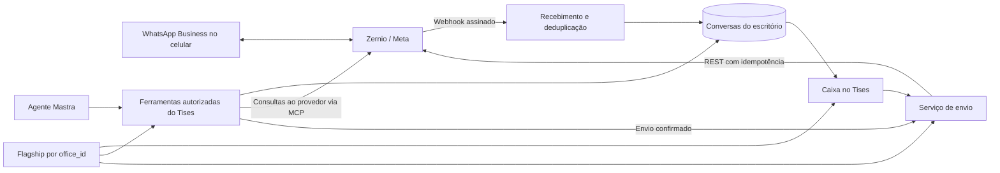

# Plano: WhatsApp Business no Tises

Atualizado em 27/09/2026. **Somente planejamento. A implementação depende do aviso do usuário para começar.**

## Objetivo e decisões confirmadas

- Prioridade da primeira versão: **caixa de conversas no Tises e acesso pelo agente**.
- Direção proposta: Zernio, usando a conexão oficial de WhatsApp Business com coexistência.
- O advogado deve continuar usando o mesmo número no aplicativo WhatsApp Business e no Tises.
- Liberação gradual por escritório, usando Cloudflare Flagship. Os escritórios do piloto ainda serão definidos.
- O usuário informou que configurará `ZERNIO_API_KEY` no ambiente local. A chave não precisa ser enviada pelo chat.

## O que a pesquisa confirmou

A Zernio documenta o modo `onboarding=business_app`: o número continua no aplicativo **WhatsApp Business** e também fica acessível pela API. O fluxo exige participação do titular e elegibilidade na Meta. Não prometer o mesmo comportamento para o aplicativo WhatsApp pessoal. Conversas individuais são o foco; grupos não são sincronizados. A importação de histórico depende do fluxo e do consentimento do titular. [Conexão e coexistência](https://docs.zernio.com/platforms/whatsapp/connection).

O Flagship permite regras por atributo, incluindo uma lista de `office_id`. A avaliação deverá acontecer no servidor, com ID derivado da sessão. Usar padrão `false`; falta de configuração, erro ou timeout também resulta em `false`. Mudanças podem levar até 30 segundos para se propagar. Isso controla a liberação do produto; a autorização continua dependendo de sessão, vínculo com o escritório e papel. [Targeting](https://developers.cloudflare.com/flagship/targeting/operators/), [propagação](https://developers.cloudflare.com/flagship/concepts/#flag-propagation).

Não há desvantagem inerente em conectar o agente ao MCP da Zernio. Ele é uma forma de chamar operações do provedor. Não substitui webhooks para receber mensagens continuamente, nem as verificações de acesso do Tises. O catálogo inclui operações além de WhatsApp, portanto o agente deve receber apenas ferramentas selecionadas. [MCP](https://docs.zernio.com/mcp), [ferramentas](https://docs.zernio.com/mcp/tools).

## Experiência proposta para a primeira versão

1. **Conectar:** administrador do escritório abre Integrações, escolhe WhatsApp Business e conclui o fluxo oficial de coexistência. O Tises confirma a associação entre perfil, conta e escritório no servidor.
2. **Atender:** caixa com lista de conversas, histórico paginado, estado de leitura, mensagens recebidas e enviadas, inclusive respostas feitas pelo celular. Layout com dois painéis no desktop e navegação entre lista e conversa no celular.
3. **Responder:** envio de texto com indicação de envio, entrega, falha ou resultado ainda incerto. Não reenviar automaticamente uma mensagem cujo resultado seja desconhecido.
4. **Usar o agente:** consultar conversas, resumir o histórico, preparar respostas e solicitar o envio. Aplicar a confirmação de ações externas já existente no chat, mostrando destinatário e texto antes do envio.
5. **Operar a conexão:** mostrar conexão pendente, conectada e reconexão necessária; permitir desconexão pelo administrador.

O escopo de anexos e modelos aprovados precisa entrar no desenho detalhado da primeira versão. A janela de atendimento de 24 horas não pode ser ignorada: fora dela, implementar envio por modelo aprovado ou apresentar uma limitação explícita, sem tentar enviar texto livre. Criação de campanhas, grupos e atendimento automático disparado por mensagem não estão incluídos nesta proposta. [Inbox WhatsApp](https://docs.zernio.com/platforms/whatsapp/inbox).

## Arquitetura proposta

### Isolamento e conexão

- Um perfil Zernio por escritório; inicialmente, um número conectado por escritório.
- Chave da plataforma usada somente no backend para provisionar e conectar. Chaves restritas ao perfil para operações do escritório, criptografadas com o mecanismo existente de credenciais e incluídas na rotação de chaves.
- Callback de conexão com estado de uso único, prazo de validade e associação à sessão. Os IDs recebidos na URL não comprovam propriedade; consultar a conta e o perfil no provedor antes de ativar a conexão.
- APIs e ferramentas derivam o escritório da sessão e revalidam acesso. IDs de perfil, conta e credenciais não são parâmetros escolhidos pelo modelo.
- Conteúdo de mensagens tratado como conteúdo de terceiros pelo mecanismo de proteção do agente.

[Modelo de múltiplos clientes](https://docs.zernio.com/multi-tenant), [chaves com escopo](https://docs.zernio.com/api-keys/create-api-key).

### Recebimento e escala

- Webhooks atualizam a base do Tises; a caixa consulta essa base. Evitar consultas periódicas à Zernio para cada escritório.
- Verificar HMAC do corpo bruto, limitar tamanho, deduplicar por ID do evento e persistir antes de confirmar recebimento.
- Tratar eventos fora de ordem, mensagens enviadas pelo aplicativo, edição, exclusão, entrega, leitura e desconexão. Não regredir uma mensagem lida para apenas enviada.
- Usar a API para importação inicial, paginação de histórico e reconciliação. Respeitar limites compartilhados da conta e evitar buscas completas repetidas.
- Definir retenção e acesso a anexos; não publicar documentos dos clientes em armazenamento aberto por conveniência.
- Diferenciar suspensão de envios/liberação da interface e recepção de eventos de conexões existentes, evitando perda de mensagens ao desligar temporariamente a feature.

[Inbox para múltiplos clientes](https://docs.zernio.com/multi-tenant/inbox), [eventos de inbox](https://docs.zernio.com/webhooks/inbox).

### Papel do MCP

O agente usará ferramentas com contratos do Tises, sujeitas às mesmas regras da interface. Consultas ao provedor poderão usar MCP com chave restrita ao escritório, sem expor ao modelo ferramentas de administração, descoberta irrestrita ou operações de outras plataformas.

O schema da ferramenta de envio publicado no SDK da Zernio consultado nesta pesquisa não expõe `Idempotency-Key`; a API REST de envio documenta esse cabeçalho. A proposta é usar REST no serviço de envio, inclusive quando solicitado pelo agente. Essa escolha deverá ser reconferida no catálogo autenticado antes da implementação. [Código oficial do MCP](https://github.com/zernio-dev/zernio-python/blob/develop/src/late/mcp/generated_tools.py), [envio REST](https://docs.zernio.com/messages/send-inbox-message).

O registro local do envio também é necessário: timeout ou erro do provedor pode acontecer depois da aceitação da mensagem. Um estado incerto deve levar à conferência do histórico, sem uma nova tentativa automática. Não afirmar que MCP, sozinho, garante ou prejudica escalabilidade.

### Flagship

- Flag proposta: `whatsapp-integration`, variação padrão desligada.
- Começar com lista explícita de escritórios; posteriormente avaliar porcentagens usando `office_id` como atributo estável.
- Aplicar a decisão na navegação, página, APIs e catálogo de ferramentas; esconder um botão não protege o backend.
- Worker: binding nativo `FLAGS`. Next.js local em Node: avaliação REST ou SDK servidor, com token restrito de avaliação.
- Usar apps separados por ambiente e verificar a versão instalada do Wrangler ao configurar o binding.

Detalhes e fontes: [pesquisa do Flagship](./pesquisa-flagship-whatsapp.md).

## Sequência quando houver autorização para começar

1. Rever o estado atual do repositório e confirmar contratos autenticados da Zernio, elegibilidade da coexistência e configuração dos webhooks.
2. Definir o escopo de anexos/modelos, provisionar Flagship inicialmente desligado e preparar migrações, credenciais e conexão.
3. Implementar recebimento, histórico e envio com proteção contra duplicidade; depois conectar caixa e ferramentas do agente ao mesmo serviço.
4. Validar e apresentar o fluxo completo com uma conta e um número de teste autorizados.
5. Liberar aos escritórios escolhidos para o piloto, acompanhar falhas de conexão/envio e ampliar gradualmente.

## Critérios de validação

- Escritório não liberado não acessa a feature por interface, URL direta ou ferramenta do agente; falha do Flagship mantém esse resultado.
- Um escritório não consulta nem envia pela conta de outro; revogação de sessão ou mudança de papel interrompe ações privilegiadas.
- Callback inválido, expirado, repetido ou de outra sessão não ativa uma conexão.
- Webhooks sem assinatura válida são recusados; repetição e inversão de ordem não duplicam nem corrompem mensagens.
- Duas tentativas da mesma operação não geram dois envios. Resultado incerto permanece identificável e não é repetido automaticamente.
- Envio solicitado pelo agente corresponde exatamente ao destinatário e conteúdo confirmados.
- Teste real de coexistência: receber, responder no celular, responder no Tises e conferir sincronização e estados.
- Conferir desktop, celular, teclado e estados de carregamento, vazio, erro e reconexão. Rodar `pnpm lint`, `pnpm typecheck`, `pnpm test` e `pnpm build` quando houver alterações de código.

## Estado ao encerrar o planejamento

Os arquivos de implementação e a dependência adicionados antes da orientação de aguardar foram removidos. O app Flagship temporário de staging e sua flag desativada também foram removidos. Nenhuma integração foi implantada ou liberada a clientes. Permanecem apenas este plano e as notas de pesquisa desta conversa; alterações de outros trabalhos no repositório foram preservadas.
